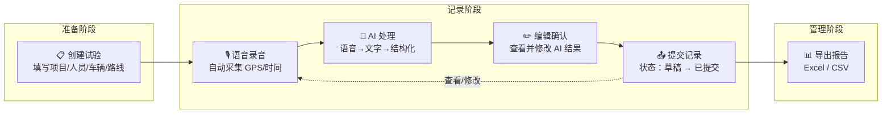
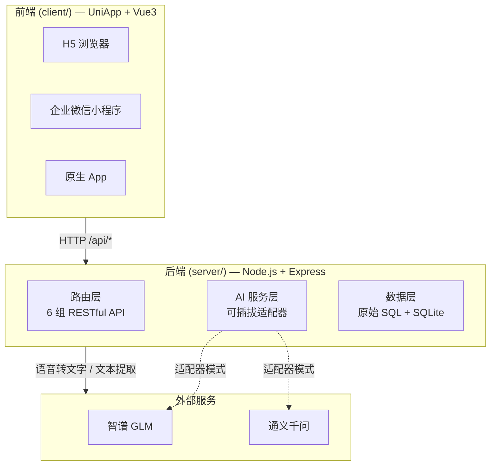
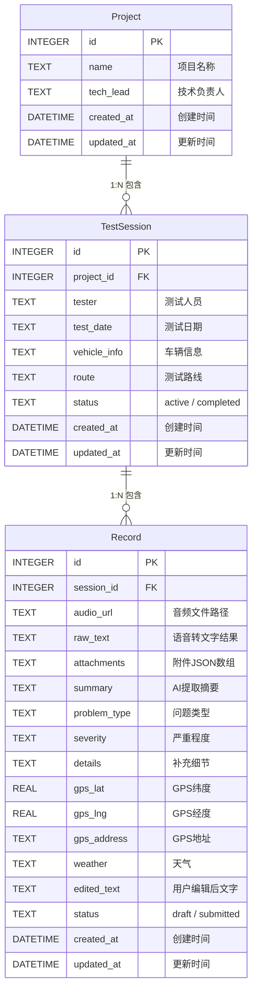
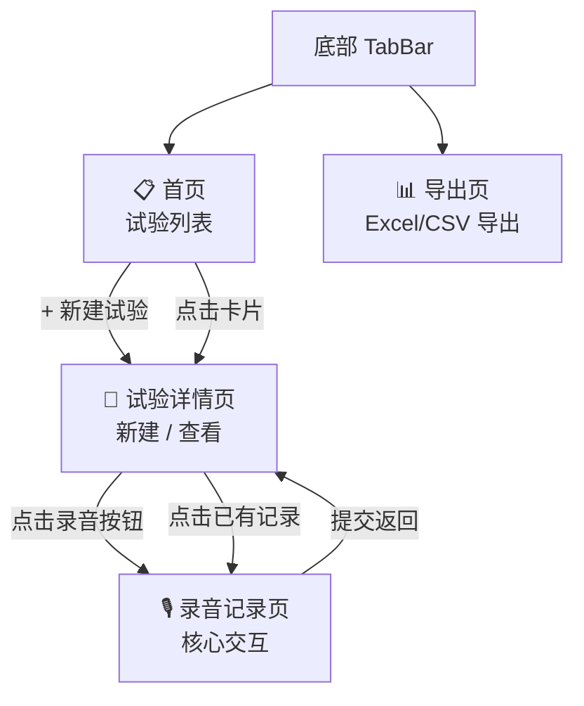

**路测助手**是一套面向自动驾驶/ADAS 路测场景的轻量级试验记录管理系统。它的核心目标只有一个：让坐在副驾的记录员能通过**语音快速记录问题**，由 AI 自动完成语音转文字和结构化信息提取，将原本低效的手动填表过程压缩到"说一句话、看一眼、点一下提交"的极致流程。项目目前处于 MVP 阶段，以"给领导和同事测试效果"为优先，后续再逐步迭代企业微信集成、权限体系和云端部署。

Sources: [README.md](README.md#L1-L3), [PRD 设计文档](docs/superpowers/specs/2026-04-09-road-test-assistant-design.md#L1-L18)

## 它解决什么问题

在主机厂自动驾驶路测场景中，每辆车配备安全员（驾驶位）和记录员（副驾）。路测过程中一旦发现问题，记录员需要迅速记录现场情况——问题现象、车速、路况、GPS 位置等信息。传统做法是手动填写表格或记事本，既分散注意力又容易遗漏关键信息。路测助手将这个流程彻底改写：

| 传统流程 | 路测助手流程 |
|---------|------------|
| 手动打字记录问题 | 语音说出问题，AI 自动转文字 |
| 手动填写问题类型、严重程度等 | AI 自动识别并分类提取 |
| 事后补填 GPS、时间、天气 | 自动采集 GPS，记录时间戳 |
| 回到办公室再整理导出 | 现场提交，随时导出 Excel/CSV |
| 纸质或散落文件，难以追溯 | 集中存储，三层结构化组织 |

使用者可能是内部工程师，也可能是外包/劳务同事，因此系统的设计原则之一就是**降低使用门槛**——能说就不写，能自动就不手动。

Sources: [PRD 设计文档](docs/superpowers/specs/2026-04-09-road-test-assistant-design.md#L9-L17)

## 核心业务流程

整个路测助手的使用流程可以用六个步骤串起：从试验准备到数据导出，形成完整的数据闭环。下图展示了这一流程中各角色的参与和数据流向：



**准备阶段**：测试开始前，记录员在系统中新建试验，填写项目名称、测试人员、技术负责人、车辆信息和测试路线。

**记录阶段**：这是系统最核心的交互循环——录音完成后，系统自动执行 ASR（语音转文字）→ AI 结构化提取（问题类型、严重程度、摘要等）→ 用户确认编辑 → 提交。整个过程无需手动输入任何一个字段。草稿每 3 秒自动保存，防止意外丢失。

**管理阶段**：路测结束后，技术负责人可以查看所有已提交记录并导出为 Excel/CSV 报告。

Sources: [PRD 设计文档](docs/superpowers/specs/2026-04-09-road-test-assistant-design.md#L55-L101), [CLAUDE.md](CLAUDE.md#L29-L43)

## 系统架构总览

路测助手采用经典的**前后端分离架构**，前端和后端是两个完全独立的应用，通过 HTTP 接口通信。前端由 HBuilderX 管理（非 Vue CLI），后端是标准的 Node.js 项目。



**前端**使用 UniApp + Vue3 框架，通过条件编译同时支持 H5 浏览器、企业微信小程序和原生 App 三端运行。录音通过 `RecorderManager` API 实现，定位通过 `uni.getLocation` 获取，文件上传通过 `uni.uploadFile` 完成。H5 开发模式下，`manifest.json` 配置了 `/api` 路径自动代理到后端 `localhost:3000`。

**后端**基于 Node.js + Express，使用 `better-sqlite3` 作为数据库（MVP 阶段本地存储，后续可迁移 MySQL）。没有使用 ORM——所有数据操作通过原始 SQL 实现，保证了查询的透明性和极简性。文件存储在本地 `uploads/` 目录，后续可迁移到阿里云 OSS。

Sources: [server/src/app.js](server/src/app.js#L1-L47), [client/manifest.json](client/manifest.json#L16-L26), [CLAUDE.md](CLAUDE.md#L24-L46)

## 数据模型：三层实体结构

系统采用**项目 → 试验 → 记录**的三层数据结构，每层之间通过外键关联，这种设计天然支持"一项目多车并行"的路测组织方式：



| 层级 | 说明 | 核心字段 | 状态流转 |
|------|------|---------|---------|
| **项目 (Project)** | 顶层组织单元，代表一个路测项目 | 项目名称、技术负责人 | 无状态 |
| **试验 (TestSession)** | 一次具体的测试活动，归属于某个项目 | 测试人员、日期、车辆、路线 | active → completed |
| **记录 (Record)** | 一次问题记录，包含 AI 提取的结构化数据 | 音频、文字、摘要、问题类型、严重程度 | draft → submitted |

记录的 **AI 提取字段**（`summary`、`problem_type`、`severity`、`details`）是路测助手最核心的增值数据——它们由大模型自动从语音转写文本中提取，无需人工填写。问题类型涵盖六种分类：感知异常、规划异常、控制异常、接管、系统故障和其他；严重程度分为致命、严重、一般和轻微四级。

Sources: [server/src/models/database.js](server/src/models/database.js#L25-L68), [PRD 设计文档](docs/superpowers/specs/2026-04-09-road-test-assistant-design.md#L19-L54)

## 技术栈一览

| 层级 | 技术选型 | 说明 |
|------|---------|------|
| 前端框架 | UniApp + Vue3 | 跨端编译（H5 + 企业微信小程序），由 HBuilderX 管理 |
| 后端运行时 | Node.js + Express | 轻量级 MVP 方案，端口 3000 |
| 数据库 | SQLite (better-sqlite3) | MVP 阶段本地存储，WAL 模式，外键约束开启 |
| 文件存储 | 本地 `uploads/` 目录 | 后续迁移阿里云 OSS |
| AI 语音转文字 | 智谱 GLM-ASR-2512 / 通义千问 qwen3-asr-flash | 可插拔切换，通义千问无 30 秒限制 |
| AI 文本提取 | 智谱 glm-4-flash / 通义千问 qwen-plus | 可插拔切换 |
| 数据导出 | xlsx (Node.js) | 支持 Excel (.xlsx) 和 CSV 两种格式 |
| 测试框架 | Jest + Supertest | 后端 API 集成测试，内存数据库隔离 |

环境要求方面，后端需要 Node.js ≥ 18.x，前端需要安装 HBuilderX（最新版）。系统提供两个可选的 AI 服务商，通过环境变量 `ZHIPU_API_KEY` 或 `DASHSCOPE_API_KEY` 配置——至少填写一个即可运行，未填则使用 Mock 适配器降级。

Sources: [README.md](README.md#L5-L13), [README.md](README.md#L110-L121), [server/.env.example](server/.env.example)

## 项目目录结构

```
路测助手/
├── client/                    # 🖥️ 前端 — UniApp + Vue3（HBuilderX 管理）
│   ├── pages/
│   │   ├── index/             #   首页：试验列表与项目管理
│   │   ├── session-detail/    #   试验详情：新建/查看试验，记录管理
│   │   ├── record/            #   录音记录：核心交互页面
│   │   └── export/            #   数据导出：Excel/CSV
│   ├── services/api.js        #   API 服务层封装
│   ├── pages.json             #   页面路由与导航栏配置
│   └── manifest.json          #   UniApp 应用配置（H5 代理等）
│
├── server/                    # ⚙️ 后端 — Node.js + Express
│   ├── src/
│   │   ├── app.js             #   Express 入口：挂载路由、中间件、初始化数据库
│   │   ├── models/
│   │   │   ├── database.js    #   SQLite 建表（自动执行）
│   │   │   └── queries.js     #   全部 CRUD 查询函数
│   │   ├── routes/            #   6 组 RESTful 路由
│   │   │   ├── projects.js    #   项目 CRUD
│   │   │   ├── sessions.js    #   试验 CRUD
│   │   │   ├── records.js     #   记录 CRUD
│   │   │   ├── upload.js      #   文件上传
│   │   │   ├── export.js      #   数据导出
│   │   │   └── ai.js          #   AI 语音转文字 + 结构化提取
│   │   └── services/          #   AI 适配器体系
│   │       ├── base-adapter.js  #   抽象基类
│   │       ├── zhipu-adapter.js #   智谱 GLM 实现
│   │       ├── qwen-adapter.js  #   通义千问实现
│   │       ├── mock-adapter.js  #   Mock 降级实现
│   │       └── ai-service.js    #   适配器选择器（单例）
│   ├── tests/                 #   Jest + Supertest 测试
│   ├── uploads/               #   上传文件存储目录
│   └── data/                  #   SQLite 数据库文件目录
│
├── docs/                      # 📄 设计文档
│   └── superpowers/specs/     #   PRD 产品需求文档
└── 路测助手-MVP设计.canvas     #   MVP 设计画板（Obsidian Canvas）
```

Sources: [README.md](README.md#L77-L108), [CLAUDE.md](CLAUDE.md#L24-L43)

## 前端页面流转

前端共 4 个页面（新建试验功能内嵌在试验详情页中，通过 `?new=1` 参数区分新建/查看模式），底部 TabBar 包含"试验"和"导出"两个入口：



**首页**（`pages/index`）展示试验卡片列表，每个卡片显示项目名、路线、日期和状态，底部有新建试验按钮。

**试验详情页**（`pages/session-detail`）是一个双模式页面：通过 URL 参数 `?new=1` 进入新建模式，否则展示试验信息和该试验下的记录列表，底部悬浮录音按钮。

**录音记录页**（`pages/record`）是整个系统最核心的页面，承载了录音 → 上传 → ASR 转写 → AI 结构化提取 → 编辑确认 → 提交的完整交互链路。

**导出页**（`pages/export`）通过条件编译实现 H5 和原生平台的差异化下载方式。

Sources: [client/pages.json](client/pages.json#L1-L50), [PRD 设计文档](docs/superpowers/specs/2026-04-09-road-test-assistant-design.md#L55-L101)

## AI 适配器：可插拔的大模型接口

路测助手的 AI 能力通过**适配器模式**实现可插拔切换。所有适配器继承自 `BaseAIAdapter` 抽象基类，统一实现 `speechToText()` 和 `extractFields()` 两个核心方法。系统启动时，`ai-service.js` 根据环境变量自动选择适配器——检测到 `DASHSCOPE_API_KEY` 优先使用通义千问，否则使用智谱 GLM，两者都没有则降级到 Mock 适配器。

| 适配器 | 语音转文字模型 | 结构化提取模型 | 状态 | 备注 |
|--------|-------------|-------------|------|------|
| **ZhiPuAdapter** | GLM-ASR-2512 | glm-4-flash | ✅ 可用 | 当前默认，ASR 限 30 秒 |
| **QwenAdapter** | qwen3-asr-flash | qwen-plus | ✅ 可用 | 推荐，无时长限制 |
| **MockAdapter** | 返回模拟文本 | 返回模拟 JSON | ✅ 可用 | 无 API Key 时的降级方案 |

这种设计确保了后续切换到内部部署模型时，只需新增一个适配器类即可，无需修改业务逻辑代码。

Sources: [server/src/services/base-adapter.js](server/src/services/base-adapter.js#L1-L24), [CLAUDE.md](CLAUDE.md#L38-L41), [PRD 设计文档](docs/superpowers/specs/2026-04-09-road-test-assistant-design.md#L142-L155)

## 下一步阅读

你现在对路测助手有了全局认知。以下是推荐的阅读路径，帮助你从"能跑起来"到"能改代码"：

**入门指南**（建议按顺序阅读）：
- [快速搭建开发环境](2-kuai-su-da-jian-kai-fa-huan-jing) — 手把手把项目跑起来
- [技术栈与依赖清单](3-ji-zhu-zhan-yu-yi-lai-qing-dan) — 深入理解每一项技术选型的细节

**核心业务流程**：
- [从新建试验到提交记录的完整工作流](4-cong-xin-jian-shi-yan-dao-ti-jiao-ji-lu-de-wan-zheng-gong-zuo-liu) — 数据在前后端之间的完整流转
- [语音采集与 AI 结构化提取流程](5-yu-yin-cai-ji-yu-ai-jie-gou-hua-ti-qu-liu-cheng) — 最核心的 AI 处理链路详解
- [数据导出（Excel / CSV）流程](6-shu-ju-dao-chu-excel-csv-liu-cheng) — 导出功能的条件编译与平台差异