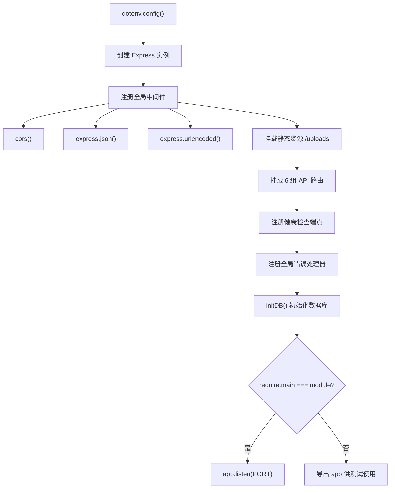
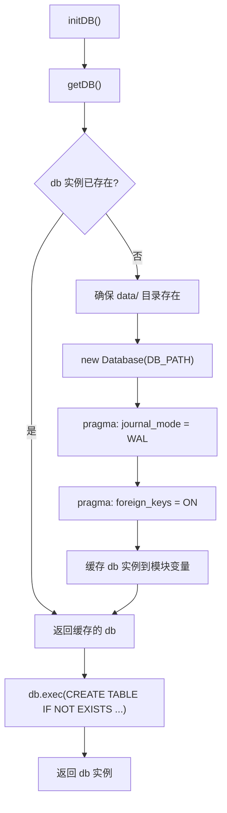
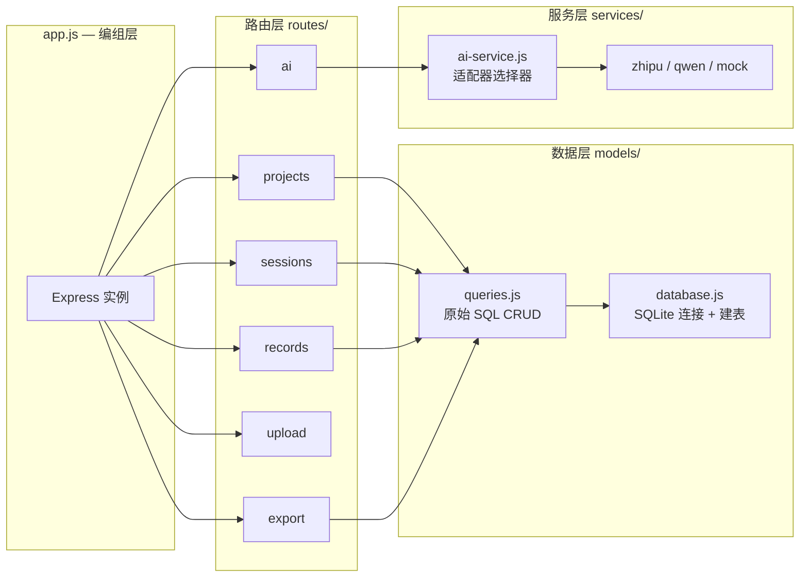

`app.js` 是路测助手后端服务的**唯一入口文件**，仅 47 行代码便完成了从环境变量加载、中间件注册、路由挂载、数据库初始化到 HTTP 服务启动的全部编排工作。本文将逐层拆解这个文件的设计意图，揭示其"能启动也能被测试"的双重导出策略，以及与之紧密关联的数据库初始化链路。

Sources: [app.js](server/src/app.js#L1-L47)

## 整体启动流程

应用的启动遵循一条严格的线性依赖链：环境配置先于 Express 实例，中间件先于路由，数据库初始化先于服务监听。下图展示了 `app.js` 中各步骤的执行顺序与依赖关系：



这种线性编排确保每个阶段依赖的前置条件都已就绪。特别值得注意的是 `initDB()` 位于路由挂载之后——这意味着即使数据库尚未建表，路由模块本身已经完成加载（因为路由函数内部调用 `getDB()` 时才真正获取连接），这是一种**延迟求值（lazy evaluation）**的巧妙运用。

Sources: [app.js](server/src/app.js#L1-L47)

## 环境变量加载：一切配置的起点

```js
require('dotenv').config();
```

这是 `app.js` 的第一行，也是整个后端所有配置读取的根基。`dotenv` 从项目根目录的 `.env` 文件中读取键值对并注入到 `process.env` 中，后续代码中所有对环境变量的访问（`process.env.PORT`、`process.env.ZHIPU_API_KEY` 等）都依赖此行先于一切业务代码执行。

| 环境变量 | 用途 | 默认值 |
|---|---|---|
| `PORT` | HTTP 服务监听端口 | `3000` |
| `DB_PATH` | SQLite 数据库文件路径 | `server/data/roadtest.db` |
| `ZHIPU_API_KEY` | 智谱 GLM AI 服务密钥 | 无（降级为 Mock） |
| `DASHSCOPE_API_KEY` | 通义千问 AI 服务密钥 | 无（降级为 Mock） |

Sources: [app.js](server/src/app.js#L1), [.env.example](server/.env.example#L1-L10)

## 中间件栈：四层请求处理管线

Express 应用通过 `app.use()` 依次注册了四层全局中间件，每个进入应用的 HTTP 请求都将按注册顺序流经这条管线：

```js
app.use(cors());                                           // 第 1 层：跨域
app.use(express.json());                                   // 第 2 层：JSON 解析
app.use(express.urlencoded({ extended: true }));            // 第 3 层：URL 编码解析
app.use('/uploads', express.static(path.join(__dirname, '..', 'uploads'))); // 第 4 层：静态文件
```

**第 1 层 `cors()`**：无参数调用意味着对所有来源（Origin）开放跨域访问。在路测助手的场景下，前端 UniApp 的 H5 模式运行在独立端口（如 5173），需要跨域访问后端 3000 端口的 API。对于原生 App 模式，请求不受浏览器同源策略限制，此中间件不产生副作用。

**第 2 层 `express.json()`**：将请求体中 `Content-Type: application/json` 的载荷自动解析为 `req.body` JavaScript 对象。路测助手的 POST/PUT 请求（创建项目、提交记录等）均依赖此中间件。

**第 3 层 `express.urlencoded({ extended: true })**：解析 URL 编码的表单数据。`extended: true` 使用 `qs` 库支持嵌套对象解析。虽然当前 API 主要使用 JSON 格式，但保留此中间件为表单提交场景提供兼容。

**第 4 层 静态资源托管**：将 `server/uploads/` 目录映射到 `/uploads` URL 路径。这使得通过 Multer 上传的音频、图片文件可以通过 `http://localhost:3000/uploads/<filename>` 直接访问，无需额外编写文件读取路由。

Sources: [app.js](server/src/app.js#L11-L16)

## 路由挂载：六组 RESTful API 端点

```js
app.use('/api/projects', require('./routes/projects'));
app.use('/api/sessions', require('./routes/sessions'));
app.use('/api/records', require('./routes/records'));
app.use('/api/export',   require('./routes/export'));
app.use('/api/upload',   require('./routes/upload'));
app.use('/api/ai',       require('./routes/ai'));
```

所有业务路由统一挂在 `/api` 前缀下，与静态资源路径 `/uploads` 形成清晰的命名空间隔离。每组路由模块遵循相同的模式：创建 `express.Router()` 实例、定义端点处理函数、导出 router。以下表格汇总了各路由模块的职责与核心端点：

| 路由模块 | 挂载路径 | 核心功能 | 数据流向 |
|---|---|---|---|
| `projects.js` | `/api/projects` | 项目的 CRUD | → `queries.js` → `database.js` |
| `sessions.js` | `/api/sessions` | 试验的 CRUD + 按 project_id 过滤 | → `queries.js` → `database.js` |
| `records.js` | `/api/records` | 记录的 CRUD + 按 session_id 过滤 | → `queries.js` → `database.js` |
| `export.js` | `/api/export` | Excel/CSV 文件导出 | → `queries.js` → `xlsx` 库 |
| `upload.js` | `/api/upload` | 文件上传（Multer） | → 磁盘 `uploads/` 目录 |
| `ai.js` | `/api/ai` | ASR 转写 + 结构化提取 + 完整流水线 | → `ai-service.js` → AI 适配器 |

路由模块采用 `require()` 直接内联导入而非顶层变量引用，这是 Express 路由注册的常见简洁写法。虽然失去了在启动时打印加载状态的能力，但对于仅有六个路由模块的小型应用而言，这种写法的可读性收益远大于调试灵活性损失。

Sources: [app.js](server/src/app.js#L19-L24)

## 健康检查与全局错误处理

在路由挂载之后、数据库初始化之前，`app.js` 注册了两个特殊端点：

```js
// 健康检查 — 简单的 GET 端点
app.get('/api/health', (req, res) => {
  res.json({ status: 'ok', timestamp: new Date().toISOString() });
});

// 全局错误处理 — 四参数签名是 Express 识别错误中间件的约定
app.use((err, req, res, _next) => {
  console.error(err.stack);
  res.status(500).json({ error: 'Internal server error' });
});
```

**健康检查端点** `/api/health` 返回固定 `{ status: 'ok' }` 加当前时间戳。它不访问数据库，因此即使数据库初始化失败，此端点仍可响应——这使得运维监控能够区分"服务存活但数据库异常"与"服务本身未启动"两种故障场景。

**全局错误处理中间件**采用 Express 约定的四参数签名 `(err, req, res, next)`。任何路由或中间件中通过 `next(err)` 或异步抛出的错误都会被此中间件捕获，统一以 500 状态码和 JSON 格式返回。注意 `_next` 参数以下划线命名，这是 JavaScript 中表达"此参数存在但故意不使用"的惯用写法。

Sources: [app.js](server/src/app.js#L27-L35)

## 数据库初始化：建表与 WAL 模式配置

```js
initDB();
```

`initDB()` 调用触发了 `server/src/models/database.js` 中定义的初始化逻辑，其内部执行流程如下：



**`getDB()` 单例模式**：通过模块级变量 `let db` 实现单例。首次调用时创建 `better-sqlite3` 实例并设置两个关键 pragma，后续调用直接返回缓存实例。这保证了整个应用生命周期中只有一个数据库连接——对于 SQLite 这种单文件数据库而言是最佳实践。

**WAL 模式 (`journal_mode = WAL`)**：Write-Ahead Logging 允许读操作与写操作并发执行，避免了默认回滚日志模式下写操作阻塞读操作的性能瓶颈。在路测助手的典型使用场景中（前端频繁查询记录列表的同时 AI 服务可能在写入结构化字段），WAL 模式显著提升了并发吞吐量。

**外键约束 (`foreign_keys = ON`)**：SQLite 默认不启用外键检查。此设置确保 `records.session_id` 和 `test_sessions.project_id` 的引用完整性，防止删除项目时留下孤立的试验记录。

**`CREATE TABLE IF NOT EXISTS`**：三个表（`projects`、`test_sessions`、`records`）使用幂等建表语句。这意味着无论是首次启动还是后续重启，`initDB()` 都能安全执行而不会因表已存在而报错。

Sources: [database.js](server/src/models/database.js#L1-L73), [app.js](server/src/app.js#L38)

## 条件启动与模块导出策略

```js
if (require.main === module) {
  app.listen(PORT, () => {
    console.log(`路测助手服务运行在 http://localhost:${PORT}`);
  });
}

module.exports = app;
```

这段代码实现了**双重身份模式**，是 Node.js 应用支持测试的惯用技巧：

- **直接运行**（`node src/app.js` 或 `npm start`）：`require.main === module` 为 `true`，启动 HTTP 监听
- **被其他模块引用**（如 `const app = require('./app')`）：条件不成立，仅导出 Express 实例而不启动监听

Jest + Supertest 测试框架正是利用这一特性：测试文件导入 `app` 后调用 `supertest(app)` 发送请求，Supertest 会在内部创建临时 HTTP 服务器，无需真正占用端口，测试结束后自动清理。这种设计使得测试可以并行执行而不会产生端口冲突。

Sources: [app.js](server/src/app.js#L40-L46)

## 启动方式与 npm 脚本

`package.json` 中定义了两个启动脚本和一个测试脚本：

| 命令 | 脚本内容 | 用途 |
|---|---|---|
| `npm start` | `node src/app.js` | 生产环境启动 |
| `npm run dev` | `nodemon src/app.js` | 开发环境热重启 |
| `npm test` | `jest --forceExit` | 运行测试套件 |

`nodemon` 监听文件变更自动重启服务，配合 `dotenv` 加载的环境变量实现开箱即用的开发体验。`--forceExit` 标志确保 Jest 在所有测试完成后强制退出进程，防止 `better-sqlite3` 的数据库连接保持进程存活。

Sources: [package.json](server/src/package.json#L6-L10)

## 应用架构全景

`app.js` 是整个后端的编组枢纽，但它自身不包含任何业务逻辑。以下架构图展示了 `app.js` 与各模块的依赖关系，帮助你定位任何功能背后的具体代码位置：



此图清晰地展示了三层分离的架构哲学：路由层只做 HTTP 协议适配（参数校验、状态码设置），数据层只做 SQL 执行，服务层封装第三方 API 调用。`app.js` 作为编组层将这些模块粘合在一起，其自身始终保持极简。

Sources: [app.js](server/src/app.js#L1-L47)

## 延伸阅读

本文聚焦于 Express 入口的静态结构与初始化流程。各路由模块的具体端点设计、查询层的原始 SQL 实现细节、以及 Multer 文件上传的配置策略，将在后续页面深入展开：

- [RESTful API 路由设计（Projects / Sessions / Records / Upload / Export / AI）](11-restful-api-lu-you-she-ji-projects-sessions-records-upload-export-ai) — 六组路由的端点规格与请求/响应契约
- [原始 SQL 查询层：无 ORM 的 CRUD 实现](12-yuan-shi-sql-cha-xun-ceng-wu-orm-de-crud-shi-xian) — `queries.js` 的 prepared statement 模式与动态 UPDATE 构造
- [Multer 文件上传与静态资源托管](13-multer-wen-jian-shang-chuan-yu-jing-tai-zi-yuan-tuo-guan) — 磁盘存储策略与文件类型过滤
- [Jest + Supertest 测试策略与数据库隔离方案](24-jest-supertest-ce-shi-ce-lue-yu-shu-ju-ku-ge-chi-fang-an) — `require.main === module` 在测试中的实际运用