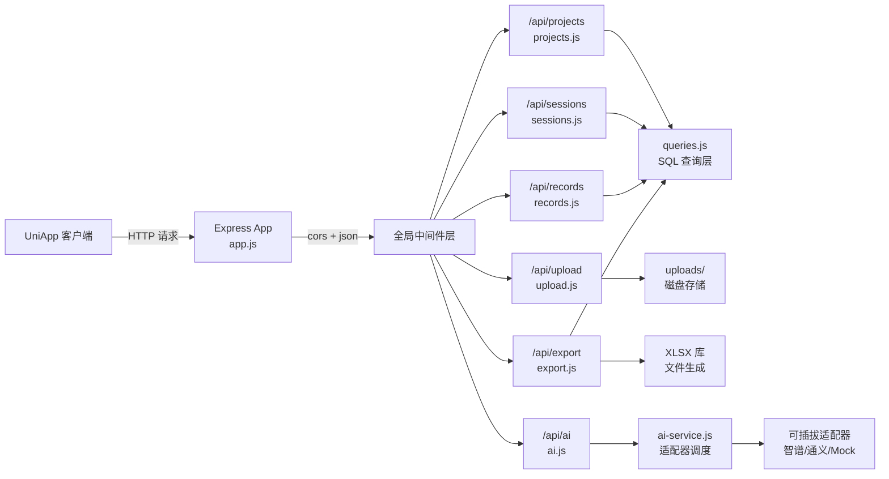
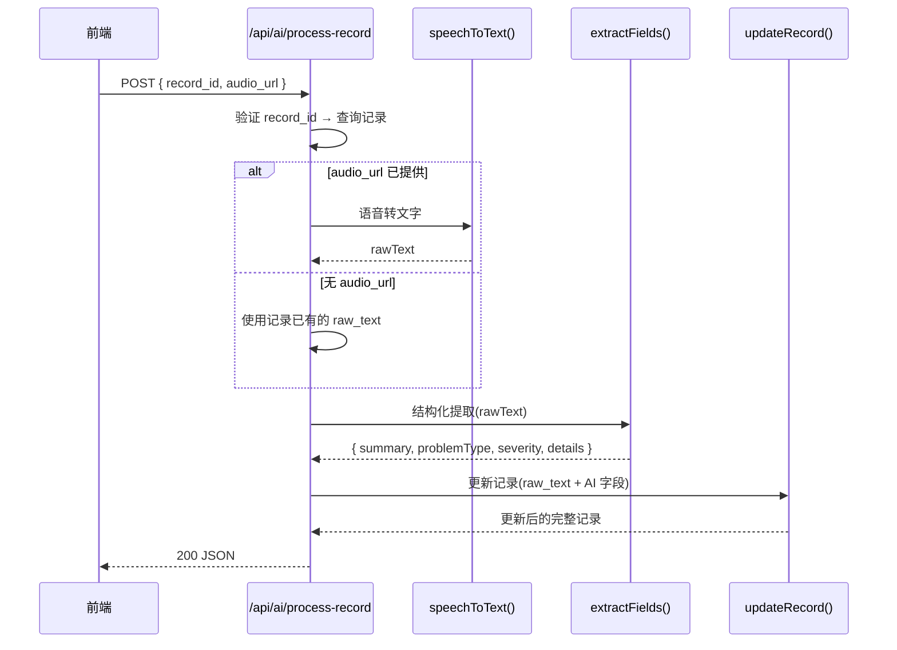

路测助手的后端 API 采用 **扁平化 RESTful 路由结构**，将六大业务域——项目（Projects）、试验（Sessions）、记录（Records）、文件上传（Upload）、数据导出（Export）、AI 处理——分别挂载在 `/api/` 前缀下的独立子路径中。这种设计放弃了传统 RESTful 的深层嵌套风格（如 `/api/projects/:id/sessions/:id/records`），转而使用顶层资源路径配合查询参数过滤（如 `/api/records?session_id=1`），在保持语义清晰的同时降低了路由嵌套的复杂度，使得每个路由模块职责单一、易于独立测试和维护。所有路由在 [app.js](server/src/app.js#L19-L24) 中以 `app.use('/api/<resource>', require('./routes/<resource>'))` 的统一模式挂载，加上全局 CORS、JSON 解析中间件和集中式错误处理器，构成了一个简洁而完整的 HTTP 服务骨架。

Sources: [app.js](server/src/app.js#L1-L47)

## 路由总览与挂载架构

Express 应用在启动时通过六个 `app.use()` 调用将路由模块注册到对应的 URL 前缀。此外还有一个健康检查端点 `/api/health` 和一个全局错误处理中间件，后者捕获所有未处理的异常并统一返回 `500 { error: 'Internal server error' }`。静态文件服务将 `server/uploads/` 目录映射到 `/uploads` 路径，使上传的音频和图片可直接通过 HTTP URL 访问。

**六大路由模块的职责划分**：

| 模块 | 挂载路径 | 文件 | 核心职责 | 同步/异步 |
|------|---------|------|---------|----------|
| Projects | `/api/projects` | [projects.js](server/src/routes/projects.js) | 项目 CRUD（列表、创建、详情） | 同步 |
| Sessions | `/api/sessions` | [sessions.js](server/src/routes/sessions.js) | 试验 CRUD + 按项目过滤 | 同步 |
| Records | `/api/records` | [records.js](server/src/routes/records.js) | 记录 CRUD + 按试验过滤 | 同步 |
| Upload | `/api/upload` | [upload.js](server/src/routes/upload.js) | Multer 文件上传（单文件/批量） | 同步 |
| Export | `/api/export` | [export.js](server/src/routes/export.js) | Excel/CSV 导出（二进制流响应） | 同步 |
| AI | `/api/ai` | [ai.js](server/src/routes/ai.js) | ASR 转写 + 结构化提取 + 全流程管线 | **异步** |

Sources: [app.js](server/src/app.js#L10-L35), [projects.js](server/src/routes/projects.js#L1-L30), [sessions.js](server/src/routes/sessions.js#L1-L40), [records.js](server/src/routes/records.js#L1-L43), [upload.js](server/src/routes/upload.js#L1-L67), [export.js](server/src/routes/export.js#L1-L114), [ai.js](server/src/routes/ai.js#L1-L74)

## Projects 路由：项目资源管理

Projects 路由提供三个端点，覆盖了项目实体的**列表查询、创建和详情获取**。值得注意的是，该模块不提供 PUT 更新和 DELETE 删除端点——这符合 MVP 阶段"项目一旦创建便作为持久归档容器"的设计意图，项目本身只是试验（Sessions）的分组维度，不需要频繁修改。

### 端点一览

| 方法 | 路径 | 说明 | 请求参数 | 成功响应 | 错误响应 |
|------|------|------|---------|---------|---------|
| `GET` | `/api/projects` | 获取全部项目列表 | 无 | `200` + JSON 数组（按 `created_at DESC` 排序） | — |
| `POST` | `/api/projects` | 创建新项目 | `{ name, tech_lead? }` | `201` + 项目对象 | `400` 若 `name` 缺失 |
| `GET` | `/api/projects/:id` | 获取单个项目详情 | 路径参数 `id` | `200` + 项目对象 | `404` 若项目不存在 |

路由处理函数直接调用 `queries.js` 中对应的同步函数（`getAllProjects`、`createProject`、`getProjectById`），将 SQLite 查询结果原样序列化为 JSON 返回。这种"瘦控制器"模式使得路由层几乎不包含业务逻辑——输入验证（`if (!name)`）、资源查找（`getProjectById`）和响应状态码选择是路由层仅有的决策点。

Sources: [projects.js](server/src/routes/projects.js#L1-L30)

## Sessions 路由：试验资源管理

Sessions 路由是六个模块中功能最完整的 CRUD 实现，包含列表（带过滤）、创建、详情和更新四个端点。**列表端点通过可选的 `?project_id=` 查询参数实现按项目过滤**——当该参数存在时，`getAllSessions(projectId)` 只返回属于指定项目的试验；省略时返回全部试验。这种"可选过滤"设计在前端首页和试验详情页之间提供了灵活的数据获取方式。

### 端点一览

| 方法 | 路径 | 说明 | 请求参数 | 成功响应 | 错误响应 |
|------|------|------|---------|---------|---------|
| `GET` | `/api/sessions` | 获取试验列表 | `?project_id=`（可选） | `200` + JSON 数组 | — |
| `POST` | `/api/sessions` | 创建新试验 | `{ project_id, tester, test_date, vehicle_info?, route? }` | `201` + 试验对象 | `400` 若必填字段缺失 |
| `GET` | `/api/sessions/:id` | 获取单个试验详情 | 路径参数 `id` | `200` + 试验对象 | `404` 若试验不存在 |
| `PUT` | `/api/sessions/:id` | 更新试验信息 | `{ tester?, test_date?, vehicle_info?, route?, status? }` | `200` + 更新后对象 | `404` 若试验不存在 |

创建试验时有三个必填字段：`project_id`（所属项目）、`tester`（测试人员）、`test_date`（测试日期）。数据库默认值为 `status = 'active'`，状态字段只能在 `active` 和 `completed` 之间切换（由 SQLite `CHECK` 约束保障）。PUT 更新采用**合并更新**策略——`updateSession` 函数对未提供的字段使用现有值回填，客户端只需发送需要变更的字段。

Sources: [sessions.js](server/src/routes/sessions.js#L1-L40)

## Records 路由：路测记录管理

Records 路由的设计体现了本系统**扁平化资源组织**的核心理念。虽然记录在数据模型上从属于试验（`session_id` 外键），但在路由层面它被提升为独立顶层资源 `/api/records`，通过 **`?session_id=` 查询参数**进行归属过滤，而非采用嵌套路径 `/api/sessions/:id/records`。

这种选择带来了三个架构优势：（1）路由注册扁平化，避免深层参数传递；（2）前端调用方式统一，所有资源遵循相同的 `{base}/{id}` 模式；（3）单个记录的 CRUD 操作（如 `GET /api/records/5`）无需在 URL 中携带父级 ID，简化了前端的 URL 构造逻辑。

### 端点一览

| 方法 | 路径 | 说明 | 请求参数 | 成功响应 | 错误响应 |
|------|------|------|---------|---------|---------|
| `GET` | `/api/records` | 获取记录列表 | `?session_id=`（**必填**） | `200` + JSON 数组 | `400` 若 `session_id` 缺失 |
| `POST` | `/api/records` | 创建新记录 | `{ session_id, audio_url?, raw_text?, attachments?, summary?, ... }` | `201` + 记录对象 | `400` 若 `session_id` 缺失 |
| `GET` | `/api/records/:id` | 获取单条记录详情 | 路径参数 `id` | `200` + 记录对象 | `404` 若记录不存在 |
| `PUT` | `/api/records/:id` | 更新记录 | `{ status?, summary?, edited_text?, ... }` | `200` + 更新后对象 | `404` 若记录不存在 |

Records 的列表端点与 Sessions 不同——**`session_id` 参数是必填的**，不允许无条件列出全部记录。这一约束反映了业务语义：记录脱离试验上下文没有独立的浏览意义，前端总是先选定试验再加载其下的记录。

记录的创建载荷支持多达 13 个字段（`session_id`, `audio_url`, `raw_text`, `attachments`, `summary`, `problem_type`, `severity`, `details`, `gps_lat`, `gps_lng`, `gps_address`, `weather`, `occurred_at`），其中只有 `session_id` 为必填。新建记录的默认状态为 `draft`，经用户确认后通过 PUT 更新为 `submitted`。**`attachments` 字段在存储时自动序列化为 JSON 字符串**，前端传入数组对象即可，无需手动序列化。PUT 更新同样采用合并更新策略，且 `updateRecord` 函数维护了一个 `allowedFields` 白名单，只接受预定义的字段更新请求，防止客户端注入非预期字段。

Sources: [records.js](server/src/routes/records.js#L1-L43)

## Upload 路由：Multer 文件上传

Upload 路由使用 **Multer** 中间件处理 `multipart/form-data` 格式的文件上传，将文件存储到 `server/uploads/` 目录，并通过自定义的 `diskStorage` 策略生成唯一文件名：`{时间戳}-{6位随机字符}{原始扩展名}`（如 `1775828529478-42n0ls.mp3`）。

### 端点一览

| 方法 | 路径 | 说明 | 表单字段 | 成功响应 | 错误响应 |
|------|------|------|---------|---------|---------|
| `POST` | `/api/upload` | 上传单个文件 | `file`（单文件） | `201` + `{ url, filename, size, mimetype }` | `400` 若无文件 / 不支持的类型 |
| `POST` | `/api/upload/multiple` | 上传多个文件 | `files`（数组，最多 10 个） | `201` + 文件信息数组 | `400` 若无文件 / 不支持的类型 |

### 文件约束

| 约束项 | 值 |
|--------|-----|
| 最大文件大小 | 100 MB |
| 允许的音频格式 | `.mp3`, `.wav`, `.m4a`, `.aac`, `.ogg` |
| 允许的媒体格式 | `.mp4`, `.mov`, `.jpg`, `.jpeg`, `.png` |
| 批量上传上限 | 10 个文件 |

上传成功后返回的 `url` 字段（如 `/uploads/1775828529478-42n0ls.mp3`）可直接用于后续的 Records 创建（`audio_url` 字段）和 AI 转写请求（`audio_url` 字段）。由于 `app.js` 中已通过 `express.static` 将 `uploads/` 目录映射到 `/uploads` 路径，这些 URL 同时也是可直接访问的 HTTP 地址。

Sources: [upload.js](server/src/routes/upload.js#L1-L67), [app.js](server/src/app.js#L16)

## Export 路由：Excel 与 CSV 导出

Export 路由将试验下的已提交记录（`status = 'submitted'`）导出为 Excel（`.xlsx`）或 CSV 格式。该路由与前五个模块有一个关键区别：**响应体不是 JSON，而是二进制文件流**。路由使用 `xlsx`（SheetJS）库在内存中生成工作簿，设置正确的 `Content-Type` 和 `Content-Disposition` 响应头后直接发送 Buffer。

### 端点一览

| 方法 | 路径 | 说明 | 请求参数 | 成功响应 | 错误响应 |
|------|------|------|---------|---------|---------|
| `GET` | `/api/export/excel` | 导出 Excel | `?session_id=` | `200` + `.xlsx` 二进制流 | `400`/`404` |
| `GET` | `/api/export/csv` | 导出 CSV | `?session_id=` | `200` + `.csv` 文本流（UTF-8 BOM） | `400`/`404` |

Excel 导出生成一个包含两个工作表的文件：**"路测记录"** 工作表导出 14 列数据（记录ID、问题描述、问题类型、严重程度、详细描述、原始文字、编辑后文字、GPS 纬度/经度、地址、天气、发生时间、状态、创建时间），并预设了列宽；**"试验信息"** 工作表导出试验元数据（项目ID、测试人员、测试日期、车辆信息、测试路线、状态）。CSV 导出则是 Excel 工作表的子集（10 列，不含"编辑后文字"、"发生时间"、"创建时间"、"地址"等列），并在文件开头添加 UTF-8 BOM 标记（`\ufeff`），确保 Excel 打开时正确识别中文编码。

导出前的校验链路为：`session_id` 必填 → 试验必须存在 → 试验下必须有 `submitted` 状态的记录。三个条件任一不满足即返回对应的 400/404 错误。

Sources: [export.js](server/src/routes/export.js#L1-L114)

## AI 路由：语音转写与结构化提取

AI 路由是整个系统中唯一包含**异步处理逻辑**的路由模块，也是唯一跨层调用的路由——它同时依赖 `ai-service.js`（AI 适配器调度）和 `queries.js`（数据库操作）。该模块提供三个端点，分别对应 AI 处理链路上的三个阶段，并包含一个**全流程管线端点**将三步串联为原子操作。

### 端点一览

| 方法 | 路径 | 说明 | 请求参数 | 成功响应 | 错误响应 |
|------|------|------|---------|---------|---------|
| `POST` | `/api/ai/transcribe` | 语音转文字 | `{ audio_url }` | `200` + `{ text }` | `400`/`500` |
| `POST` | `/api/ai/extract` | 结构化字段提取 | `{ text }` | `200` + `{ summary, problemType, severity, details }` | `400`/`500` |
| `POST` | `/api/ai/process-record` | 全流程处理 | `{ record_id, audio_url? }` | `200` + 更新后的记录对象 | `400`/`404`/`500` |

### 三步处理管线

**`/api/ai/process-record`** 是最核心的端点，实现了"转写 → 提取 → 写库"的三步原子操作。其执行逻辑为：（1）根据 `record_id` 查找记录，不存在则返回 404；（2）若请求中携带 `audio_url`，先调用 `speechToText()` 进行 ASR 转写，否则使用记录中已有的 `raw_text`；（3）基于文本调用 `extractFields()` 提取结构化字段；（4）将 `raw_text`、`summary`、`problemType`（映射为 `problem_type`）、`severity`、`details` 一并写入数据库并返回更新后的完整记录。这种设计允许前端在录音上传后**一次请求完成全部 AI 处理**，也允许分步调用 `/transcribe` 和 `/extract` 进行更细粒度的控制。

AI 服务层通过**单例适配器模式**实现可插拔：`ai-service.js` 在首次调用时根据环境变量自动选择智谱 GLM、通义千问或 Mock 适配器。路由层完全不感知具体适配器实现，只依赖 `speechToText()` 和 `extractFields()` 两个统一的异步接口。

Sources: [ai.js](server/src/routes/ai.js#L1-L74), [ai-service.js](server/src/services/ai-service.js#L1-L47)

## 设计模式与架构决策总结

### 扁平化路由 vs 嵌套式路由

本系统选择扁平化路由结构的决策基于以下考量。传统的嵌套 RESTful 风格会将记录端点设计为 `GET /api/sessions/:sessionId/records`，但路测助手的前端工作流总是在明确的试验上下文中操作记录——用户先进入试验详情页，再管理该试验下的记录。扁平化路由将归属关系通过查询参数表达（`GET /api/records?session_id=1`），避免了 URL 中多层参数的传递和解析，同时使得单条记录的操作路径（`GET/PUT /api/records/:id`）更加简洁。

### 同步查询模型

除 AI 路由外，所有路由处理函数使用 `better-sqlite3` 的同步 API 进行数据库操作。这一选择源于 SQLite 的单机嵌入式定位——在无网络 I/O 的本地数据库场景下，同步调用避免了回调/Promise 链的复杂度，代码可读性显著提升。每个路由处理函数体量控制在 5-10 行，仅包含参数验证、查询调用和响应构造三层逻辑。

### 统一错误响应格式

所有路由遵循相同的错误响应约定：`{ error: string }`。状态码映射规则为：客户端参数问题返回 `400`，资源不存在返回 `404`，AI 外部服务异常返回 `500`。全局错误处理中间件兜底捕获未预期的异常，确保任何情况下客户端收到的都是结构化 JSON 而非 HTML 错误页面。

Sources: [app.js](server/src/app.js#L32-L35), [projects.js](server/src/routes/projects.js#L14-L15), [sessions.js](server/src/routes/sessions.js#L15-L16), [records.js](server/src/routes/records.js#L8-L9), [ai.js](server/src/routes/ai.js#L9-L10)

## 完整 API 端点速查表

下表汇总了路测助手全部 15 个 API 端点，作为开发时的快速参考：

| # | 方法 | 完整路径 | 请求体/参数 | 响应类型 | 状态码 |
|---|------|---------|------------|---------|--------|
| 1 | GET | `/api/health` | — | `{ status, timestamp }` | 200 |
| 2 | GET | `/api/projects` | — | Project[] | 200 |
| 3 | POST | `/api/projects` | `{ name, tech_lead? }` | Project | 201/400 |
| 4 | GET | `/api/projects/:id` | — | Project | 200/404 |
| 5 | GET | `/api/sessions` | `?project_id=` | Session[] | 200 |
| 6 | POST | `/api/sessions` | `{ project_id, tester, test_date, ... }` | Session | 201/400 |
| 7 | GET | `/api/sessions/:id` | — | Session | 200/404 |
| 8 | PUT | `/api/sessions/:id` | `{ tester?, status?, ... }` | Session | 200/404 |
| 9 | GET | `/api/records` | `?session_id=` (**必填**) | Record[] | 200/400 |
| 10 | POST | `/api/records` | `{ session_id, raw_text?, ... }` | Record | 201/400 |
| 11 | GET | `/api/records/:id` | — | Record | 200/404 |
| 12 | PUT | `/api/records/:id` | `{ status?, summary?, ... }` | Record | 200/404 |
| 13 | POST | `/api/upload` | `file` (multipart) | `{ url, filename, size, mimetype }` | 201/400 |
| 14 | POST | `/api/upload/multiple` | `files[]` (multipart, ≤10) | FileInfo[] | 201/400 |
| 15 | GET | `/api/export/excel` | `?session_id=` | `.xlsx` 二进制流 | 200/400/404 |
| 16 | GET | `/api/export/csv` | `?session_id=` | `.csv` 文本流 | 200/400/404 |
| 17 | POST | `/api/ai/transcribe` | `{ audio_url }` | `{ text }` | 200/400/500 |
| 18 | POST | `/api/ai/extract` | `{ text }` | `{ summary, problemType, severity, details }` | 200/400/500 |
| 19 | POST | `/api/ai/process-record` | `{ record_id, audio_url? }` | Record | 200/400/404/500 |

Sources: [app.js](server/src/app.js#L19-L29), [projects.js](server/src/routes/projects.js#L1-L30), [sessions.js](server/src/routes/sessions.js#L1-L40), [records.js](server/src/routes/records.js#L1-L43), [upload.js](server/src/routes/upload.js#L1-L67), [export.js](server/src/routes/export.js#L1-L114), [ai.js](server/src/routes/ai.js#L1-L74)

## 延伸阅读

- 路由处理函数调用的 SQL 查询实现细节，参见 [原始 SQL 查询层：无 ORM 的 CRUD 实现](12-yuan-shi-sql-cha-xun-ceng-wu-orm-de-crud-shi-xian)
- 文件上传的 Multer 配置与静态资源托管机制，参见 [Multer 文件上传与静态资源托管](13-multer-wen-jian-shang-chuan-yu-jing-tai-zi-yuan-tuo-guan)
- AI 路由背后的适配器调度与可插拔设计，参见 [可插拔适配器模式：BaseAdapter 抽象与单例选择器](14-ke-cha-ba-gua-pei-qi-mo-shi-baseadapter-chou-xiang-yu-dan-li-xuan-ze-qi)
- 前端如何封装并调用这些 API 端点，参见 [前端 API 服务层封装与请求代理机制](23-qian-duan-api-fu-wu-ceng-feng-zhuang-yu-qing-qiu-dai-li-ji-zhi)
- 针对 API 路由的集成测试策略，参见 [Jest + Supertest 测试策略与数据库隔离方案](24-jest-supertest-ce-shi-ce-lue-yu-shu-ju-ku-ge-chi-fang-an)