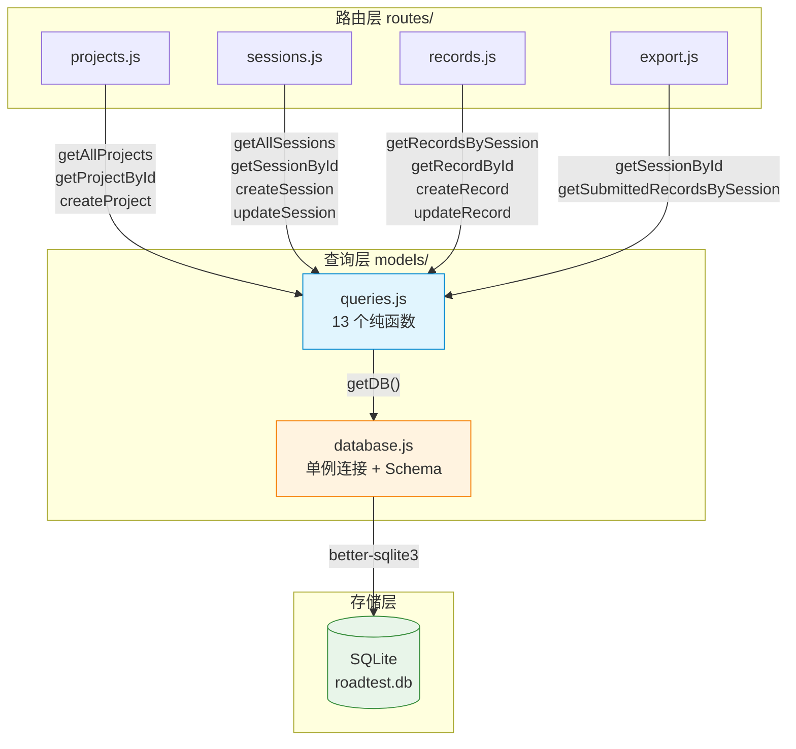
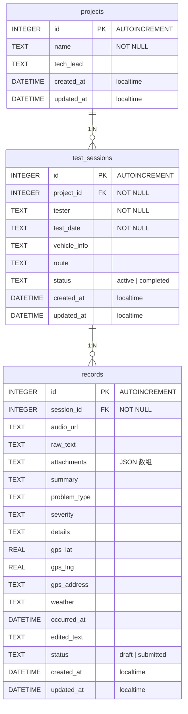

路测助手后端采用了一种**刻意回避 ORM 的数据访问架构**——所有数据库操作直接通过 `better-sqlite3` 驱动手写 SQL 完成。这一选择在 MVP 阶段提供了最大程度的透明性与控制力：每一条查询语句的含义、每一处参数绑定的方式都清晰可辨，不存在 ORM 生成的"魔法 SQL"。整个查询层由两个文件构成——[database.js](server/src/models/database.js) 负责连接管理与 Schema 初始化，[queries.js](server/src/models/queries.js) 提供 13 个纯函数覆盖三个实体的全部 CRUD 操作。路由层直接调用这些函数，返回值即为 JSON 响应体，中间零抽象层损耗。如果你曾在大型项目中与 ORM 的 N+1 查询或隐式事务搏斗，这里的设计哲学会令你耳目一新。

Sources: [database.js](server/src/models/database.js#L1-L73), [queries.js](server/src/models/queries.js#L1-L147)

## 架构总览：双层分离的数据访问

整个 SQL 查询层的核心设计可以概括为 **"连接池单例 + 纯函数查询"** 模式。下方 Mermaid 图展示了从 HTTP 请求到 SQLite 的完整调用链路——路由层 (routes/) 直接解构引入 queries.js 中的函数，这些函数通过 database.js 的 `getDB()` 获取单例连接，执行同步 SQL 操作后将结果原路返回。



这一架构的关键约束是 **同步阻塞**——`better-sqlite3` 的所有 API 都是同步的，这意味着每个查询函数在数据库操作完成前不会返回。对于路测助手这类单用户本地工具来说，这是正确的权衡：同步代码消除了回调地狱和 async/await 的心智负担，SQLite 的本地文件 I/O 延迟通常在微秒级，远不会成为瓶颈。

Sources: [queries.js](server/src/models/queries.js#L1-L147), [database.js](server/src/models/database.js#L1-L73), [projects.js](server/src/routes/projects.js#L1-L30)

## 连接管理：单例模式与数据库初始化

[database.js](server/src/models/database.js) 暴露两个函数——`getDB()` 和 `initDB()`，它们共同构成了数据库的生命周期管理。

**`getDB()`** 采用模块级变量 `let db` 实现经典的懒加载单例：首次调用时创建 `better-sqlite3` 实例，后续调用直接复用。数据库文件路径通过环境变量 `DB_PATH` 可配置，默认落位于项目根目录下的 `data/roadtest.db`。创建过程中有两个关键 pragma 设置：

| Pragma | 作用 | 选择理由 |
|---|---|---|
| `journal_mode = WAL` | 启用 Write-Ahead Logging | 读写并发安全，读操作不阻塞写操作 |
| `foreign_keys = ON` | 启用外键约束 | SQLite 默认关闭外键，需显式开启以保证引用完整性 |

**`initDB()`** 调用 `getDB()` 获取连接后，通过 `db.exec()` 执行三张表的 `CREATE TABLE IF NOT EXISTS` 语句。这里使用 `IF NOT EXISTS` 保证了幂等性——无论调用多少次，已存在的表不会被重建。应用启动时在 [app.js](server/src/app.js#L38) 中调用 `initDB()`，确保数据库在服务监听端口之前就已就绪。

数据库路径自动创建的逻辑也值得注意：如果 `DB_PATH` 指定的目录不存在，`getDB()` 会通过 `fs.mkdirSync({ recursive: true })` 逐级创建。这使得首次启动时不需要任何手动准备工作。

Sources: [database.js](server/src/models/database.js#L5-L20), [database.js](server/src/models/database.js#L22-L71), [app.js](server/src/app.js#L38)

## Schema 设计要点：时间戳策略与约束体系

三张表的 Schema 在 [database.js](server/src/models/database.js#L25-L68) 中定义，每一张表都体现了针对本地工具场景的精细考量：

**projects 表**是最简结构——仅 `name` 为 `NOT NULL`，`tech_lead` 允许为空。`created_at` 和 `updated_at` 统一使用 `datetime('now','localtime')` 作为默认值，这是 SQLite 中获取本地时区时间戳的标准方式（更多细节见 [SQLite 数据库设计与本地时区时间戳策略](9-sqlite-shu-ju-ku-she-ji-yu-ben-di-shi-qu-shi-jian-chuo-ce-lue)）。

**test_sessions 表**通过 `FOREIGN KEY (project_id) REFERENCES projects(id)` 建立与 projects 的关联，并通过 `CHECK(status IN ('active', 'completed'))` 约束状态字段只能取两个合法值。

**records 表**是最复杂的一张表，包含 16 个字段，涵盖音频 URL、原始文本、AI 结构化提取结果（summary / problem_type / severity / details）、GPS 三元组（lat / lng / address）、天气信息等。状态字段同样有 `CHECK` 约束：`status IN ('draft', 'submitted')`。`attachments` 字段以 `TEXT DEFAULT '[]'` 存储 JSON 数组字符串——这是一种轻量级的"JSON 列"方案，在 SQLite 中没有原生 JSON 类型时，通过查询层的序列化/反序列化来保证数据一致性。



Sources: [database.js](server/src/models/database.js#L25-L68)

## 查询函数全景：三种 CRUD 模式

[queries.js](server/src/models/queries.js) 中的 13 个函数可以归纳为 **三种实现模式**，每种模式代表了一种不同的 SQL 构建策略：

| 模式 | 代表函数 | 特征 |
|---|---|---|
| **静态参数绑定** | `getAllProjects`, `getProjectById`, `createProject`, `updateProject` | SQL 语句完全硬编码，参数通过 `?` 占位符传入 |
| **条件分支查询** | `getAllSessions` | 同一函数根据参数有无生成不同的 SQL 语句 |
| **动态字段构建** | `updateRecord` | 运行时遍历允许字段列表，动态拼接 SET 子句 |

Sources: [queries.js](server/src/models/queries.js#L1-L147)

### 模式一：静态参数绑定

这是最常见也最安全的模式。以 `createProject` 为例：

```javascript
// server/src/models/queries.js#L15-L19
function createProject({ name, tech_lead }) {
  const db = getDB();
  const result = db.prepare('INSERT INTO projects (name, tech_lead) VALUES (?, ?)').run(name, tech_lead || null);
  return db.prepare('SELECT * FROM projects WHERE id = ?').get(result.lastInsertRowid);
}
```

这里体现了查询层的一个**核心设计契约**：所有写操作（INSERT / UPDATE）在执行完毕后，都会立即执行一次 SELECT 回读，返回完整的实体对象。这种 **"写后读"（Write-then-Read）** 模式确保调用者拿到的始终是数据库中的真实数据，包含了自动生成的 `id`、`created_at`、`updated_at` 等字段。路由层可以直接将这个返回值作为 JSON 响应发送，无需手动构造。

参数绑定使用 `?` 占位符，由 `better-sqlite3` 的 `prepare().run()` 方法处理值映射，从根本上杜绝了 SQL 注入风险。`tech_lead || null` 的写法确保空字符串会被统一转为 `null`，避免数据库中出现无意义的空串。

Sources: [queries.js](server/src/models/queries.js#L15-L19), [queries.js](server/src/models/queries.js#L10-L13)

### 模式二：条件分支查询

`getAllSessions` 是唯一一个包含条件分支的查询函数。当传入 `projectId` 时追加 `WHERE` 子句，否则返回全部记录：

```javascript
// server/src/models/queries.js#L30-L36
function getAllSessions(projectId) {
  const db = getDB();
  if (projectId) {
    return db.prepare('SELECT * FROM test_sessions WHERE project_id = ? ORDER BY test_date DESC').all(projectId);
  }
  return db.prepare('SELECT * FROM test_sessions ORDER BY test_date DESC').all();
}
```

这里没有使用动态 SQL 拼接，而是直接分写了两条完整的 SQL 语句。这种做法的代价是多了一行重复的 SQL，但好处是每条语句都是静态可审计的——你可以一眼看出每条 SQL 的确切形态，不存在运行时字符串拼接带来的不确定性。在路由层，[sessions.js](server/src/routes/sessions.js#L6-L9) 通过 `req.query.project_id` 可选参数驱动这个分支。

Sources: [queries.js](server/src/models/queries.js#L30-L36), [sessions.js](server/src/routes/sessions.js#L6-L9)

### 模式三：动态字段构建——最复杂的查询函数

`updateRecord` 是整个查询层中最复杂的函数，也是唯一使用运行时 SQL 拼接的地方。由于 records 表有 14 个可更新字段，且前端可能只提交部分字段（PATCH 语义），该函数需要动态决定更新哪些列：

```javascript
// server/src/models/queries.js#L108-L135
function updateRecord(id, data) {
  const db = getDB();
  const existing = getRecordById(id);
  if (!existing) return null;

  const fields = [];
  const values = [];
  const allowedFields = [
    'audio_url', 'raw_text', 'attachments', 'summary', 'problem_type',
    'severity', 'details', 'gps_lat', 'gps_lng', 'gps_address', 'weather',
    'occurred_at', 'edited_text', 'status'
  ];

  for (const field of allowedFields) {
    if (data[field] !== undefined) {
      fields.push(`${field} = ?`);
      values.push(field === 'attachments' ? JSON.stringify(data[field]) : data[field]);
    }
  }

  if (fields.length === 0) return existing;

  fields.push('updated_at = datetime(\'now\',\'localtime\')');
  values.push(id);

  db.prepare(`UPDATE records SET ${fields.join(', ')} WHERE id = ?`).run(...values);
  return getRecordById(id);
}
```

这个实现包含三层防护机制：

1. **字段白名单** (`allowedFields`)：只有列出的 14 个字段才会被纳入 UPDATE 语句，任何其他字段（包括恶意注入的字段名）都会被静默忽略
2. **存在性检查** (`existing`)：先查询记录是否存在，不存在则返回 `null`，路由层据此返回 404
3. **空更新短路** (`fields.length === 0`)：如果 `data` 中没有任何允许字段，直接返回现有记录，避免执行一条无意义的 `UPDATE ... SET updated_at = ... WHERE id = ?`

值得注意的是 `attachments` 字段的特殊处理——它是唯一一个需要 `JSON.stringify()` 的字段，因为前端传入的是数组对象，而数据库列类型是 TEXT。这种"在查询层做类型适配"的做法是无 ORM 架构下的典型模式。

对比之下，`updateSession` 采用了不同的策略——它不使用动态构建，而是**将传入值与已有记录做合并**，用 `||` 和 `!== undefined` 三元运算符为每个字段提供回退值。这种方式更直观，但当字段数增多时会变得难以维护。

Sources: [queries.js](server/src/models/queries.js#L108-L135), [queries.js](server/src/models/queries.js#L51-L66)

## Prepared Statement 的复用机制

`better-sqlite3` 的 `prepare()` 方法返回一个 `Statement` 对象，该对象在内部会编译 SQL 并缓存其执行计划。在路测助手的实现中，每次查询函数被调用时都会执行 `db.prepare(sql).method()`，看起来像是每次都在重新编译 SQL。

然而，`better-sqlite3` 内部维护了一个 **预处理语句缓存**（prepared statement cache），相同 SQL 字符串的 `prepare()` 调用会命中缓存，直接返回已编译的 Statement 对象。这意味着即使代码中没有显式缓存 Statement，性能上也不会因重复编译而受损。这是选择 `better-sqlite3` 相比 `sqlite3`（异步回调版本）的一个重要优势——后者没有内置的语句缓存。

Sources: [queries.js](server/src/models/queries.js#L1-L147), [package.json](server/package.json#L12)

## 路由层集成：查询函数的直接消费

查询层函数在路由中被**同步调用、直接返回**，没有任何中间转换层。以下表格展示了每个路由文件对查询函数的完整依赖关系：

| 路由文件 | 使用的查询函数 | 调用方式 |
|---|---|---|
| [projects.js](server/src/routes/projects.js) | `getAllProjects`, `getProjectById`, `createProject` | 读操作直接 `res.json()`，写操作 `res.status(201).json()` |
| [sessions.js](server/src/routes/sessions.js) | `getAllSessions`, `getSessionById`, `createSession`, `updateSession` | 同上，`updateSession` 返回 `null` 时返回 404 |
| [records.js](server/src/routes/records.js) | `getRecordsBySession`, `getRecordById`, `createRecord`, `updateRecord` | 同上，`session_id` 为必填查询参数 |
| [export.js](server/src/routes/export.js) | `getSessionById`, `getSubmittedRecordsBySession` | 用于 Excel/CSV 导出，仅查已提交记录 |

典型的路由处理函数模式如下：

```javascript
// server/src/routes/records.js#L35-L41
router.put('/:id', (req, res) => {
  const record = updateRecord(Number(req.params.id), req.body);
  if (!record) {
    return res.status(404).json({ error: '记录不存在' });
  }
  res.json(record);
});
```

查询函数返回 `null` 等价于"实体不存在"，路由层据此返回 404；返回对象则直接作为响应体。这种 **"查询函数即服务层"** 的设计在 MVP 阶段足够简洁——但当业务逻辑复杂度增长时，你可能需要在路由和查询之间引入一个 Service 层来承载校验、组合查询等逻辑。

Sources: [records.js](server/src/routes/records.js#L35-L41), [projects.js](server/src/routes/projects.js#L1-L30), [export.js](server/src/routes/export.js#L1-L4)

## 测试策略：独立数据库的隔离验证

查询层的测试在 [queries.test.js](server/tests/queries.test.js) 中实现，采用了**环境变量切换 + 模块缓存清除**的隔离策略：

```javascript
// server/tests/queries.test.js#L4-L12
const TEST_DB_PATH = path.join(__dirname, 'queries-test.db');

beforeAll(() => {
  process.env.DB_PATH = TEST_DB_PATH;
  delete require.cache[require.resolve('../src/models/database')];
  delete require.cache[require.resolve('../src/models/queries')];
  const { initDB } = require('../src/models/database');
  initDB();
});
```

通过 `delete require.cache[...]` 强制 Node.js 重新加载模块，使 `database.js` 中的 `DB_PATH` 读取到测试专用路径。`afterAll` 中关闭数据库连接并清理测试文件（包括 WAL 和 SHM 文件）。测试用例覆盖了三个实体的完整 CRUD 流程，特别验证了 `status` 字段的约束行为和 `getSubmittedRecordsBySession` 的过滤逻辑。

[database.test.js](server/tests/database.test.js) 则更底层——它直接通过 `db.prepare()` 执行原始 SQL 来验证 Schema 约束，包括 `CHECK(status IN (...))` 对非法状态值的拒绝（期望 `toThrow()`）。

Sources: [queries.test.js](server/tests/queries.test.js#L1-L26), [database.test.js](server/tests/database.test.js#L81-L103)

## 设计权衡与扩展边界

这套无 ORM 方案的核心优势是 **透明性**——你能精确知道每条 SQL 的形态、每个参数的来源、每次查询的返回结构。但它也存在明确的扩展边界：

| 维度 | 当前方案 | 增长后的风险 |
|---|---|---|
| **查询复杂度** | 13 个函数、单表查询 | 多表 JOIN、聚合统计需要手写复杂 SQL |
| **字段数量** | records 表 16 字段 | `updateRecord` 的动态构建模式在 30+ 字段时仍可维护 |
| **事务需求** | 无跨表事务 | 需要 `db.transaction()` 包装多步操作 |
| **类型安全** | JavaScript 动态类型 | 无编译期字段名校验，拼写错误只能靠测试捕获 |
| **连接并发** | 单用户本地工具 | 多用户场景需要连接池或切换至异步驱动 |

当项目演进需要引入事务时，`better-sqlite3` 提供了 `db.transaction(fn)` 方法，可以无缝嵌入现有架构而不需要重构查询层。这也是选择同步驱动的另一个隐性优势——事务代码的编写和理解都比异步版本简单得多。

Sources: [queries.js](server/src/models/queries.js#L1-L147), [database.js](server/src/models/database.js#L1-L73)

## 延伸阅读

- 要了解三张表之间的实体关系和业务语义，请参阅 [三层实体关系：项目 → 试验 → 记录](8-san-ceng-shi-ti-guan-xi-xiang-mu-shi-yan-ji-lu)
- 要了解时间戳字段的 `localtime` 策略细节，请参阅 [SQLite 数据库设计与本地时区时间戳策略](9-sqlite-shu-ju-ku-she-ji-yu-ben-di-shi-qu-shi-jian-chuo-ce-lue)
- 要了解调用这些查询函数的路由层设计，请参阅 [RESTful API 路由设计（Projects / Sessions / Records / Upload / Export / AI）](11-restful-api-lu-you-she-ji-projects-sessions-records-upload-export-ai)
- 要了解测试隔离的具体实现，请参阅 [Jest + Supertest 测试策略与数据库隔离方案](24-jest-supertest-ce-shi-ce-lue-yu-shu-ju-ku-ge-chi-fang-an)