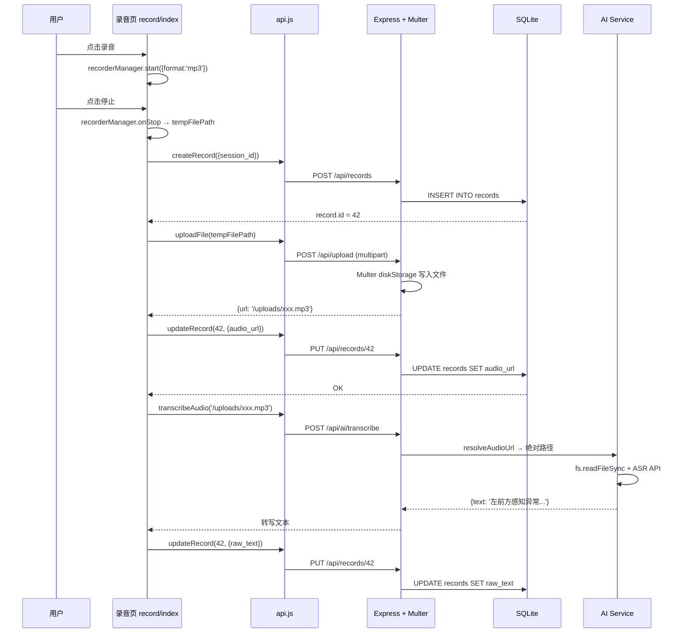

本篇深入解析路测助手中文件上传子系统的完整架构——从 Multer 磁盘存储引擎的精细化配置、Express 静态资源中间件的挂载策略，到文件在前后端之间的完整生命周期。读者将理解录音、照片、视频等媒体文件如何从前端 UniApp 采集 → Multer 持久化到磁盘 → 通过静态资源 URL 被 AI 适配器消费，形成一条完整的数据管道。

Sources: [upload.js](server/src/routes/upload.js#L1-L68), [app.js](server/src/app.js#L1-L47)

## 架构总览：文件的两条路径

上传的文件在系统中存在两条截然不同的访问路径，理解这一点是掌握整个文件子系统的关键。**磁盘路径**用于服务端内部读取（如 AI 适配器读取音频文件进行 ASR 转写），**HTTP 路径**用于客户端回放和展示（如在前端播放录音、查看照片附件）。Express 的 `express.static` 中间件充当这两条路径的桥梁——将 URL 前缀 `/uploads` 映射到物理目录 `server/uploads/`。

```mermaid
flowchart TD
    subgraph Frontend["前端 UniApp"]
        A["uni.getRecorderManager()<br/>录音 → tempFilePath"] --> B["uni.uploadFile()<br/>POST /api/upload"]
        C["uni.chooseImage()"] --> B
        D["uni.chooseVideo()"] --> B
    end

    subgraph Server["Express 后端"]
        B --> E["Multer diskStorage<br/>destination → server/uploads/<br/>filename → {ts}-{rand}{ext}"]
        E --> F["响应 JSON<br/>{ url: '/uploads/xxx.mp3' }"]
        F -->|存入 DB| G["records.audio_url<br/>records.attachments"]
        
        H["express.static<br/>/uploads → server/uploads/"] --> I["HTTP GET<br/>/uploads/xxx.mp3"]
        
        J["AI 适配器 (ASR)"] -->|resolveAudioUrl()| K["fs.readFileSync()<br/>磁盘绝对路径"]
    end

    F --> L["前端回放"]
    L --> I
    G --> J
    
    style Frontend fill:#e6f7ff,stroke:#1890ff
    style Server fill:#fff7e6,stroke:#fa8c16
```

Sources: [api.js](client/services/api.js#L101-L117), [upload.js](server/src/routes/upload.js#L14-L37), [app.js](server/src/app.js#L15-L16), [ai-service.js](server/src/services/ai-service.js#L6-L11)

## Multer 磁盘存储引擎配置

路测助手没有使用 Multer 的默认内存存储，而是通过 `multer.diskStorage` 工厂函数精确控制文件的**存储位置**和**命名策略**。这一选择至关重要——音频文件可能达到数十 MB，内存存储会导致服务端 OOM；磁盘存储则允许处理大文件而不受进程内存限制。

### 存储目录与自动创建

`UPLOAD_DIR` 指向 `server/uploads/`，通过 `path.join(__dirname, '..', '..', 'uploads')` 计算得到。模块加载时即检测目录是否存在，若不存在则以 `recursive: true` 模式创建，确保首次部署时无需手动建目录。

Sources: [upload.js](server/src/routes/upload.js#L7-L12)

### 文件名生成策略：时间戳 + 随机后缀

```javascript
filename: (req, file, cb) => {
    const ext = path.extname(file.originalname);
    const name = `${Date.now()}-${Math.random().toString(36).slice(2, 8)}${ext}`;
    cb(null, name);
}
```

文件名格式为 `{毫秒时间戳}-{6位Base36随机字符}{原始扩展名}`，例如 `1775830553318-r5rcr9.mp3`。这种命名方案有三个设计考量：**时间戳前缀**保证同一毫秒内不同文件的字典序排列；**6位 Base36 随机字符**（`Math.random().toString(36).slice(2, 8)`）提供约 21.7 亿种组合，足以消除时间戳碰撞；**保留原始扩展名**确保 MIME 类型推断的准确性。注意这里刻意不使用原始文件名——避免中文路径、特殊字符和同名冲突带来的问题。

Sources: [upload.js](server/src/routes/upload.js#L18-L23)

### 安全约束：大小限制与类型白名单

Multer 配置中包含两层防御性约束：

| 约束维度 | 配置值 | 设计意图 |
|---------|--------|---------|
| 单文件大小 | `100 * 1024 * 1024`（100 MB） | 覆盖长时间录音和高分辨率视频场景 |
| 扩展名白名单 | `.mp3 .wav .m4a .aac .ogg .mp4 .jpg .jpeg .png .mov` | 仅允许音频、图片、视频三类媒体格式 |
| 多文件数量 | `array('files', 10)` | 单次批量上传上限 10 个文件 |

文件类型过滤通过 `fileFilter` 回调实现。扩展名从 `file.originalname` 中提取并转为小写后与白名单比对；不匹配时返回 `Error('不支持的文件类型: ${ext}')`，Multer 会将此错误传递给 Express 错误处理中间件。值得注意的是，过滤仅基于扩展名而非文件魔数（Magic Number），这在路测助手的受控环境中是合理的权衡——用户是可信的内部测试人员，而非不可信的公共用户。

Sources: [upload.js](server/src/routes/upload.js#L25-L37)

## 双端点设计：单文件上传与批量上传

路由模块暴露了两个端点，分别服务于不同的前端场景：

**`POST /api/upload`** — 单文件上传，使用 `upload.single('file')` 中间件。前端录音页在录音完成后、拍照/录像后各调用一次此端点。成功响应返回 HTTP 201 和文件的元信息：

```json
{
  "url": "/uploads/1775830553318-r5rcr9.mp3",
  "filename": "1775830553318-r5rcr9.mp3",
  "size": 524288,
  "mimetype": "audio/mpeg"
}
```

**`POST /api/upload/multiple`** — 批量上传，使用 `upload.array('files', 10)` 中间件，上限 10 个文件。返回 JSON 数组，每个元素的结构与单文件响应一致。当前前端未使用此端点，但它为未来「批量导入历史录音」等功能预留了扩展点。

Sources: [upload.js](server/src/routes/upload.js#L39-L65)

## 静态资源托管：Express Static 中间件

文件上传到磁盘后，需要通过 HTTP URL 才能被前端访问。这是在 `app.js` 中通过一行代码实现的：

```javascript
app.use('/uploads', express.static(path.join(__dirname, '..', 'uploads')));
```

此配置将 URL 路径前缀 `/uploads` 映射到物理目录 `server/uploads/`。当前端请求 `GET /uploads/1775830553318-r5rcr9.mp3` 时，Express 的 static 中间件会在对应目录中查找文件，自动设置 `Content-Type`、`Content-Length` 等 HTTP 头，并支持 Range 请求（部分内容传输）——这对音频/视频文件的渐进式播放至关重要。

该中间件注册在 CORS 和 JSON 解析之后、业务路由之前（第 16 行），确保所有 `/uploads` 开头的请求优先匹配静态文件，不会被后续路由拦截。

Sources: [app.js](server/src/app.js#L10-L16)

## URL 到磁盘路径的桥梁：resolveAudioUrl

前端上传文件后获得相对 URL（如 `/uploads/xxx.mp3`），此 URL 有两个消费方：前端通过 `BASE_URL + url` 拼接成完整 HTTP 地址来回放媒体；后端 AI 适配器需要将此 URL 解析为磁盘绝对路径来读取文件内容。`ai-service.js` 中的 `resolveAudioUrl` 函数承担了后者：

```javascript
function resolveAudioUrl(audioUrl) {
  if (audioUrl && audioUrl.startsWith('/uploads/')) {
    return path.join(__dirname, '..', '..', 'uploads', path.basename(audioUrl));
  }
  return audioUrl;
}
```

该函数检测 URL 是否以 `/uploads/` 开头，若是则提取 `path.basename`（防止路径遍历攻击）并拼接为绝对路径，如 `D:\Projects\路测助手\server\uploads\1775830553318-r5rcr9.mp3`。智谱 GLM 适配器的 `speechToText` 方法随后通过 `fs.readFileSync()` 读取此路径的文件内容，构造 multipart/form-data 请求发送给 ASR API。

Sources: [ai-service.js](server/src/services/ai-service.js#L6-L11), [zhipu-adapter.js](server/src/services/zhipu-adapter.js#L45-L71)

## 前端上传封装：uni.uploadFile 与字段名契约

UniApp 框架的文件上传不走 `uni.request`，而是使用专属的 `uni.uploadFile` API。前端 `api.js` 中的 `uploadFile` 函数封装了这一差异：

```javascript
export function uploadFile(filePath) {
  return new Promise((resolve, reject) => {
    uni.uploadFile({
      url: BASE_URL + '/api/upload',
      filePath,
      name: 'file',  // 字段名必须与 Multer 的 upload.single('file') 一致
      success: (res) => {
        if (res.statusCode === 201) {
          resolve(JSON.parse(res.data));
        }
      },
    });
  });
}
```

`name: 'file'` 参数是前后端之间的隐式契约——它对应 Multer 中 `upload.single('file')` 的字段名。如果两侧不一致，Multer 不会解析到文件，`req.file` 将为 `undefined`，导致 400 错误。此外，`uni.uploadFile` 的响应体是字符串而非自动解析的 JSON，因此需要手动 `JSON.parse(res.data)`。

Sources: [api.js](client/services/api.js#L101-L117)

## 完整文件生命周期：从前端采集到数据库持久化

以最核心的**录音上传 → ASR 转写**流程为例，文件贯穿以下阶段：



Sources: [record/index.vue](client/pages/record/index.vue#L218-L241), [ai.js](server/src/routes/ai.js#L7-L19), [queries.js](server/src/models/queries.js#L80-L106)

### 附件上传的差异化路径

照片和视频的上传走一条更轻量的路径。`takePhoto` 和 `chooseVideo` 方法调用 `uploadFile` 后，返回的 URL 被推入 `attachments` 数组而非单独的数据库字段：

```javascript
this.attachments.push({ type: 'photo', url: uploadResult.url });
```

`attachments` 数组在 `saveDraft` 定时器（每 3 秒）或 `submitRecord` 时被整体序列化为 JSON 字符串写入 `records.attachments` 字段。这种设计意味着附件 URL 存储为 `[{"type":"photo","url":"/uploads/xxx.jpg"}]` 格式的 JSON 文本，读取时需要 `JSON.parse` 反序列化。

Sources: [record/index.vue](client/pages/record/index.vue#L290-L315), [queries.js](server/src/models/queries.js#L92-L94)

## 版本控制与磁盘管理

`.gitignore` 通过通配符排除 `uploads/` 下的 `.mp3`、`.jpg`、`.mp4` 文件，避免用户数据进入版本库。但注意 `.gitkeep` 不在 uploads 目录中——目录的自动创建由 Multer 配置保证，不依赖 Git 的目录占位文件。当前系统没有实现文件清理机制——已上传的文件会无限累积在 `server/uploads/` 目录中。对于 MVP 阶段这是可接受的，但生产部署时需要考虑基于记录状态的定期清理策略。

Sources: [.gitignore](server/.gitignore#L1-L7), [upload.js](server/src/routes/upload.js#L9-L12)

## 错误处理与边界情况

Multer 的错误会传递到 Express 的全局错误处理中间件。当前处理策略是统一的 500 响应 `{ error: 'Internal server error' }`，没有针对文件上传场景的差异化错误消息。以下是关键的边界情况及其处理方式：

| 场景 | 触发条件 | 系统行为 |
|------|---------|---------|
| 无文件上传 | `upload.single('file')` 但请求无文件 | `req.file` 为 `undefined`，返回 400 |
| 文件类型不合法 | 扩展名不在白名单 | Multer 传递 `Error` 到错误中间件，返回 500 |
| 文件过大 | 超过 100MB | Multer 抛出 `LIMIT_FILE_SIZE` 错误 |
| 批量上传为空 | `upload.array` 但无文件 | `req.files` 为空数组，返回 400 |
| 目录不存在 | 首次部署 | 模块加载时自动 `mkdirSync` |

Sources: [upload.js](server/src/routes/upload.js#L40-L51), [app.js](server/src/app.js#L32-L35)

## 延伸阅读

本文聚焦于文件上传与静态托管的实现细节。如需理解文件上传后如何被 AI 服务消费，请参阅 [可插拔适配器模式：BaseAdapter 抽象与单例选择器](14-ke-cha-ba-gua-pei-qi-mo-shi-baseadapter-chou-xiang-yu-dan-li-xuan-ze-qi) 和 [智谱 GLM 适配器实现（ASR + 结构化提取）](15-zhi-pu-glm-gua-pei-qi-shi-xian-asr-jie-gou-hua-ti-qu)。上传路由在整体 API 设计中的位置请参阅 [RESTful API 路由设计](11-restful-api-lu-you-she-ji-projects-sessions-records-upload-export-ai)。前端录音页完整调用链路请参阅 [核心录音页：录音 → 上传 → ASR → AI 分析的完整实现](20-he-xin-lu-yin-ye-lu-yin-shang-chuan-asr-ai-fen-xi-de-wan-zheng-shi-xian)。