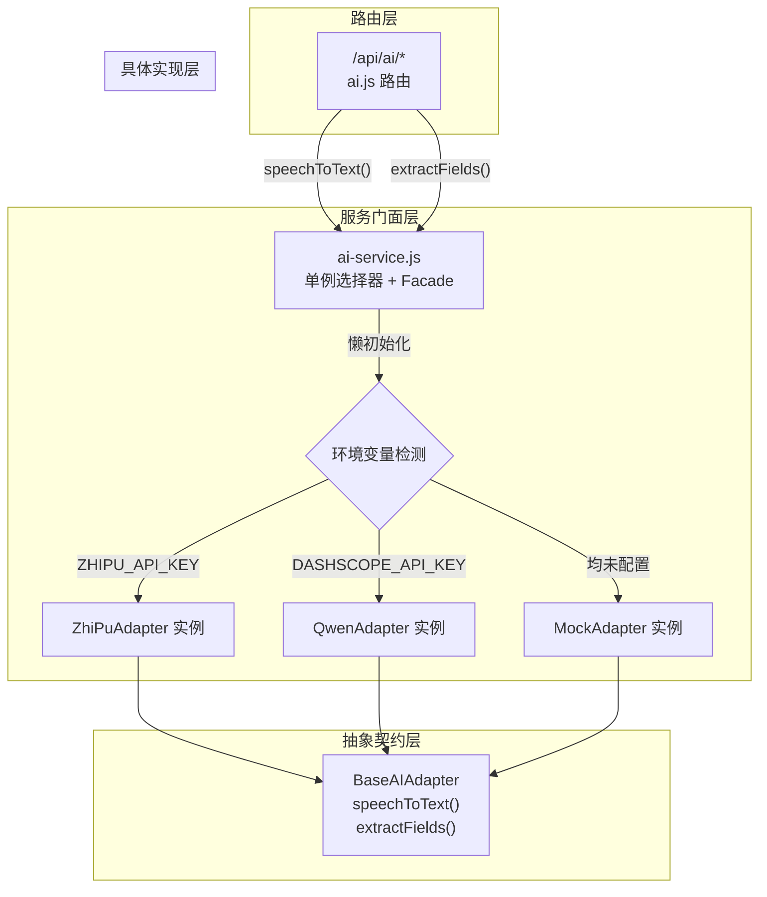

路测助手的 AI 能力（语音转写、结构化提取）并非绑定于某个特定大模型厂商，而是通过一套 **适配器抽象层** 实现厂商无关的调用。这套体系的核心由三个角色构成：**BaseAIAdapter** 定义接口契约，**具体适配器**（ZhiPuAdapter / QwenAdapter / MockAdapter）封装厂商差异，**ai-service.js** 作为单例选择器对外提供统一门面。本文聚焦于这套可插拔架构的设计原理、选择器机制及其可测试性保障。

Sources: [base-adapter.js](server/src/services/base-adapter.js#L1-L25), [ai-service.js](server/src/services/ai-service.js#L1-L48)

## 架构全景：三层角色与协作关系

在深入每个组件之前，先理解整体分层结构。下图展示了从路由层到适配器层的完整调用链路，以及环境变量如何驱动适配器选择：



**关键设计决策**：路由层不直接 `require` 任何具体适配器——它只与 `ai-service.js` 的门面函数交互。这意味着替换底层 AI 厂商时，路由代码零改动。

Sources: [ai.js](server/src/routes/ai.js#L1-L35), [ai-service.js](server/src/services/ai-service.js#L1-L48)

## BaseAIAdapter：接口契约与「虚方法」模式

`BaseAIAdapter` 是一个纯抽象基类，不包含任何业务逻辑，仅定义两个必须被覆盖的方法签名：

| 方法 | 输入 | 输出 | 语义 |
|------|------|------|------|
| `speechToText(audioUrl)` | 音频文件路径、URL 或 base64 data URI | `Promise<string>` | ASR 语音转写 |
| `extractFields(text)` | 路测记录文本 | `Promise<{summary, problemType, severity, details}>` | LLM 结构化提取 |

**实现约束**：两个方法体均直接 `throw new Error('... not implemented')`，这是一种 JavaScript 中常见的「虚方法」惯用写法——不借助 TypeScript 的 `abstract` 关键字，也能在运行时强制子类必须覆盖。如果某个具体适配器遗漏了某个方法的实现，调用时会立即抛出明确的错误信息。

值得注意的是，`extractFields` 的返回值约定了四个固定字段（`summary`、`problemType`、`severity`、`details`），这是一个跨适配器的**数据契约**。无论底层使用智谱 GLM 还是通义千问，上层消费者都能以统一结构接收结果。

Sources: [base-adapter.js](server/src/services/base-adapter.js#L4-L24)

## 单例选择器：环境变量驱动的懒初始化

`ai-service.js` 承担了三个职责：**适配器选择**、**实例缓存**、**门面代理**。

### 选择策略

选择器的决策逻辑遵循优先级链：`ZHIPU_API_KEY` → `DASHSCOPE_API_KEY` → Mock 降级。这不是简单的 `if-else`——它体现了项目对**运行环境自适应**的设计意图：

```
优先级 1：智谱 GLM（推荐，项目首选）
优先级 2：通义千问（备选，同等能力）
兜底：Mock 适配器（零配置可运行）
```

三档降级确保了三种场景的平滑覆盖：生产部署使用真实 AI 服务，CI 环境通过 Mock 绕过外部依赖，开发者试用时无需任何 API Key 即可跑通全流程。

Sources: [ai-service.js](server/src/services/ai-service.js#L13-L33), [.env.example](server/.env.example#L1-L10)

### 懒初始化与实例缓存

`getAdapter()` 函数采用经典的**懒汉式单例**——模块级变量 `adapter` 初始为 `null`，首次调用时根据环境变量实例化具体适配器并缓存，后续调用直接复用同一实例：

```javascript
let adapter = null;          // 模块级单例句柄

function getAdapter() {
  if (!adapter) {            // 首次调用触发初始化
    if (process.env.ZHIPU_API_KEY) {
      adapter = new ZhiPuAdapter();
    } else if (process.env.DASHSCOPE_API_KEY) {
      adapter = new QwenAdapter();
    } else {
      adapter = new MockAdapter();
    }
  }
  return adapter;            // 后续调用直接返回缓存实例
}
```

**设计权衡**：这种模式的优势在于应用启动时零开销——直到首次 AI 请求到来才创建适配器实例。但也带来了一个隐含约束：**运行期间无法通过修改环境变量动态切换适配器**，因为 `process.env` 的读取只发生一次。如需运行时切换，必须调用 `setAdapter()`。

Sources: [ai-service.js](server/src/services/ai-service.js#L15-L37)

## 门面函数：统一调用接口与 URL 预处理

`ai-service.js` 导出的 `speechToText()` 和 `extractFields()` 是两个门面函数，它们在委托给适配器之前完成了**参数预处理**：

`speechToText` 门面在调用适配器之前，通过 `resolveAudioUrl()` 将 Web 相对路径（如 `/uploads/xxx.mp3`）转换为服务器本地文件系统绝对路径。这一层转换至关重要——前端传入的是 HTTP 上下文中的相对 URL，而智谱 GLM 适配器需要读取本地文件进行 multipart 上传。适配器本身不应关心路径解析逻辑，这是门面层的职责。

Sources: [ai-service.js](server/src/services/ai-service.js#L6-L11), [ai-service.js](server/src/services/ai-service.js#L39-L45)

## setAdapter：可测试性的关键出口

`setAdapter(newAdapter)` 函数虽然在生产代码中不被调用，却是整个适配器体系的**可测试性锚点**。它允许测试用例在 `beforeEach` 中注入 MockAdapter 或自定义 stub，确保单元测试不依赖外部 AI 服务：

```javascript
// 测试中的典型用法
beforeEach(() => {
  setAdapter(new MockAdapter());  // 每个测试前重置为 Mock
});

test('适配器可替换', async () => {
  const custom = new MockAdapter();
  custom.speechToText = async () => 'custom result';  // 方法级 stub
  setAdapter(custom);
  const text = await speechToText('url');
  expect(text).toBe('custom result');
});
```

这种设计使得 `ai-service.js` 成为一个**可注入的依赖容器**：生产环境通过环境变量自动装配，测试环境通过 `setAdapter` 手动注入。两种场景共享同一套门面函数，保证了测试路径与生产路径的完全一致性。

Sources: [ai-service.js](server/src/services/ai-service.js#L35-L37), [ai-service.test.js](server/tests/ai-service.test.js#L1-L30)

## 具体适配器对比：构造参数与能力差异

虽然三个适配器的详细实现属于各自文档的范畴，此处从架构视角对比它们的构造参数与初始化差异，帮助理解选择器如何适配不同厂商的配置模式：

| 维度 | ZhiPuAdapter | QwenAdapter | MockAdapter |
|------|-------------|-------------|-------------|
| 环境变量 Key | `ZHIPU_API_KEY` | `DASHSCOPE_API_KEY` | 无需配置 |
| ASR 模型默认值 | `glm-asr-2512` | `qwen3-asr-flash` | — |
| Chat 模型默认值 | `glm-4-flash` | `qwen-plus` | — |
| 构造函数参数 | `apiKey`, `baseUrl`, `asrModel`, `chatModel` | 同左 | 无参 |
| ASR 输入格式 | 本地文件 / URL / base64 三路分支 | 单一 URL 直传 | 忽略输入 |
| JSON 解析策略 | 手动正则兜底 | 手动正则兜底 + `response_format` | 硬编码返回 |

**共同模式**：所有适配器的构造函数均接受可选 `config` 对象，允许通过代码覆盖默认模型和 API 地址。这种 **约定优于配置** 的设计使得零配置即可运行（环境变量提供默认值），同时保留了高级定制的可能性。

Sources: [zhipu-adapter.js](server/src/services/zhipu-adapter.js#L21-L28), [qwen-adapter.js](server/src/services/qwen-adapter.js#L19-L26), [mock-adapter.js](server/src/services/mock-adapter.js#L3-L16)

## 扩展新适配器的接入规范

基于现有架构，接入一个新的 AI 厂商（如百度文心、讯飞星火）只需遵循以下步骤：

1. **创建适配器文件** `server/src/services/xxx-adapter.js`，继承 `BaseAIAdapter`，实现 `speechToText()` 和 `extractFields()` 两个方法
2. **在选择器中注册**：在 `ai-service.js` 的 `getAdapter()` 函数中新增 `else if` 分支，检测对应的环境变量 Key
3. **在路由层无需改动**：`/api/ai/*` 路由只消费 `ai-service.js` 的门面函数，天然适配新适配器
4. **编写测试**：在 `ai-service.test.js` 中通过 `setAdapter()` 注入新适配器实例，验证方法签名与返回结构

整个接入过程的**改动隔离性**体现在：新增一个文件 + 修改 `ai-service.js` 一处选择逻辑，其余模块完全不受影响。这正是可插拔架构的核心价值。

Sources: [ai-service.js](server/src/services/ai-service.js#L17-L33), [ai-service.test.js](server/tests/ai-service.test.js#L23-L29)

## 延伸阅读

- **适配器的具体实现细节**：参见 [智谱 GLM 适配器实现（ASR + 结构化提取）](15-zhi-pu-glm-gua-pei-qi-shi-xian-asr-jie-gou-hua-ti-qu) 和 [通义千问适配器实现与对比](16-tong-yi-qian-wen-gua-pei-qi-shi-xian-yu-dui-bi)
- **零配置降级方案**：参见 [Mock 适配器：无 API Key 时的降级方案](17-mock-gua-pei-qi-wu-api-key-shi-de-jiang-ji-fang-an)
- **环境变量配置细节**：参见 [环境变量配置与 API Key 管理](25-huan-jing-bian-liang-pei-zhi-yu-api-key-guan-li)
- **调用端路由设计**：参见 [RESTful API 路由设计（Projects / Sessions / Records / Upload / Export / AI）](11-restful-api-lu-you-she-ji-projects-sessions-records-upload-export-ai)
- **测试策略**：参见 [Jest + Supertest 测试策略与数据库隔离方案](24-jest-supertest-ce-shi-ce-lue-yu-shu-ju-ku-ge-chi-fang-an)