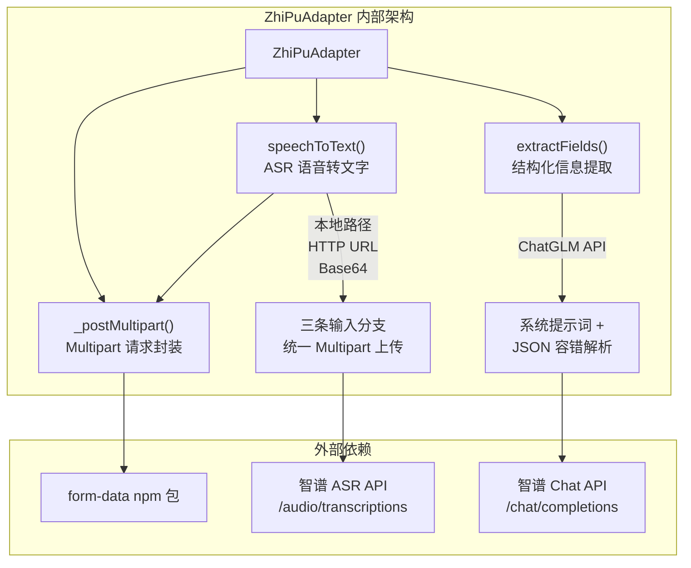
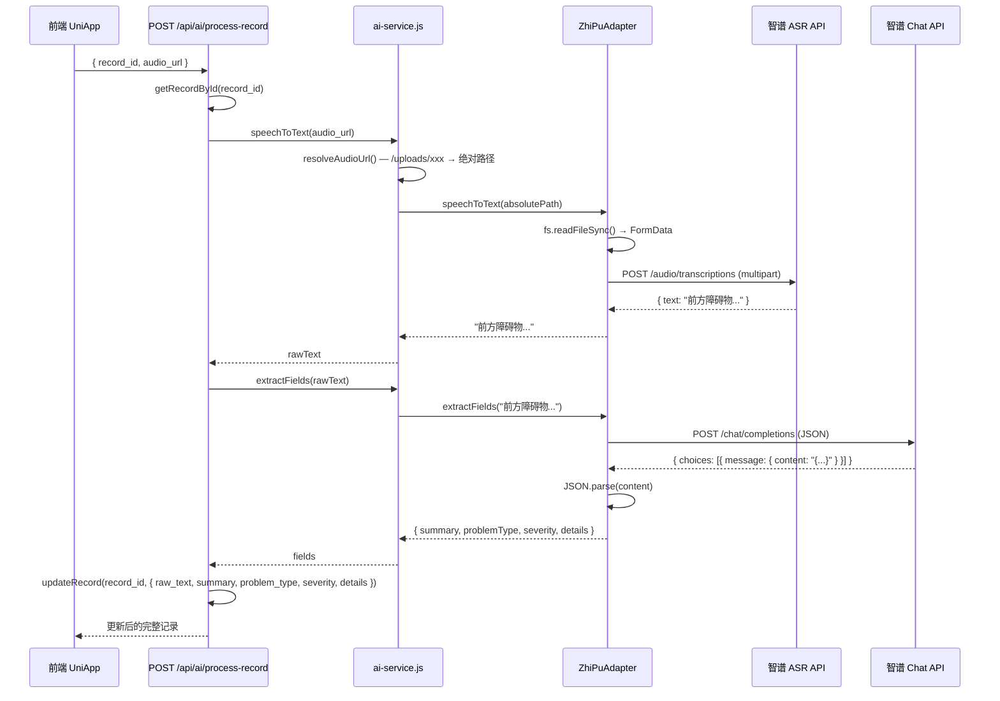

本文档深入解析 **ZhiPuAdapter** 的完整实现——它是路测助手 AI 适配器体系中基于智谱 AI（ZhiPu GLM）的默认适配器实现，负责将语音文件转为文字（ASR）并从路测记录中提取结构化字段。阅读前建议先理解 [可插拔适配器模式：BaseAdapter 抽象与单例选择器](14-ke-cha-ba-gua-pei-qi-mo-shi-baseadapter-chou-xiang-yu-dan-li-xuan-ze-qi) 中定义的接口契约，本文档聚焦于智谱适配器自身的构造设计、网络请求细节、多源音频处理策略以及 JSON 解析的容错机制。

Sources: [zhipu-adapter.js](server/src/services/zhipu-adapter.js#L1-L176)

## 架构定位与职责边界

ZhiPuAdapter 继承自 `BaseAIAdapter`，实现了两个核心抽象方法 `speechToText()` 和 `extractFields()`。在 [ai-service.js](server/src/services/ai-service.js) 的单例选择器中，当环境变量 `ZHIPU_API_KEY` 存在时，它会被优先实例化，成为全局唯一的 AI 后端。



适配器通过 **两个独立的智谱 API 端点** 完成工作：ASR 端点负责语音转写，Chat 端点负责结构化提取。两者共享 `apiKey` 和 `baseUrl` 配置，但使用不同的模型。

Sources: [base-adapter.js](server/src/services/base-adapter.js#L1-L25), [ai-service.js](server/src/services/ai-service.js#L1-L48), [zhipu-adapter.js](server/src/services/zhipu-adapter.js#L21-L28)

## 构造函数与配置体系

ZhiPuAdapter 的构造函数接收一个可选的 `config` 对象，所有参数均有合理的默认值回退链——先取 `config` 传入值，再取环境变量，最后使用硬编码默认值。

| 配置项 | `config` 键 | 环境变量回退 | 默认值 | 用途 |
|--------|------------|-------------|--------|------|
| API 密钥 | `config.apiKey` | `ZHIPU_API_KEY` | 无 | Bearer Token 认证 |
| API 基地址 | `config.baseUrl` | 无 | `https://open.bigmodel.cn/api/paas/v4` | 智谱开放平台端点 |
| ASR 模型 | `config.asrModel` | 无 | `glm-asr-2512` | 语音识别模型 |
| Chat 模型 | `config.chatModel` | 无 | `glm-4-flash` | 结构化提取模型 |

这种三层回退设计使得适配器在**零配置**时即可工作（只需设置 `ZHIPU_API_KEY`），同时也支持在测试场景中通过 `config` 参数完全覆盖行为。`glm-4-flash` 的选择兼顾了响应速度与成本——结构化提取对推理能力的要求不高，快速返回对用户体验更为关键。

Sources: [zhipu-adapter.js](server/src/services/zhipu-adapter.js#L21-L28)

## `_postMultipart()` — form-data 与原生 fetch 的兼容桥接

这个私有方法解决了一个 Node.js 运行时层面的关键问题：**`form-data` npm 包产生的流（Stream）对象与 Node.js 原生 `fetch` 不兼容**。`form-data` 的 pipe 流在传递给原生 `fetch` 时，`Content-Length` 头无法被自动推断，导致请求失败。解决方案是调用 `form.getBuffer()` 将整个表单序列化为 Buffer，并手动设置 `Content-Length` 头。

```
_postMultipart(url, form)
  ├── form.getBuffer()         → 将 multipart 表单序列化为完整 Buffer
  ├── Content-Length            → 从 buffer.length 显式计算
  ├── form.getHeaders()        → 获取 boundary 等 multipart 头信息
  └── fetch(url, { method, headers, body: formBuffer })
```

这种"全量缓冲"策略的代价是内存占用——对于大文件会一次性加载到内存中。但在路测场景中，单条录音通常在 30 秒以内（MP3 格式约几百 KB），内存压力可以忽略不计。

Sources: [zhipu-adapter.js](server/src/services/zhipu-adapter.js#L31-L43), [CLAUDE.md](CLAUDE.md#L47)

## `speechToText()` — 三源统一的 ASR 管线

`speechToText()` 方法的核心设计是**三种音频输入格式的统一处理**。无论输入是本地文件路径、远程 HTTP URL 还是 Base64 data URI，最终都被转化为 `multipart/form-data` 格式发送到智谱 ASR 端点 `/audio/transcriptions`。

| 输入格式 | 检测条件 | 处理方式 | MIME 推断 |
|---------|---------|---------|----------|
| 本地文件路径 | 以 `/`、`file://` 或 Windows 盘符开头 | `fs.readFileSync()` 直接读取 | `.mp3` → `audio/mpeg`，其余 → `audio/wav` |
| HTTP/HTTPS URL | 以 `http` 开头 | 先 `fetch` 下载为 ArrayBuffer，再转 Buffer | 从 URL 路径取扩展名推断 |
| Base64 data URI | 以 `data:` 开头 | 正则提取 MIME 和 base64 数据，`Buffer.from()` 解码 | 从 data URI 前缀提取 |

三条分支的逻辑高度对称——都经历了 **获取 Buffer → 构建 FormData → 调用 `_postMultipart()` → 解析响应** 的流程。唯一的差异在于 Buffer 的来源：`fs.readFileSync`、`fetch + arrayBuffer` 或 `Buffer.from(base64)`。

MIME 类型推断的策略是**二元简化**：仅区分 MP3 和 WAV 两种格式。这在路测场景中足够——录音设备输出的格式通常是固定的（通过 `uni.getRecorderManager()` 默认输出 MP3）。若未来需要支持更多格式（如 OGG、M4A），则需要引入更完善的 MIME 映射表。

**重要限制**：智谱 ASR 对音频时长有约 30 秒的限制。CLAUDE.md 中记录了这一已知问题，并建议在长录音场景下切换至通义千问适配器。

Sources: [zhipu-adapter.js](server/src/services/zhipu-adapter.js#L45-L134), [CLAUDE.md](CLAUDE.md#L87)

## `extractFields()` — 结构化提取与 JSON 容错解析

结构化提取通过智谱 Chat API 实现，核心机制是**精心设计的系统提示词**引导 GLM 模型输出严格的 JSON 格式。提示词定义了路测领域的四维结构化模式：

| 字段 | 语义 | 值域约束 |
|------|------|---------|
| `summary` | 一句话问题描述 | 自由文本 |
| `problemType` | 问题分类 | `感知异常`、`规划异常`、`控制异常`、`接管`、`系统故障`、`其他` 六选一 |
| `severity` | 严重程度 | `致命`、`严重`、`一般`、`轻微` 四选一 |
| `details` | 补充细节描述 | 自由文本，信息不足时为 `null` |

API 请求设置了 `temperature: 0.1`——极低的温度值确保输出的确定性，因为结构化提取场景要求**每次相同输入产生一致的分类结果**，而非创造性输出。系统提示词末尾的"只返回JSON，不要其他内容"指令试图让模型输出干净的 JSON，但 LLM 并不总是严格遵从这一约束。

因此，`extractFields()` 实现了**双层 JSON 解析容错**：首先尝试直接 `JSON.parse(content)`；若失败，则用正则 `/\{[\s\S]*\}/` 从可能的 markdown 代码块或多余文本中提取第一个 JSON 对象。这种防御性编程模式在实际运行中至关重要——模型偶尔会在 JSON 前后附加解释性文字。

Sources: [zhipu-adapter.js](server/src/services/zhipu-adapter.js#L136-L172)

## 端到端数据流：从路由到适配器

以下时序图展示了前端发起录音处理请求后，数据经过路由层、服务层最终到达智谱 API 的完整流转过程：



路由层中的 `process-record` 端点是这一流程的编排者——它将 ASR 和结构化提取串联为**同步管线**：先转录语音，再提取结构化字段，最后将所有结果一次性写入数据库。`ai-service.js` 中的 `resolveAudioUrl()` 函数在这一流程中扮演关键角色：将前端传入的 `/uploads/xxx` 相对路径转换为服务器上的绝对文件系统路径，使适配器的 `speechToText()` 能正确识别这是一个本地文件并走 `fs.readFileSync` 分支。

Sources: [ai.js](server/src/routes/ai.js#L36-L72), [ai-service.js](server/src/services/ai-service.js#L5-L11), [zhipu-adapter.js](server/src/services/zhipu-adapter.js#L45-L172)

## 与其他适配器的关键差异

以下是智谱 GLM 适配器与通义千问适配器在 ASR 调用模式上的核心差异对比：

| 维度 | 智谱 GLM 适配器 | 通义千问适配器 |
|------|----------------|--------------|
| ASR 请求格式 | `multipart/form-data`（文件上传） | JSON（`input_audio` 消息块） |
| ASR 输入限制 | 需本地读取为 Buffer | 直接传递 URL/Base64 字符串 |
| ASR 模型 | `glm-asr-2512` | `qwen3-asr-flash` |
| 结构化提取模型 | `glm-4-flash` | `qwen-plus` |
| JSON 强制格式 | 无（依赖提示词 + 正则容错） | `response_format: { type: 'json_object' }` |
| 依赖 | 需要 `form-data` npm 包 | 无额外依赖 |

最显著的架构差异在 ASR 层面：智谱采用传统的文件上传模式（multipart），需要将音频序列化为表单字段；通义千问则复用 Chat Completions 的消息格式，将音频作为 `input_audio` 类型的消息内容传入。后者在代码简洁性上更优——无需处理 multipart 编码和 `form-data` 包的兼容性问题。

Sources: [zhipu-adapter.js](server/src/services/zhipu-adapter.js#L45-L134), [qwen-adapter.js](server/src/services/qwen-adapter.js#L28-L62)

## 扩展与定制指南

若需在现有 ZhiPuAdapter 基础上进行定制，以下几种模式是常见且安全的：

**切换模型版本**：通过构造函数的 `config` 参数传入自定义模型名即可。例如，当智谱发布更新的 ASR 模型时，只需 `new ZhiPuAdapter({ asrModel: 'glm-asr-3000' })` 即可升级，无需修改适配器代码。

**调整提取提示词**：`EXTRACT_PROMPT` 是模块级常量，直接修改 [zhipu-adapter.js](server/src/services/zhipu-adapter.js#L5-L19) 顶部的模板字符串即可。若需动态提示词，可将该常量改为构造函数参数或实例属性。

**新增音频格式支持**：当前 MIME 推断仅处理 `.mp3` 和 `.wav`。扩展时需修改 `speechToText()` 中三处 MIME 推断逻辑（本地路径分支、HTTP URL 分支、Base64 分支），建议抽取为统一的 `getMimeType(ext)` 工具函数以消除重复。

Sources: [zhipu-adapter.js](server/src/services/zhipu-adapter.js#L1-L176)

## 相关导航

- **上游**：[可插拔适配器模式：BaseAdapter 抽象与单例选择器](14-ke-cha-ba-gua-pei-qi-mo-shi-baseadapter-chou-xiang-yu-dan-li-xuan-ze-qi) — 理解接口契约与适配器选择机制
- **同级对比**：[通义千问适配器实现与对比](16-tong-yi-qian-wen-gua-pei-qi-shi-xian-yu-dui-bi) — 不同 API 风格的备选实现
- **降级方案**：[Mock 适配器：无 API Key 时的降级方案](17-mock-gua-pei-qi-wu-api-key-shi-de-jiang-ji-fang-an) — 测试与无密钥场景
- **调用方**：[核心录音页：录音 → 上传 → ASR → AI 分析的完整实现](20-he-xin-lu-yin-ye-lu-yin-shang-chuan-asr-ai-fen-xi-de-wan-zheng-shi-xian) — 前端如何触发整个 AI 处理管线
- **配置参考**：[环境变量配置与 API Key 管理](25-huan-jing-bian-liang-pei-zhi-yu-api-key-guan-li) — 密钥配置与优先级规则