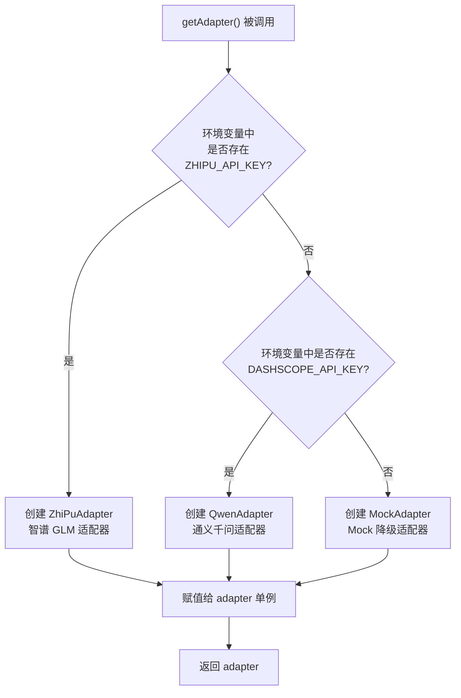
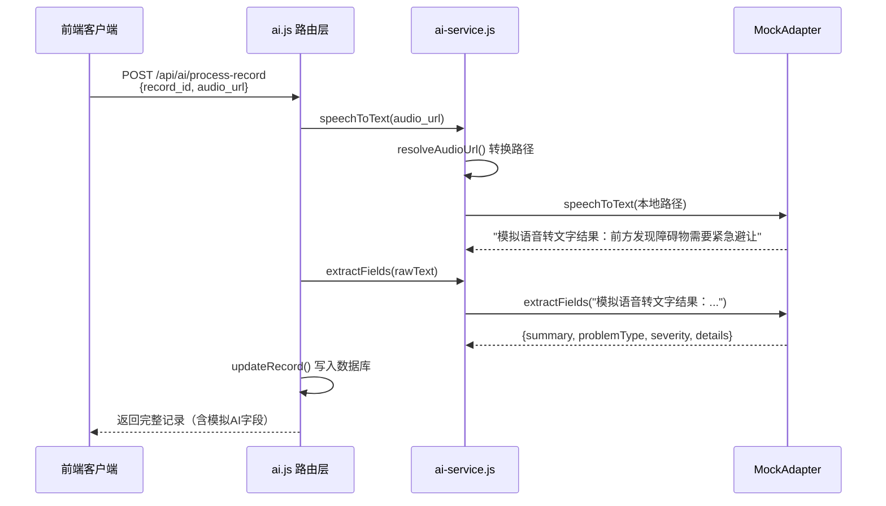

在路测助手的 AI 适配器体系中，**Mock 适配器**（`MockAdapter`）扮演着一个看似简单却至关重要的角色：当你尚未配置任何 AI 服务的 API Key 时，它会自动接管所有 AI 请求，返回预设的模拟数据，让整个系统无需任何外部依赖即可运行。这不仅是一种"降级策略"，更是开发调试和自动化测试的基石。本文将深入解析 Mock 适配器的设计意图、实现细节，以及它在整个适配器选择链中的触发机制。

Sources: [mock-adapter.js](server/src/services/mock-adapter.js#L1-L18), [ai-service.js](server/src/services/ai-service.js#L1-L47)

## 适配器选择链中的 Mock 定位

在阅读本文之前，建议先了解 [可插拔适配器模式：BaseAdapter 抽象与单例选择器](14-ke-cha-ba-gua-pei-qi-mo-shi-baseadapter-chou-xiang-yu-dan-li-xuan-ze-qi) 中的整体架构设计。Mock 适配器处于选择链的**最末端**——它是当所有正式适配器都无法匹配时的兜底方案。

以下流程图展示了 `ai-service.js` 中 `getAdapter()` 函数的适配器选择逻辑：



可以看到，Mock 适配器不需要任何环境变量或配置，它的激活条件就是 **"两个 API Key 都不存在"**。这是一种零配置的设计——首次克隆仓库后不做任何额外设置，启动服务即可看到完整的 AI 功能流程（虽然数据是模拟的）。服务启动时控制台会打印一行提示，明确告知当前处于 Mock 模式：`AI适配器: Mock (未配置API Key，请设置 ZHIPU_API_KEY 或 DASHSCOPE_API_KEY)`。

Sources: [ai-service.js](server/src/services/ai-service.js#L17-L33)

## Mock 适配器的完整实现

Mock 适配器的源码只有 19 行，是整个适配器体系中最精简的实现。它继承自 `BaseAIAdapter`，实现了两个抽象方法，每个方法都返回硬编码的模拟数据：

```javascript
class MockAdapter extends BaseAIAdapter {
  async speechToText(audioUrl) {
    return '模拟语音转文字结果：前方发现障碍物需要紧急避让';
  }

  async extractFields(text) {
    return {
      summary: '前方障碍物紧急避让',
      problemType: '感知异常',
      severity: '一般',
      details: '行驶过程中前方出现障碍物，系统进行了紧急避让操作',
    };
  }
}
```

这里有几个值得注意的设计要点：

**完全忽略输入参数。** `speechToText` 接收 `audioUrl` 但从不使用它；`extractFields` 接收 `text` 也同样忽略。这意味着无论你传入什么音频文件、什么文字内容，Mock 适配器都返回相同的固定结果。这种"无视输入"的设计是有意为之——Mock 的目标是**保证返回、模拟结构**，而不是模拟智能。

**返回格式与真实适配器完全一致。** 对比智谱 GLM 适配器和通义千问适配器的 `extractFields` 输出结构，Mock 返回的对象包含完全相同的四个字段：`summary`（摘要）、`problemType`（问题类型）、`severity`（严重程度）、`details`（补充细节）。这使得 Mock 适配器成为了一个**透明替换品**——上层调用代码（路由层 `ai.js` 中的 `process-record` 接口）无需做任何条件判断即可正常工作。

**纯同步逻辑包装为异步接口。** 两个方法都声明为 `async`，但内部没有任何 `await` 操作。这保持了与真实适配器一致的异步签名，确保调用方用 `await` 处理时行为统一。

Sources: [mock-adapter.js](server/src/services/mock-adapter.js#L3-L16), [base-adapter.js](server/src/services/base-adapter.js#L4-L22)

## Mock 模式与真实模式的对比

下表从多个维度对比了 Mock 适配器与两个正式适配器的核心差异：

| 对比维度 | MockAdapter | ZhiPuAdapter | QwenAdapter |
|:---|:---|:---|:---|
| **所需环境变量** | 无（零配置） | `ZHIPU_API_KEY` | `DASHSCOPE_API_KEY` |
| **外部网络请求** | 无 | 智谱 GLM API | 通义千问 API |
| **响应延迟** | ≈ 0ms（即时返回） | 1-5s（取决于音频长度） | 1-5s（取决于音频长度） |
| **speechToText 输出** | 固定模拟文字 | 真实 ASR 转写结果 | 真实 ASR 转写结果 |
| **extractFields 输出** | 固定模拟结构化数据 | AI 实时分析结果 | AI 实时分析结果 |
| **结果是否随输入变化** | ❌ 永远相同 | ✅ 根据内容智能解析 | ✅ 根据内容智能解析 |
| **适用场景** | 开发调试、单元测试 | 生产环境 | 生产环境 |
| **代码行数** | 19 行 | 176 行 | 104 行 |

Sources: [mock-adapter.js](server/src/services/mock-adapter.js#L1-L18), [zhipu-adapter.js](server/src/services/zhipu-adapter.js#L1-L176), [qwen-adapter.js](server/src/services/qwen-adapter.js#L1-L103)

## 在自动化测试中的核心角色

Mock 适配器最大的价值体现在测试层面。查看 `tests/ai-service.test.js` 可以发现，每个测试用例的 `beforeEach` 钩子中都会将全局适配器重置为 Mock 实例：

```javascript
beforeEach(() => {
  setAdapter(new MockAdapter());
});
```

这确保了：
- 测试执行**不依赖任何外部 API**，避免因网络问题或 API 配额限制导致测试失败
- 测试结果是**确定性的**——相同的断言每次都通过
- 测试执行速度极快，因为没有网络 I/O 延迟

测试用例验证了 Mock 适配器的关键行为：`speechToText` 返回包含"障碍物"的文字（`expect(text).toContain('障碍物')`），`extractFields` 返回包含 `summary`、`problemType`、`severity` 四个字段的对象，且 `problemType` 值为"感知异常"。这些断言既是 Mock 行为的验证，也是**适配器接口契约的回归保障**——如果有人修改了返回格式，测试会立刻失败。

此外，测试还验证了适配器的可插拔性——通过 `setAdapter()` 注入自定义的 Mock 实例并覆盖其 `speechToText` 方法，证明适配器可以在运行时动态替换。这正是 [可插拔适配器模式：BaseAdapter 抽象与单例选择器](14-ke-cha-ba-gua-pei-qi-mo-shi-baseadapter-chou-xiang-yu-dan-li-xuan-ze-qi) 中所描述的设计目标。

Sources: [ai-service.test.js](server/tests/ai-service.test.js#L1-L45)

## Mock 模式的数据流追踪

当 Mock 适配器生效时，一个完整的 AI 处理请求（`POST /api/ai/process-record`）的数据流如下：



注意一个细节：即使 Mock 适配器完全忽略了输入参数，`ai-service.js` 中的 `resolveAudioUrl()` 函数仍然会将 `/uploads/xxx` 形式的相对 URL 转换为本地绝对路径。这是服务层的通用逻辑，不因适配器类型而变化，保证了数据流在任何模式下都走完整路径。

Sources: [ai.js](server/src/routes/ai.js#L37-L72), [ai-service.js](server/src/services/ai-service.js#L6-L11)

## 从 Mock 切换到真实适配器

当你准备好使用真实 AI 服务时，只需要在 `server/.env` 文件中配置相应的 API Key 即可（参考 `.env.example` 模板）：

```env
# 方案一：智谱 GLM（推荐）
ZHIPU_API_KEY=your_real_api_key_here

# 方案二：通义千问（备选）
DASHSCOPE_API_KEY=your_real_api_key_here
```

**无需重启服务即可切换。** 由于 `getAdapter()` 使用了单例模式（`adapter` 变量），切换 API Key 后只需重启应用。如果两个 Key 同时存在，智谱 GLM 优先级更高（`ZHIPU_API_KEY` 先被检查）。详细的环境变量配置方法请参考 [环境变量配置与 API Key 管理](25-huan-jing-bian-liang-pei-zhi-yu-api-key-guan-li)。

Sources: [.env.example](server/.env.example#L1-L10), [ai-service.js](server/src/services/ai-service.js#L19-L29)

## 设计总结

Mock 适配器虽然代码量极少，但它体现了几个关键的架构设计思想：

**开闭原则的实践。** 新增一个适配器不需要修改任何现有代码，只需创建一个继承 `BaseAIAdapter` 的新类。Mock 适配器本身就是这个原则最简单的验证——它只用了 19 行代码就完成了对整个 AI 功能链路的模拟。

**渐进式接入策略。** 项目从零配置到生产就绪的路径非常清晰：先用 Mock 跑通全流程 → 配置 API Key → 自动切换为真实适配器。每一步都是无风险的增量操作，降低了新开发者的上手门槛。

**测试基础设施。** Mock 适配器让单元测试可以完全隔离外部依赖，这在 [Jest + Supertest 测试策略与数据库隔离方案](24-jest-supertest-ce-shi-ce-lue-yu-shu-ju-ku-ge-chi-fang-an) 中描述的测试体系中扮演着不可或缺的角色。

Sources: [mock-adapter.js](server/src/services/mock-adapter.js#L1-L18), [base-adapter.js](server/src/services/base-adapter.js#L1-L24), [ai-service.js](server/src/services/ai-service.js#L1-L47)

---

**延伸阅读**：如果你想了解 Mock 适配器所实现的接口契约细节，请参阅 [可插拔适配器模式：BaseAdapter 抽象与单例选择器](14-ke-cha-ba-gua-pei-qi-mo-shi-baseadapter-chou-xiang-yu-dan-li-xuan-ze-qi)；想对比真实适配器的实现差异，可继续阅读 [智谱 GLM 适配器实现（ASR + 结构化提取）](15-zhi-pu-glm-gua-pei-qi-shi-xian-asr-jie-gou-hua-ti-qu) 和 [通义千问适配器实现与对比](16-tong-yi-qian-wen-gua-pei-qi-shi-xian-yu-dui-bi)。