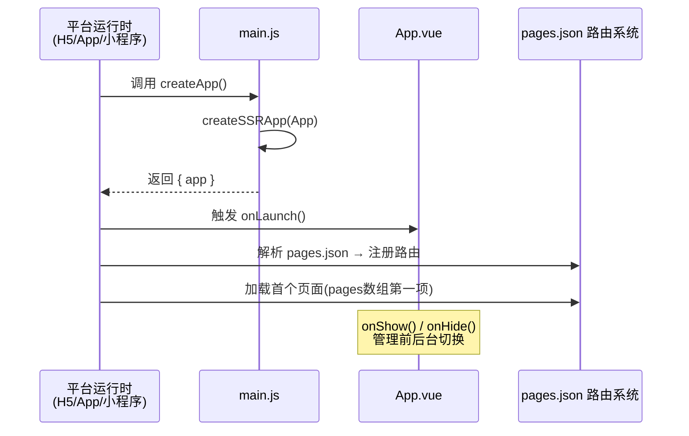
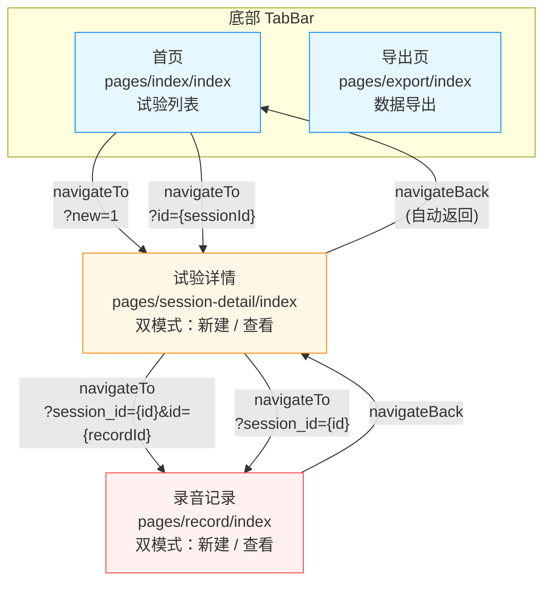

本页深入解析路测助手前端的 **项目骨架**、**路由声明机制** 与 **页面间导航模式**。你将理解 `client/` 目录下每个顶层文件的职责分工，掌握 `pages.json` 如何驱动 UniApp 路由系统，以及四个业务页面如何通过 `uni.navigateTo` / `uni.navigateBack` 与 TabBar 构成完整的导航图。

Sources: [pages.json](client/pages.json#L1-L50), [main.js](client/main.js#L1-L7), [App.vue](client/App.vue#L1-L19), [manifest.json](client/manifest.json#L1-L27)

---

## 项目目录总览

`client/` 是一个标准的 UniApp + Vue3 项目，由 HBuilderX 管理。其目录结构如下：

```
client/
├── .hbuilderx/          # HBuilderX IDE 配置（调试目标等）
│   └── launch.json
├── App.vue              # 应用根组件（生命周期入口）
├── main.js              # 应用启动入口（createSSRApp）
├── manifest.json        # 平台配置（应用名、H5代理、微信小程序等）
├── pages.json           # 路由表 + TabBar + 全局导航栏样式
├── index.html           # H5 平台入口 HTML
├── pages/               # 页面目录（每个子目录 = 一个路由）
│   ├── index/           #   首页 — 试验列表
│   ├── session-detail/  #   试验详情 / 新建试验（双模式）
│   ├── record/          #   录音记录页
│   └── export/          #   数据导出页
├── services/            # API 服务层封装
│   └── api.js
├── components/          # 公共组件目录（当前为空，预留给后续抽取）
├── static/              # 静态资源目录
└── utils/               # 工具函数目录（当前为空）
```

**关键设计特点**：项目采用了极简的目录分层——没有使用 `store/`（无全局状态管理）、没有 `router/`（UniApp 内置路由不需要 vue-router），所有 API 调用集中在单个 `services/api.js` 文件中。这种"够用即止"的结构非常适合 MVP 阶段快速迭代，同时为后续扩展预留了 `components/` 和 `utils/` 目录。

Sources: [launch.json](client/.hbuilderx/launch.json#L1-L10), [manifest.json](client/manifest.json#L1-L27)

---

## 应用启动链：从 main.js 到 App.vue

UniApp + Vue3 的启动流程与传统 Vue SPA 有本质区别。项目使用 **SSR 兼容模式** 启动，入口函数 `createApp()` 导出而非直接挂载——这是因为 UniApp 编译器会在不同平台（H5、App、小程序）各自接管挂载逻辑。

启动链如下：



**`main.js`** 的核心代码仅有 4 行：从 `vue` 导入 `createSSRApp`，将 `App.vue` 组件包装为应用实例并导出。框架自动处理平台差异化的挂载。[main.js](client/main.js#L1-L7)

**`App.vue`** 承担三个应用级生命周期的监听：`onLaunch`（首次启动）、`onShow`（从后台回到前台）、`onHide`（进入后台）。当前仅输出日志，但其全局 `<style>` 设置了 `page { background-color: #f5f5f5 }` 作为所有页面的默认背景色。[App.vue](client/App.vue#L1-L19)

**`index.html`** 仅在 H5 平台使用，包含响应式 viewport 设置和 `<div id="app">` 挂载点。小程序和 App 平台会忽略此文件。[index.html](client/index.html#L1-L17)

Sources: [main.js](client/main.js#L1-L7), [App.vue](client/App.vue#L1-L19), [index.html](client/index.html#L1-L17)

---

## pages.json：路由声明与全局配置

`pages.json` 是 UniApp 项目的 **路由中枢**，它同时管理三个维度：页面路由表、全局导航栏样式、底部 TabBar 配置。

### 路由表结构

项目注册了 **4 个页面**，按数组顺序排列：

| 路由路径 | 导航栏标题 | 页面文件 | 页面角色 |
|---|---|---|---|
| `pages/index/index` | 试验列表 | `pages/index/index.vue` | **首页（TabBar页）** |
| `pages/session-detail/index` | 试验详情 | `pages/session-detail/index.vue` | 栈内页面（双模式） |
| `pages/record/index` | 录音记录 | `pages/record/index.vue` | 栈内页面 |
| `pages/export/index` | 导出 | `pages/export/index.vue` | **TabBar页** |

**核心规则**：`pages` 数组的 **第一项即为应用启动页**。本项目将 `pages/index/index` 放在首位，用户打开应用即进入试验列表页。[pages.json](client/pages.json#L1-L27)

每个页面声明包含 `path`（相对于项目根目录，**不含 `.vue` 后缀**）和 `style`（覆盖全局导航栏标题）。路径遵循 UniApp 约定：每个页面是 `pages/` 下的一个子目录，目录内的 `index.vue` 即页面组件。

### 全局导航栏样式

`globalStyle` 定义所有页面共享的导航栏外观：

```json
{
  "navigationBarTextStyle": "black",
  "navigationBarTitleText": "路测助手",
  "navigationBarBackgroundColor": "#F8F8F8",
  "backgroundColor": "#F8F8F8"
}
```

当某个页面的 `style.navigationBarTitleText` 覆盖了全局值时，该页面显示自己的标题。例如首页显示"试验列表"而非"路测助手"。[pages.json](client/pages.json#L28-L33)

### TabBar 配置

项目配置了一个 **两栏底部 TabBar**：

| 属性 | 值 | 说明 |
|---|---|---|
| `color` | `#999999` | 未选中文字颜色（灰色） |
| `selectedColor` | `#007AFF` | 选中文字颜色（iOS 蓝） |
| `backgroundColor` | `#ffffff` | TabBar 背景色（白色） |
| `borderStyle` | `black` | 顶部分割线颜色 |

Tab 栏包含两个入口：

- **"试验"** → `pages/index/index`（试验列表首页）
- **"导出"** → `pages/export/index`（数据导出页）

**注意**：当前 TabBar 未配置 `iconPath` / `selectedIconPath`，因此两个 Tab 仅显示纯文字、无图标。这是 MVP 阶段的简化选择，后续可添加图标资源到 `static/` 目录并在 `list` 中指定。[pages.json](client/pages.json#L34-L49)

**TabBar 页面的导航行为特殊性**：TabBar 页面之间切换不会进入页面栈（不触发 `onLoad`，仅触发 `onShow`/`onHide`）。这意味着首页和导出页每次切换回来时，通过 `onShow` 生命周期重新加载数据，确保列表状态始终最新。

Sources: [pages.json](client/pages.json#L1-L50)

---

## 页面导航图与参数传递

本项目的四个页面构成了两种导航模式：**TabBar 切换**（首页 ↔ 导出）和 **栈式推入/弹出**（首页 → 试验详情 → 录音页）。



### 导航方式与参数传递详解

项目使用三种 UniApp 导航 API，每种对应不同的页面栈行为：

| 导航 API | 使用场景 | 栈行为 | 参数传递方式 |
|---|---|---|---|
| `uni.navigateTo({ url })` | 进入子页面 | 新页面压入栈顶 | URL query string |
| `uni.navigateBack()` | 返回上一页 | 弹出栈顶页面 | 无 |
| TabBar 点击 | 首页 ↔ 导出切换 | 切换 Tab（不影响栈） | 无 |

**参数传递全部通过 URL query string**，这是 UniApp 跨平台兼容性最好的方式。项目中实际使用的参数组合如下：

| 来源页面 | 目标页面 | URL 示例 | 参数说明 |
|---|---|---|---|
| 首页 | 试验详情（新建） | `/pages/session-detail/index?new=1` | `new=1` 表示新建模式 |
| 首页 | 试验详情（查看） | `/pages/session-detail/index?id=5` | `id` 为试验 ID |
| 试验详情 | 录音页（新建） | `/pages/record/index?session_id=5` | `session_id` 为所属试验 |
| 试验详情 | 录音页（查看） | `/pages/record/index?id=12&session_id=5` | 同时传记录 ID 和试验 ID |

Sources: [index.vue (首页)](client/pages/index/index.vue#L72-L77), [session-detail/index.vue](client/pages/session-detail/index.vue#L135-L141), [session-detail/index.vue (导航方法)](client/pages/session-detail/index.vue#L212-L217), [record/index.vue](client/pages/record/index.vue#L147-L153)

---

## 页面路由模式：双模式页面的参数分发

项目中最值得关注的路由设计是 **session-detail** 和 **record** 两个页面的"双模式"机制——同一个页面组件通过不同的 query 参数进入不同的业务模式。

### session-detail 页面的双模式

试验详情页在 `onLoad(options)` 生命周期中根据参数分发逻辑：

```javascript
onLoad(options) {
  if (options.new === '1') {
    this.isNew = true;        // 新建模式：展示表单
  } else if (options.id) {
    this.sessionId = Number(options.id);
    this.loadSession();       // 查看模式：加载试验数据
  }
}
```

- **新建模式**（`?new=1`）：设置 `isNew = true`，模板通过 `v-if="isNew"` 渲染创建表单，包含项目名称、测试人员、日期选择器等字段。创建成功后将 `isNew` 置为 `false`，就地切换到详情视图。[session-detail/index.vue](client/pages/session-detail/index.vue#L135-L141)

- **查看模式**（`?id=xxx`）：直接调用 `getSession(id)` 加载试验信息，渲染试验详情卡片和关联的记录列表。[session-detail/index.vue](client/pages/session-detail/index.vue#L149-L155)

### record 页面的双模式

录音页的分发逻辑类似：

```javascript
onLoad(options) {
  this.sessionId = Number(options.session_id);
  if (options.id) {
    this.recordId = Number(options.id);
    this.loadRecord();        // 查看/编辑已有记录
  }
  // 若无 id，则为新建记录（录音后自动创建）
}
```

- **新建记录**（仅 `?session_id=xxx`）：页面进入录音就绪状态，用户点击录音按钮后才开始创建记录。
- **查看/编辑记录**（`?id=xxx&session_id=xxx`）：加载已有记录数据，展示转写文本和 AI 分析结果。[record/index.vue](client/pages/record/index.vue#L147-L158)

**设计权衡**：这种"一页双模式"的方案避免了为新建和查看分别创建页面，减少了路由表条目和页面文件数量。在 MVP 阶段这是务实的取舍。如果未来两种模式的模板逻辑差异继续增大，建议拆分为独立页面以提升可维护性。

Sources: [session-detail/index.vue](client/pages/session-detail/index.vue#L135-L195), [record/index.vue](client/pages/record/index.vue#L147-L180)

---

## H5 开发服务器与 API 代理

项目在 H5 平台开发时需要解决跨域问题。`manifest.json` 中的 `h5.devServer` 配置了开发代理：

```json
"h5": {
  "devServer": {
    "port": 8080,
    "proxy": {
      "/api": {
        "target": "http://localhost:3000",
        "changeOrigin": true
      }
    }
  }
}
```

这意味着 H5 开发模式下，所有 `/api` 前缀的请求会被代理到后端 `http://localhost:3000`，无需在请求层手动拼接完整 URL。但值得注意的是，`services/api.js` 中硬编码了 `BASE_URL = 'http://192.168.1.10:3000'`，这使得真机调试时请求直接发往电脑局域网 IP。[manifest.json](client/manifest.json#L16-L26)

**两种运行环境的请求路径差异**：

| 环境 | 请求路径 | 代理行为 |
|---|---|---|
| H5 浏览器（开发） | `http://192.168.1.10:3000/api/...` | 直接请求（绕过了 devServer proxy） |
| App / 真机 | `http://192.168.1.10:3000/api/...` | 直接请求（无代理机制） |

当前 `api.js` 统一使用绝对 URL 拼接，使得 H5 的 `devServer.proxy` 配置实际上未被利用。关于这一机制的详细分析请参阅 [前端 API 服务层封装与请求代理机制](23-qian-duan-api-fu-wu-ceng-feng-zhuang-yu-qing-qiu-dai-li-ji-zhi)。

Sources: [manifest.json](client/manifest.json#L16-L26), [api.js](client/services/api.js#L1-L4)

---

## manifest.json 平台配置一览

`manifest.json` 是 UniApp 的 **平台元数据中枢**，控制应用的跨平台行为：

| 配置项 | 值 | 用途 |
|---|---|---|
| `name` | `路测助手` | 应用显示名称 |
| `appid` | `""`（空） | DCloud 应用 ID（需在发布前申请） |
| `description` | `智驾场地试验用例管理系统` | 应用描述 |
| `versionName` / `versionCode` | `1.0.0` / `100` | 版本号 |
| `vueVersion` | `"3"` | 指定使用 Vue 3 |
| `transformPx` | `false` | 禁用 px 到 rpx 的自动转换 |
| `mp-weixin.appid` | `""`（空） | 微信小程序 AppID（待配置） |
| `mp-weixin.urlCheck` | `false` | 关闭微信域名校验（开发阶段） |
| `h5.devServer` | 见上文 | H5 开发服务器与代理 |

`vueVersion: "3"` 是关键声明——它告诉 UniApp 编译器使用 Vue 3 的模板编译器和运行时。虽然本项目的页面组件使用的是 Options API 而非 Composition API（`<script setup>`），但 Vue 3 运行时同时兼容两种写法。[manifest.json](client/manifest.json#L1-L27)

Sources: [manifest.json](client/manifest.json#L1-L27)

---

## 生命周期与数据刷新策略

UniApp 页面拥有独立于 Vue 的页面生命周期。项目中各页面利用不同的生命周期钩子实现数据加载策略：

| 页面 | 使用的生命周期 | 策略 |
|---|---|---|
| 首页 `index` | `onShow()` | 每次页面可见时重新加载试验列表和项目列表 |
| 试验详情 `session-detail` | `onLoad(options)` + `onShow()` | `onLoad` 解析路由参数决定模式；`onShow` 刷新记录列表 |
| 录音页 `record` | `onLoad(options)` + `onUnload()` | `onLoad` 解析参数并初始化录音管理器；`onUnload` 清理定时器和录音状态 |
| 导出页 `export` | `onShow()` | 每次可见时重新加载试验列表 |

**`onShow` vs `onLoad` 的选择逻辑**：`onLoad` 仅在页面首次创建时触发一次（接收路由参数），`onShow` 在每次页面变为可见时触发（包括从子页面返回、从后台回到前台）。首页和导出页使用 `onShow` 确保返回时列表数据始终最新；试验详情页的 `onShow` 则专门用于刷新记录列表——因为用户从录音页提交返回后，记录列表需要反映最新状态。[index.vue](client/pages/index/index.vue#L55-L57), [session-detail/index.vue](client/pages/session-detail/index.vue#L143-L147), [record/index.vue](client/pages/record/index.vue#L147-L166)

录音页的 `onUnload` 生命周期尤为关键：它负责清理 `setInterval` 创建的录音计时器和自动草稿保存定时器，并在页面销毁时停止正在进行的录音，防止资源泄漏。[record/index.vue](client/pages/record/index.vue#L160-L166)

Sources: [index.vue](client/pages/index/index.vue#L55-L57), [session-detail/index.vue](client/pages/session-detail/index.vue#L135-L147), [record/index.vue](client/pages/record/index.vue#L147-L166)

---

## 扩展指南：如何添加新页面

若需为项目添加新页面，需完成以下三步：

**第一步：创建页面目录和文件**。在 `client/pages/` 下新建子目录和 `index.vue` 文件，例如 `pages/settings/index.vue`。

**第二步：在 `pages.json` 中注册路由**。向 `pages` 数组添加条目：

```json
{
  "path": "pages/settings/index",
  "style": {
    "navigationBarTitleText": "设置"
  }
}
```

**第三步：通过导航 API 跳转**。在现有页面中使用 `uni.navigateTo({ url: '/pages/settings/index' })` 即可跳转。若该页面需要从外部接收数据，通过 URL query string 传递参数，在目标页面的 `onLoad(options)` 中读取。

若新页面需要加入 TabBar，还需在 `pages.json` 的 `tabBar.list` 中添加对应条目。注意 **TabBar 页面不能使用 `navigateTo` 跳转**，必须通过 `uni.switchTab()` 或用户点击 TabBar 切换。

Sources: [pages.json](client/pages.json#L1-L50)

---

## 延伸阅读

本页聚焦于项目骨架与路由配置。各页面的具体业务实现、组件逻辑和样式细节请按以下顺序深入：

- [首页：试验列表与项目管理](19-shou-ye-shi-yan-lie-biao-yu-xiang-mu-guan-li) — 首页的列表加载、卡片渲染与跳转逻辑
- [核心录音页：录音 → 上传 → ASR → AI 分析的完整实现](20-he-xin-lu-yin-ye-lu-yin-shang-chuan-asr-ai-fen-xi-de-wan-zheng-shi-xian) — 录音页的复杂交互与状态流转
- [试验详情页：双模式（新建 / 查看）与记录管理](21-shi-yan-xiang-qing-ye-shuang-mo-shi-xin-jian-cha-kan-yu-ji-lu-guan-li) — 双模式页面的完整设计
- [导出页：条件编译实现 H5 与原生平台的差异化下载](22-dao-chu-ye-tiao-jian-bian-yi-shi-xian-h5-yu-yuan-sheng-ping-tai-de-chai-yi-hua-xia-zai) — UniApp 条件编译的实战用法
- [前端 API 服务层封装与请求代理机制](23-qian-duan-api-fu-wu-ceng-feng-zhuang-yu-qing-qiu-dai-li-ji-zhi) — `services/api.js` 的封装模式与跨域策略