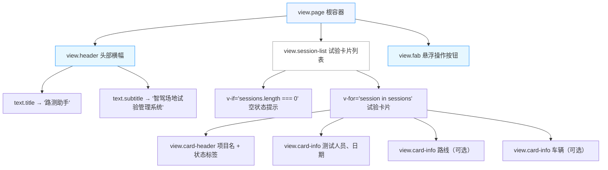
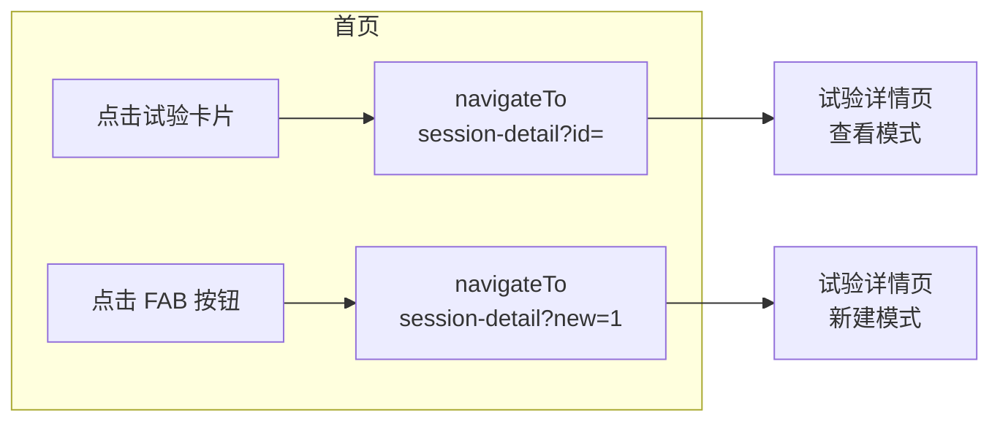
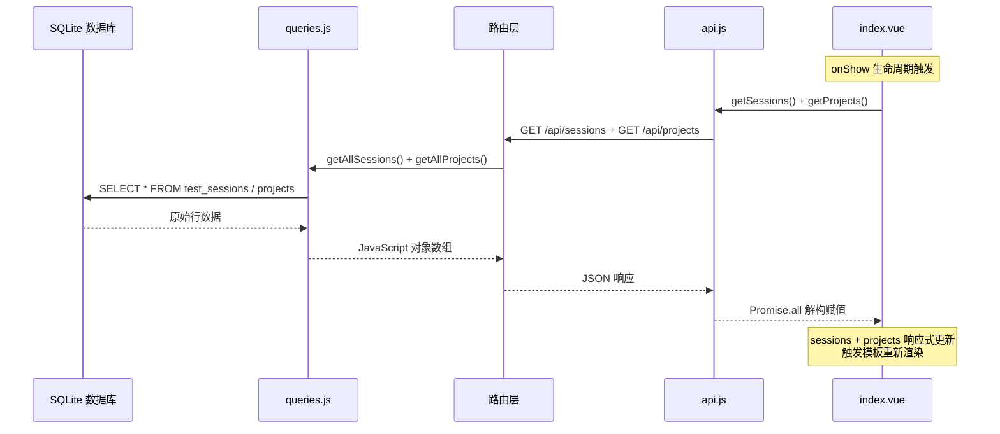

首页是路测助手的核心入口页面，承载着**试验列表展示**与**新建试验引导**两大职责。它作为 UniApp 的首个注册路由页面（`pages/index/index`），同时也是底部 TabBar 的第一个标签页，用户每次启动应用都会首先看到这个页面。本文将从页面结构、数据加载机制、交互导航逻辑和视觉设计四个维度，对首页的完整实现进行剖析。

Sources: [pages.json](client/pages.json#L1-L50), [index.vue](client/pages/index/index.vue#L1-L205)

## 页面路由定位与 TabBar 集成

在 `pages.json` 中，首页被声明为 `pages` 数组的第一项，路径为 `pages/index/index`，导航栏标题设为"试验列表"。由于 UniApp 默认将 `pages[0]` 作为应用启动页，这意味着用户打开路测助手后立即进入试验列表视图。

更值得注意的是，首页被纳入了 `tabBar.list` 配置，标签文字为"试验"，与"导出"页并列为两个底部标签页之一。这意味着首页在应用生命周期内不会被销毁——它被 TabBar 缓存，用户从"导出"页切回"试验"页时触发的不是重新创建，而是 `onShow` 生命周期钩子。这一设计直接影响了首页的数据刷新策略。

Sources: [pages.json](client/pages.json#L1-L50)

## 组件结构与模板层次

首页模板由三个视觉层级构成，形成清晰的信息架构：



**头部横幅**使用 `135deg` 渐变背景（`#1890ff` → `#36cfc9`），展示应用名称与功能描述，为用户提供即时上下文。**试验卡片列表**区域通过 `v-if` / `v-for` 指令实现条件渲染和列表渲染，空数据时展示引导性文案。**悬浮操作按钮**（FAB）固定在视口底部中央，提供"新建试验"的快捷入口。

Sources: [index.vue](client/pages/index/index.vue#L1-L42)

## 数据加载机制：并行请求与生命周期协同

首页的数据加载策略体现了 UniApp TabBar 页面的特殊生命周期考量：

```javascript
onShow() {
  this.loadData();
},
```

选择 `onShow` 而非 `onLoad` 是关键设计决策。`onLoad` 仅在页面首次创建时触发一次，而 `onShow` 在每次页面从后台切回前台、或从其他页面通过 TabBar 返回时都会触发。这意味着用户在试验详情页完成操作（如结束试验、新增记录）后返回首页，列表数据会自动刷新。

Sources: [index.vue](client/pages/index/index.vue#L55-L57)

`loadData` 方法使用 `Promise.all` 并行发起两个 API 请求，最大化加载效率：

```javascript
async loadData() {
  try {
    var results = await Promise.all([getSessions(), getProjects()]);
    this.sessions = results[0];
    this.projects = results[1];
  } catch (err) {
    uni.showToast({ title: '加载失败', icon: 'none' });
  }
}
```

| 请求 | API 函数 | 后端路由 | SQL 查询 | 返回内容 |
|------|----------|----------|----------|----------|
| 试验列表 | `getSessions()` | `GET /api/sessions` | `SELECT * FROM test_sessions ORDER BY test_date DESC` | 全部试验记录 |
| 项目列表 | `getProjects()` | `GET /api/projects` | `SELECT * FROM projects ORDER BY created_at DESC` | 全部项目记录 |

两个请求相互独立，`Promise.all` 确保它们并行执行，只有当两个请求都成功完成后才更新组件数据。任意一个请求失败，均通过 `uni.showToast` 展示"加载失败"的提示。

Sources: [index.vue](client/pages/index/index.vue#L63-L71), [api.js](client/services/api.js#L41-L56), [sessions.js](server/src/routes/sessions.js#L6-L9), [projects.js](server/src/routes/projects.js#L6-L9), [queries.js](server/src/models/queries.js#L5-L8), [queries.js](server/src/models/queries.js#L30-L36)

## 跨实体名称解析：项目 ID → 项目名称

试验卡片中需要展示项目名称，但 `test_sessions` 表存储的是 `project_id` 外键，而非项目名称。首页采用**前端关联解析**策略解决这个问题：

```javascript
getProjectName(projectId) {
  var p = this.projects.find(function(p) { return p.id === projectId; });
  return p ? p.name : '未知项目';
}
```

在模板中通过 `{{ getProjectName(session.project_id) }}` 调用该方法。这是一种**客户端 Join** 模式——后端返回两个独立的扁平列表，前端在渲染时完成关联。这种策略在数据量较小（项目数量有限）的场景下是合理的，避免了后端返回冗余的 JOIN 结果数据。

当项目 ID 无法匹配时，展示"未知项目"作为降级文案，确保页面不会因数据不一致而崩溃。

Sources: [index.vue](client/pages/index/index.vue#L21), [index.vue](client/pages/index/index.vue#L59-L62)

## 卡片信息渲染与状态视觉编码

每张试验卡片展示的结构化信息直接映射了 `test_sessions` 表的核心字段：

| 模板字段 | 数据字段 | 数据库列 | 渲染条件 |
|----------|----------|----------|----------|
| 项目名称 | `session.project_id` → `getProjectName()` | `project_id` (FK) | 始终展示 |
| 状态标签 | `session.status` | `status` | 始终展示 |
| 测试人员 | `session.tester` | `tester` | 始终展示 |
| 日期 | `session.test_date` | `test_date` | 始终展示 |
| 路线 | `session.route` | `route` | `v-if="session.route"` 条件渲染 |
| 车辆 | `session.vehicle_info` | `vehicle_info` | `v-if="session.vehicle_info"` 条件渲染 |

**状态视觉编码**采用双色方案：`active`（进行中）使用蓝色胶囊标签（背景 `#e6f7ff`，文字 `#1890ff`），`completed`（已结束）使用绿色胶囊标签（背景 `#f6ffed`，文字 `#52c41a`）。这种设计源自 Ant Design 的色彩规范，通过直觉化的颜色映射帮助用户快速区分试验的当前状态。

路线和车辆信息使用 `v-if` 条件渲染，避免在数据为空时出现空白行，保持卡片的紧凑布局。

Sources: [index.vue](client/pages/index/index.vue#L14-L36), [database.js](server/src/models/database.js#L34-L45)

## 导航交互：两种入口路径

首页提供两个核心导航交互，分别对应**查看已有试验**和**创建新试验**两种用户意图：



**查看试验详情**：用户点击任意试验卡片触发 `goToDetail(session.id)`，通过 `uni.navigateTo` 跳转到 `/pages/session-detail/index?id=<sessionId>`。详情页的 `onLoad` 钩子读取 `options.id` 参数，进入查看模式并加载完整的试验信息和记录列表。

**新建试验**：用户点击底部 FAB 按钮触发 `goToNewSession()`，跳转到 `/pages/session-detail/index?new=1`。详情页检测到 `new === '1'` 参数后，切换到新建表单模式，展示项目名称、技术负责人、测试人员、日期、车辆信息和路线的输入表单。这体现了**单页面双模式**的复用设计——详情页同时承担了"查看"和"创建"两个职责。

Sources: [index.vue](client/pages/index/index.vue#L72-L77), [session-detail/index.vue](client/pages/session-detail/index.vue#L135-L141)

## 前端 API 服务层对接

首页通过 `services/api.js` 中封装的两个函数与后端通信。该服务层使用 `uni.request` 封装了统一的 Promise 化请求函数，并预配置了 `Content-Type: application/json` 请求头：

| 函数 | HTTP 方法 | 端点 | 首页用途 |
|------|-----------|------|----------|
| `getSessions(projectId)` | GET | `/api/sessions` | 加载全部试验列表（不传 `projectId`） |
| `getProjects()` | GET | `/api/projects` | 加载项目列表用于名称解析 |

`getSessions` 函数支持可选的 `projectId` 参数（用于按项目过滤试验），但首页调用时不传参，获取全部试验记录。这种参数化设计为后续可能的"按项目筛选"功能预留了扩展空间。

Sources: [api.js](client/services/api.js#L4-L34), [api.js](client/services/api.js#L41-L51), [api.js](client/services/api.js#L54-L56)

## 视觉设计与布局细节

首页的 CSS 设计遵循移动端优先原则，所有尺寸使用 `rpx` 响应式单位：

| 元素 | 样式特征 | 关键属性 |
|------|----------|----------|
| 页面根容器 | 浅灰底色，底部留白 | `min-height: 100vh`、`padding-bottom: 120rpx` |
| 头部横幅 | 蓝绿渐变，内边距充足 | `linear-gradient(135deg, #1890ff, #36cfc9)`、`padding: 60rpx 40rpx 40rpx` |
| 空状态区 | 居中排列，灰色弱化 | `text-align: center`、`padding: 120rpx 40rpx` |
| 试验卡片 | 白底圆角，微投影 | `border-radius: 16rpx`、`box-shadow: 0 2rpx 12rpx rgba(0,0,0,0.06)` |
| FAB 按钮 | 固定定位，渐变背景，投影悬浮感 | `position: fixed`、`bottom: 140rpx`、渐变同头部 |

头部横幅与 FAB 按钮共享相同的渐变色方案（`#1890ff` → `#36cfc9`），形成**视觉锚点**的一致性。FAB 的 `bottom: 140rpx` 偏移量恰好避开了 TabBar 的高度区域，避免交互冲突。页面的 `padding-bottom: 120rpx` 同样为 FAB 留出空间，确保列表最后一项不被按钮遮挡。

Sources: [index.vue](client/pages/index/index.vue#L82-L205)

## 数据流全链路总结

从数据库到用户界面的完整数据路径如下：



Sources: [queries.js](server/src/models/queries.js#L5-L36), [sessions.js](server/src/routes/sessions.js#L6-L9), [projects.js](server/src/routes/projects.js#L6-L9), [api.js](client/services/api.js#L4-L56), [index.vue](client/pages/index/index.vue#L55-L71)

## 延伸阅读

- **试验详情页的双模式实现**：首页的两个导航入口最终都指向同一个详情页，理解该页面的"新建/查看"双模式切换逻辑，请参阅 [试验详情页：双模式（新建 / 查看）与记录管理](21-shi-yan-xiang-qing-ye-shuang-mo-shi-xin-jian-cha-kan-yu-ji-lu-guan-li)。
- **API 服务层的封装机制**：首页调用的 `getSessions` / `getProjects` 函数如何通过 `uni.request` 实现 Promise 化封装，请参阅 [前端 API 服务层封装与请求代理机制](23-qian-duan-api-fu-wu-ceng-feng-zhuang-yu-qing-qiu-dai-li-ji-zhi)。
- **数据库表结构设计**：`test_sessions` 与 `projects` 表的完整建表语句和外键约束，请参阅 [SQLite 数据库设计与本地时区时间戳策略](9-sqlite-shu-ju-ku-she-ji-yu-ben-di-shi-qu-shi-jian-chuo-ce-lue) 和 [三层实体关系：项目 → 试验 → 记录](8-san-ceng-shi-ti-guan-xi-xiang-mu-shi-yan-ji-lu)。
- **路由注册全局配置**：首页在 `pages.json` 中的注册方式及 TabBar 配置，请参阅 [UniApp + Vue3 项目结构与页面路由配置](18-uniapp-vue3-xiang-mu-jie-gou-yu-ye-mian-lu-you-pei-zhi)。