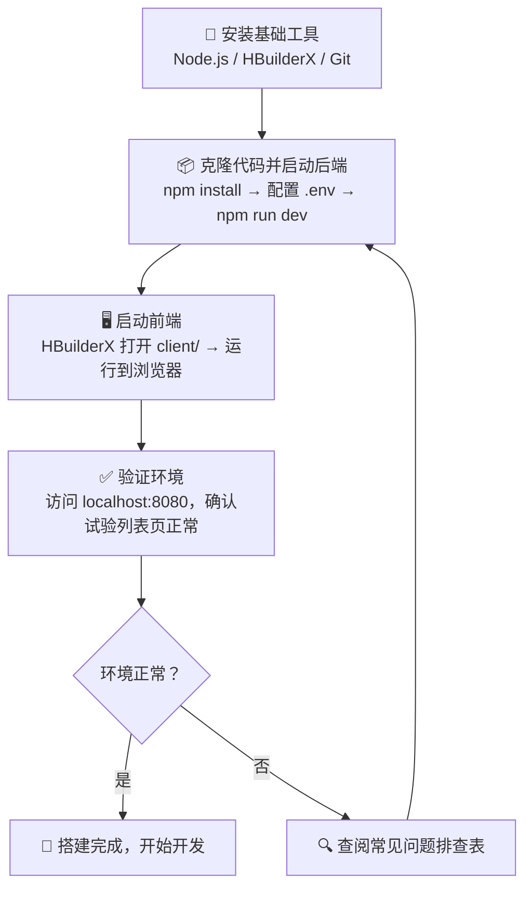
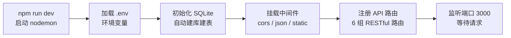
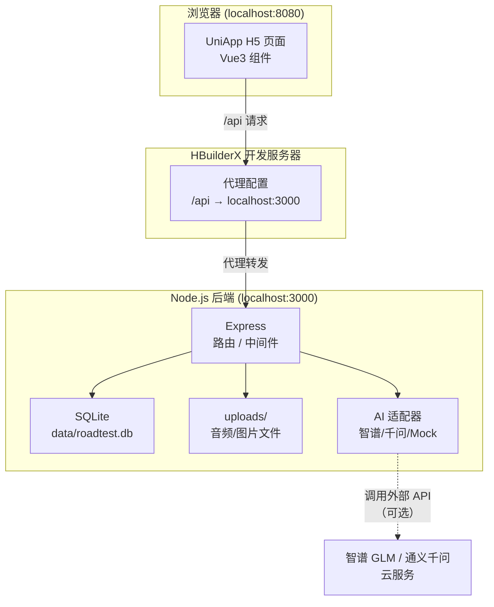

本文是一份面向初学者的**一站式开发环境搭建指南**，将引导你从零开始把「路测助手」项目在本地完整跑起来。搭建过程分为四个阶段：**安装基础工具 → 克隆代码与启动后端 → 启动前端 → 验证连通性**。每个阶段都包含操作命令、原理说明和常见问题排查，确保你能顺利进入开发状态。

Sources: [README.md](README.md#L1-L131), [CLAUDE.md](CLAUDE.md#L1-L91)

## 整体搭建流程

在动手之前，先通过下面的流程图理解搭建全貌——你将依次完成四个阶段，最终得到一个前后端联动的本地开发环境：



**前后端协作关系**：后端（Express）运行在 `localhost:3000`，前端（UniApp H5 模式）运行在 `localhost:8080`，前端的开发服务器内置了代理配置，将所有 `/api` 请求自动转发到后端。这意味着你在浏览器中开发调试时，API 调用是无感代理的。

Sources: [manifest.json](client/manifest.json#L16-L26), [app.js](server/src/app.js#L1-L47)

## 环境要求

在开始搭建前，请确认你的电脑已安装以下工具：

| 工具 | 版本要求 | 用途 | 下载地址 |
|------|---------|------|---------|
| **Node.js** | ≥ 18.x | 后端运行时，`better-sqlite3` 原生模块需要此版本 | https://nodejs.org |
| **npm** | ≥ 9.x（随 Node.js 附带） | 后端依赖管理 | — |
| **HBuilderX** | 最新正式版 | 前端编译与运行（**必须使用 HBuilderX**，非 Vue CLI 项目） | https://www.dcloud.io/hbuilderx.html |
| **Git** | 任意稳定版 | 克隆代码仓库 | https://git-scm.com |

> **为什么必须用 HBuilderX？** 本项目的前端是 **HBuilderX 管理的 UniApp 项目**，没有 `package.json`，不使用 Vite/Webpack 等 CLI 工具链。所有编译、热更新、真机运行都依赖 HBuilderX IDE 内置工具。

Sources: [README.md](README.md#L5-L14), [CLAUDE.md](CLAUDE.md#L17-L22)

## 第一步：克隆项目代码

打开终端（Windows 上推荐使用 PowerShell 或 Git Bash），执行以下命令将代码克隆到本地：

```bash
git clone https://github.com/tiae8823-byte/GAC-Road-Test-Assistant.git
cd GAC-Road-Test-Assistant
```

克隆完成后，你的本地目录结构应如下所示：

```
GAC-Road-Test-Assistant/
├── client/          ← 前端项目（UniApp + Vue3）
├── server/          ← 后端项目（Node.js + Express）
├── docs/            ← 设计文档
├── README.md
└── CLAUDE.md
```

注意 `client/` 和 `server/` 是**两个完全独立的应用**，不存在 monorepo 工作区关系，它们各自独立安装依赖、独立启动。

Sources: [README.md](README.md#L18-L23), [CLAUDE.md](CLAUDE.md#L26-L27)

## 第二步：搭建并启动后端

后端是一个 Node.js + Express 应用，使用 SQLite 作为数据库（无需额外安装数据库软件），首次启动时会**自动创建数据库文件和表结构**。

### 2.1 安装依赖

```bash
cd server
npm install
```

后端的核心依赖如下，了解它们有助于你后续阅读代码：

| 依赖包 | 版本 | 作用 |
|--------|------|------|
| `express` | ^4.21.0 | Web 框架，提供 RESTful API |
| `better-sqlite3` | ^11.0.0 | SQLite 驱动（同步 API，零配置数据库） |
| `multer` | ^1.4.5-lts.1 | 文件上传中间件（处理音频/图片上传） |
| `cors` | ^2.8.5 | 跨域资源共享中间件 |
| `dotenv` | ^17.4.1 | 从 `.env` 文件加载环境变量 |
| `xlsx` | ^0.18.5 | 生成 Excel/CSV 导出文件 |
| `form-data` | ^4.0.5 | 构造 multipart/form-data 请求（调用 AI API） |

> **Windows 用户注意**：`better-sqlite3` 是原生 C++ 模块，安装时会尝试下载预编译二进制文件。如果下载失败，请确保网络通畅，或设置 npm 镜像源：`npm config set registry https://registry.npmmirror.com`。

Sources: [package.json](server/package.json#L1-L25)

### 2.2 配置环境变量

后端通过 `.env` 文件管理环境变量。项目提供了一个模板文件，你需要复制并修改它：

```bash
# 在 server/ 目录下执行
cp .env.example .env
```

然后用文本编辑器打开 `.env` 文件，填入你的 AI 服务 API Key：

```ini
# AI 服务配置（二选一，至少填一个）
# 智谱 GLM（当前默认使用的适配器）
ZHIPU_API_KEY=your_zhipu_api_key_here

# 通义千问（备选适配器，ASR 无 30 秒音频限制，推荐）
# DASHSCOPE_API_KEY=your_dashscope_api_key_here

# 服务端口（默认 3000，一般无需修改）
PORT=3000
```

**环境变量配置说明**：

| 变量 | 是否必填 | 说明 |
|------|---------|------|
| `ZHIPU_API_KEY` | 与 `DASHSCOPE_API_KEY` 二选一 | 智谱 GLM 平台的 API Key，启用智谱适配器 |
| `DASHSCOPE_API_KEY` | 与 `ZHIPU_API_KEY` 二选一 | 阿里通义千问平台的 API Key，启用千问适配器 |
| `PORT` | 否 | 后端监听端口，默认 `3000` |
| `DB_PATH` | 否 | SQLite 数据库文件路径，默认 `data/roadtest.db` |

> **没有 API Key 能启动吗？** 可以。后端内置了 **Mock 适配器**，当你没有配置任何 API Key 时，AI 相关接口会返回模拟数据，其他功能（项目管理、录音上传、数据导出）照常工作。这在[Mock 适配器：无 API Key 时的降级方案](17-mock-gua-pei-qi-wu-api-key-shi-de-jiang-ji-fang-an)中有详细说明。

Sources: [.env.example](server/.env.example#L1-L10), [README.md](README.md#L67-L76), [ai-service.js](server/src/services/ai-service.js)

### 2.3 启动后端服务

```bash
# 在 server/ 目录下执行（开发模式，带热重载）
npm run dev
```

当你看到终端输出以下信息时，说明后端启动成功：

```
路测助手服务运行在 http://localhost:3000
```

此时后端已经完成了以下工作：



**首次启动时发生了什么？** `initDB()` 函数会检查 `server/data/roadtest.db` 是否存在——如果不存在，它会自动创建 `data/` 目录和数据库文件，并执行 `CREATE TABLE IF NOT EXISTS` 语句建立 `projects`、`test_sessions`、`records` 三张表。因此你**完全不需要手动建库建表**。

你可以快速验证后端是否正常响应，在浏览器中访问：`http://localhost:3000/api/health`。如果返回类似 `{"status":"ok","timestamp":"..."}` 的 JSON，则后端工作正常。

Sources: [app.js](server/src/app.js#L1-L47), [database.js](server/src/models/database.js#L1-L74)

### 2.4 后端可用的 npm 脚本

| 命令 | 作用 | 使用场景 |
|------|------|---------|
| `npm run dev` | 以 nodemon 启动，代码修改自动重启 | **日常开发** |
| `npm start` | 以 node 直接启动，无热重载 | 生产部署 |
| `npm test` | 运行全部 Jest 测试 | 提交代码前验证 |

Sources: [package.json](server/package.json#L6-L10)

## 第三步：搭建并启动前端

前端是 UniApp + Vue3 项目，由 **HBuilderX** 管理，不需要 `npm install`。操作步骤如下：

### 3.1 用 HBuilderX 打开项目

1. 启动 **HBuilderX**
2. 菜单栏：**文件 → 打开目录** → 选择项目根目录下的 `client/` 文件夹
3. 确认左侧项目树能看到 `pages/`、`services/`、`App.vue` 等文件

> **重要**：请打开的是 `client/` 目录本身，而不是它的父目录。HBuilderX 以打开的目录作为项目根，如果层级不对会导致编译失败。

### 3.2 运行到浏览器（H5 模式）

1. 在 HBuilderX 菜单栏：**运行 → 运行到浏览器 → Chrome**（或其他浏览器）
2. HBuilderX 会自动编译项目并在浏览器中打开

前端启动后，H5 开发服务器运行在 `http://localhost:8080`。关键在于，`manifest.json` 中已经配置了**开发代理**，将所有 `/api` 前缀的请求自动转发到 `http://localhost:3000`（即后端地址）：

```json
"h5": {
  "devServer": {
    "port": 8080,
    "proxy": {
      "/api": {
        "target": "http://localhost:3000",
        "changeOrigin": true
      }
    }
  }
}
```

这意味着你在 H5 模式下开发时，**无需手动处理跨域问题**——前端页面向 `/api/xxx` 发请求，开发服务器自动代理到后端。

Sources: [manifest.json](client/manifest.json#L16-L26), [README.md](README.md#L39-L47)

### 3.3 真机调试（可选）

如果需要在手机上调试（测试录音等移动端特性），需要修改 API 地址，因为手机无法通过 `localhost` 访问你电脑上的后端。

**操作步骤**：

1. 确保手机和电脑连接**同一个 Wi-Fi 局域网**
2. 查看你电脑的内网 IP（Windows 上执行 `ipconfig`，找到无线网卡的 IPv4 地址，通常形如 `192.168.x.x`）
3. 修改 `client/services/api.js` 中的 `BASE_URL`：

```js
// 将此处的 IP 替换为你电脑的内网 IP
const BASE_URL = 'http://192.168.x.x:3000';
```

4. 在 HBuilderX 中：**运行 → 运行到手机或模拟器** → 选择已连接的设备

> 更详细的真机调试指南请参考 [真机调试与 HBuilderX 跨端运行指南](26-zhen-ji-diao-shi-yu-hbuilderx-kua-duan-yun-xing-zhi-nan)。

Sources: [api.js](client/services/api.js#L1-L2), [README.md](README.md#L49-L57)

## 第四步：验证环境搭建成功

按照以下检查清单逐项确认你的开发环境是否就绪：

| # | 验证项 | 操作方式 | 预期结果 |
|---|--------|---------|---------|
| 1 | 后端健康检查 | 浏览器访问 `http://localhost:3000/api/health` | 返回 `{"status":"ok",...}` |
| 2 | 前端页面加载 | 浏览器访问 `http://localhost:8080` | 显示「路测助手」试验列表页面 |
| 3 | 前后端联通 | 在前端首页尝试新建一个项目 | 项目创建成功，列表中出现新条目 |
| 4 | 数据库正常 | 查看 `server/data/roadtest.db` 文件是否存在 | 文件已自动创建 |
| 5 | 测试套件 | 在 `server/` 目录下执行 `npm test` | 所有测试通过 |

如果以上五项全部通过，恭喜你，开发环境搭建完成！

Sources: [README.md](README.md#L58-L64), [app.js](server/src/app.js#L27-L29)

## 开发环境架构总览

搭建完成后，你的本地开发环境由以下几部分组成，它们之间的关系如下：



Sources: [app.js](server/src/app.js#L1-L47), [manifest.json](client/manifest.json#L16-L26), [api.js](client/services/api.js#L1-L26)

## 常见问题排查

在搭建过程中你可能会遇到以下问题，对照排查即可：

| 问题 | 可能原因 | 解决方案 |
|------|---------|---------|
| `npm install` 报错 `gyp ERR` | `better-sqlite3` 原生模块编译失败 | 确保安装了 Node.js ≥ 18；尝试设置镜像源 `npm config set registry https://registry.npmmirror.com` 后重新安装 |
| 后端启动报 `EADDRINUSE` | 端口 3000 被其他程序占用 | 在 `.env` 中修改 `PORT` 为其他端口（如 `3001`），同时修改前端 `manifest.json` 中的 proxy target |
| 浏览器打开 `localhost:8080` 无响应 | HBuilderX 未正确编译前端 | 在 HBuilderX 中关闭项目重新打开，或清理编译缓存：菜单 → 运行 → 清理编译缓存 |
| 前端页面打开但 API 请求 404 | 代理配置未生效 | 确认后端在 3000 端口正常运行；确认 `manifest.json` 中 proxy 配置正确；重启 HBuilderX 运行 |
| 真机无法连接后端 | 手机和电脑不在同一局域网，或防火墙阻止 | 确认同一 Wi-Fi；Windows 防火墙放行 3000 端口；`api.js` 中的 IP 是否为电脑当前内网 IP |
| AI 相关接口返回错误 | API Key 未配置或无效 | 编辑 `server/.env` 填入有效的 API Key；或者不填，系统自动降级为 Mock 模式 |
| `npm test` 测试失败 | 测试依赖数据库状态 | 测试使用独立的内存数据库，不应受影响；如失败请检查 `jest.config.js` 配置 |
| `data/roadtest.db` 文件过大 | 开发过程中积累了大量测试数据 | 可直接删除该文件，重启后端会自动重建空数据库 |

Sources: [README.md](README.md#L122-L131), [.gitignore](.gitignore#L1-L11), [jest.config.js](server/jest.config.js#L1-L5)

## 下一步阅读

环境搭建完成后，建议按以下顺序继续阅读文档以深入了解项目：

1. **[技术栈与依赖清单](3-ji-zhu-zhan-yu-yi-lai-qing-dan)** — 全面了解项目使用了哪些技术，为什么这样选型
2. **[从新建试验到提交记录的完整工作流](4-cong-xin-jian-shi-yan-dao-ti-jiao-ji-lu-de-wan-zheng-gong-zuo-liu)** — 理解核心业务流程，建立产品直觉
3. **[前后端分离架构总览](7-qian-hou-duan-fen-chi-jia-gou-zong-lan)** — 从架构层面理解前后端如何协作
4. **[环境变量配置与 API Key 管理](25-huan-jing-bian-liang-pei-zhi-yu-api-key-guan-li)** — 深入理解环境变量管理策略