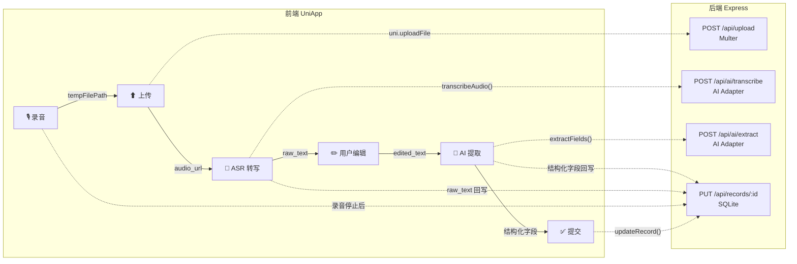
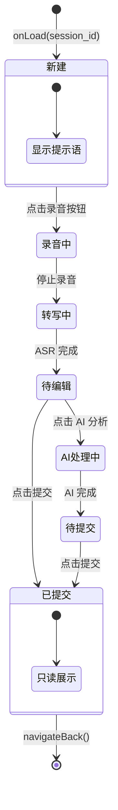
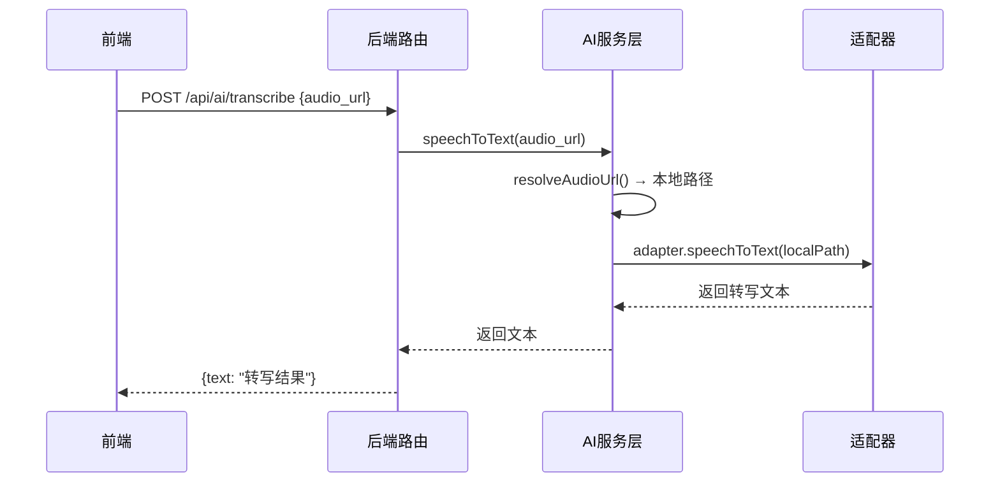
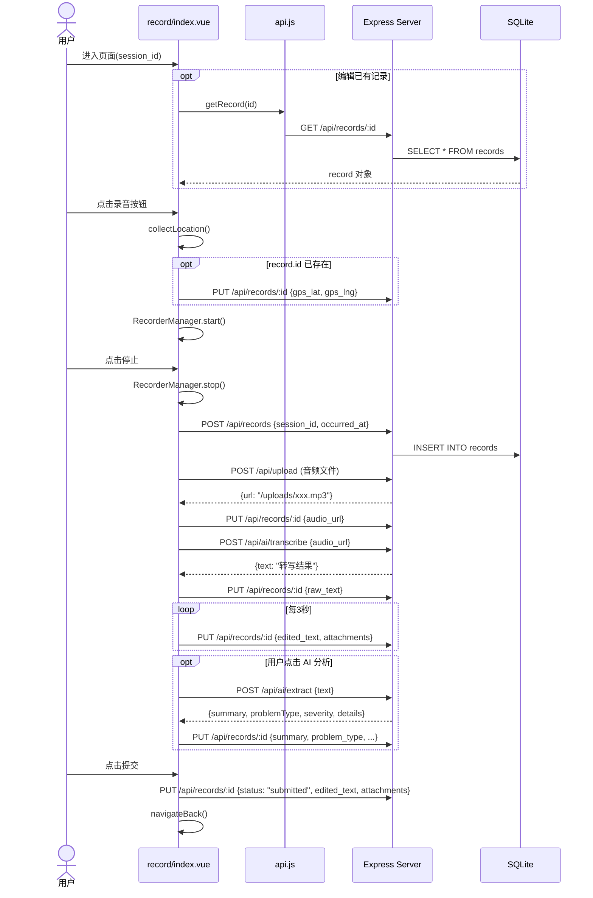

录音页（`pages/record/index`）是路测助手的**核心交互入口**，承载了从语音采集到 AI 结构化提取的完整数据处理管线。本文从架构总览开始，逐层拆解其页面状态机、数据管线、API 调用时序以及关键设计决策，帮助高级开发者快速掌握该页面的实现全貌与修改边界。

Sources: [index.vue](client/pages/record/index.vue#L1-L120), [pages.json](client/pages.json#L14-L20)

## 架构总览：四阶段数据处理管线

录音页的核心职责可以用一条线性管线来描述——**采集 → 传输 → 转写 → 结构化**。每个阶段的输出既是下一阶段的输入，也会持久化到后端数据库，形成增量式的状态推进。下面这张图展示了从前端用户操作到后端服务调用的完整数据流向：



**关键架构特征**：管线并非自动串联的——ASR 转写在录音停止后自动触发，但 AI 结构化提取需要用户**手动点击**「AI 分析」按钮。这种设计赋予了用户在转写结果基础上进行编辑修正的机会，避免在错误的文本上浪费 AI 调用额度。

Sources: [index.vue](client/pages/record/index.vue#L218-L261), [ai.js](server/src/routes/ai.js#L1-L74)

## 页面状态机：Draft 与 Submitted 的双模式切换

录音页通过 `record.status` 字段驱动两套完全不同的 UI 模板。整个页面本质上是一个**隐式状态机**，状态流转如下：



模板层面的条件渲染逻辑非常简洁——仅用 `v-if="!record.id || record.status === 'draft'"` 一行就区分了**编辑态**和**已提交态**。在编辑态下，各子模块（录音按钮、转写结果、AI 结果、GPS 信息、附件、操作按钮）通过各自的数据绑定条件逐步显现，形成渐进式的信息展示体验。

| UI 区块 | 显示条件 | 数据来源 |
|---------|---------|---------|
| 引导提示语 | `!isRecording && !record.raw_text` | 静态文案 |
| 录音按钮 + 计时器 | 始终可见（编辑态） | `isRecording` / `recordingDuration` |
| 转写结果编辑框 | `record.raw_text` 存在 | ASR 返回 / 用户编辑 |
| AI 识别结果卡 | `record.summary` 存在 | `extractFields()` 返回 |
| GPS 信息卡 | `record.gps_lat` 存在 | `uni.getLocation()` |
| 附件区 | 始终可见（编辑态） | `attachments[]` |
| AI 分析按钮 | `record.raw_text` 存在 | — |
| 提交按钮 | `record.raw_text` 存在 | — |

Sources: [index.vue](client/pages/record/index.vue#L4-L96), [index.vue](client/pages/record/index.vue#L98-L118)

## 录音阶段：RecorderManager 与参数选择

录音功能基于 UniApp 的 `uni.getRecorderManager()` API 实现，这是一个平台无关的录音管理器。页面在 `onLoad` 生命周期中初始化录音器并注册 `onStop` 回调：

```javascript
this.recorderManager = uni.getRecorderManager();
this.recorderManager.onStop((res) => {
  this.audioFilePath = res.tempFilePath;
  this.handleRecordingDone();
});
```

录音参数的选择直接影响 ASR 识别准确率和文件大小。当前配置为 **MP3 格式、16kHz 采样率、单声道**，这是一个在语音识别准确性与文件体积之间取得平衡的标准配置。16kHz 是电话级语音采样率的行业标准（满足奈奎斯特定理对 8kHz 以内人声频率的覆盖），同时 MP3 格式在 UniApp 跨平台兼容性上表现最佳。

**录音启动时的并行操作**——`toggleRecording()` 在开始录音的同时会调用 `collectLocation()` 获取当前 GPS 坐标，这是一个非阻塞的异步操作，不影响录音本身。计时器通过 `setInterval` 每秒递增 `recordingDuration`，在 UI 上以 `MM:SS` 格式实时展示。

Sources: [index.vue](client/pages/record/index.vue#L147-L201), [index.vue](client/pages/record/index.vue#L319-L323)

## 上传阶段：Multer 文件上传与 URL 映射

录音停止后触发 `handleRecordingDone()` 方法，这是整个管线的**编排核心**。上传阶段的执行序列如下：

1. **创建 Record 实体**（如果尚未创建）——调用 `createRecord({ session_id, occurred_at })` 在数据库中建立一条空记录
2. **上传音频文件**——通过 `uni.uploadFile()` 将临时文件发送到 `POST /api/upload`
3. **回写 audio_url**——调用 `updateRecord()` 将上传返回的 URL 路径写入数据库

后端上传路由使用 **Multer** 中间件处理文件存储。文件名生成策略为 `{时间戳}-{6位随机字符}{扩展名}`（例如 `1775830553318-r5rcr9.mp3`），这种命名方式在时间排序唯一性和碰撞抵抗之间取得了良好平衡。上传限制为 **100MB**，允许的文件类型涵盖音频（mp3/wav/m4a/aac/ogg）、视频（mp4/mov）和图片（jpg/jpeg/png）三类。

值得注意的是 `uploadFile()` 函数是 `api.js` 中唯一**不使用**通用 `request()` 封装的 API 调用，因为 UniApp 的 `uni.uploadFile` 是独立的文件上传 API，与 `uni.request` 的调用方式不同。它直接构造 `Promise` 包装 `uni.uploadFile`，成功时解析 `res.data`（需要 `JSON.parse`，因为 `uni.uploadFile` 返回字符串格式的响应体）。

Sources: [index.vue](client/pages/record/index.vue#L218-L241), [upload.js](server/src/routes/upload.js#L14-L51), [api.js](client/services/api.js#L101-L117)

## ASR 转写阶段：从 audio_url 到 raw_text

上传完成后，前端立即调用 `transcribeAudio(uploadResult.url)` 触发语音转文字。该请求到达后端 `POST /api/ai/transcribe` 路由，核心处理链路为：



`ai-service.js` 中的 `resolveAudioUrl()` 函数承担了一个关键的**路径转换**职责：前端传入的是 Web URL（如 `/uploads/xxx.mp3`），而适配器需要的是文件系统绝对路径。该函数检测到 `/uploads/` 前缀后，自动映射到 `server/uploads/` 目录下的实际文件路径。

**适配器单例选择机制**——`getAdapter()` 根据 `.env` 中的 API Key 配置自动选择适配器实例：`ZHIPU_API_KEY` 优先使用智谱 GLM，其次 `DASHSCOPE_API_KEY` 使用通义千问，两者均未配置时降级为 Mock 适配器。这种设计使得部署时无需修改代码即可切换 AI 供应商。

转写结果返回后，前端将 `raw_text` 同时赋值给 `record.raw_text`（只读备份）和 `editableText`（双向绑定到 textarea），并调用 `updateRecord()` 持久化到数据库。此时用户可以在 textarea 中自由编辑转写文本。

Sources: [index.vue](client/pages/record/index.vue#L228-L237), [ai.js](server/src/routes/ai.js#L7-L19), [ai-service.js](server/src/services/ai-service.js#L6-L45)

## AI 结构化提取：手动触发的 Prompt 工程

与 ASR 自动触发不同，AI 结构化提取需要用户在编辑完文本后**主动点击**「AI 分析」按钮。这一设计决策的背后是成本控制——LLM 调用存在费用和延迟，允许用户先修正转写错误再提交，可以显著提高提取准确性并减少无效调用。

点击按钮后，`runAI()` 方法执行以下流程：

1. 将 `editableText`（可能已被用户编辑修改）发送到 `POST /api/ai/extract`
2. 后端将文本传递给适配器的 `extractFields()` 方法
3. 适配器使用预设的系统 Prompt（路测问题分析助手）构造 Chat Completion 请求
4. 返回结构化 JSON：`{ summary, problemType, severity, details }`
5. 前端将结果映射为 `{ summary, problem_type, severity, details }` 并更新记录

**Prompt 工程细节**——以智谱 GLM 适配器为例，系统 Prompt 定义了严格的输出 schema：`problemType` 限定为 6 种枚举值（感知异常/规划异常/控制异常/接管/系统故障/其他），`severity` 限定为 4 级（致命/严重/一般/轻微），温度参数设为 0.1 以获得确定性的分类结果。适配器还内置了 JSON 解析容错机制——当 LLM 返回非纯 JSON 内容时，会通过正则 `\{[\s\S]*\}` 提取首个 JSON 对象。

前端 UI 中，严重程度字段使用 CSS class 动态着色：致命（红色 `#ffccc7`）、严重（粉红 `#ffa39e`）、一般（浅红 `#fff1f0`）、轻微（绿色 `#f6ffed`），通过 `.severity-{值}` 类名实现零逻辑的视觉映射。

Sources: [index.vue](client/pages/record/index.vue#L243-L261), [zhipu-adapter.js](server/src/services/zhipu-adapter.js#L5-L19), [zhipu-adapter.js](server/src/services/zhipu-adapter.js#L136-L172), [index.vue](client/pages/record/index.vue#L447-L450)

## GPS 采集与附件系统

**GPS 定位**在录音启动时通过 `collectLocation()` 异步获取，使用 WGS84 坐标系。定位成功后直接调用 `updateRecord()` 将经纬度写入数据库。注意这里有一个**条件守卫**——`if (!this.record.id) return;`，这意味着 GPS 数据仅在 Record 实体已创建后才会回写。在首次录音的场景下，由于 Record 在 `handleRecordingDone()` 中才创建，GPS 数据会在录音停止后的第一次 `saveDraft()` 周期中写入。定位失败时采用静默降级策略（空 `fail` 回调），不阻断主流程。

**附件系统**支持拍照（`uni.chooseImage`）和录像（`uni.chooseVideo`）两种类型。每个附件通过 `uploadFile()` 上传后以 `{ type, url }` 对象的形式追加到 `attachments` 数组。该数组在 `updateRecord()` 时被 `JSON.stringify()` 序列化后存入数据库的 `attachments TEXT` 字段（默认值为 `'[]'`）。附件的删除目前仅在前端数组层面操作（`splice`），需要等待下一次自动保存或手动提交时才会同步到后端。

Sources: [index.vue](client/pages/record/index.vue#L203-L216), [index.vue](client/pages/record/index.vue#L290-L318), [queries.js](server/src/models/queries.js#L108-L135)

## 自动保存草稿机制

页面在 `onLoad` 中启动一个 **3 秒间隔**的定时器，持续调用 `saveDraft()` 方法。该方法仅在两个条件同时满足时执行写操作：`record.id` 存在（实体已创建）且 `editableText` 非空（有内容可保存）。保存内容包括 `edited_text`（用户编辑后的文本）和 `attachments`（附件列表），失败时静默吞没异常，避免干扰用户体验。

```javascript
async saveDraft() {
  if (!this.record.id || !this.editableText) return;
  try {
    await updateRecord(this.record.id, {
      edited_text: this.editableText,
      attachments: this.attachments,
    });
  } catch (e) { /* silent */ }
}
```

定时器在 `onUnload` 生命周期中被清理，同时如果录音正在进行也会主动停止录音器。这确保了页面退出时不会留下悬挂的录音进程或定时器泄漏。

Sources: [index.vue](client/pages/record/index.vue#L158-L166), [index.vue](client/pages/record/index.vue#L281-L289)

## 提交流程与状态终结

用户点击「提交」按钮后，`submitRecord()` 方法将记录状态从 `draft` 切换为 `submitted`，同时保存最终版本的 `edited_text` 和 `attachments`。状态变更触发模板的条件渲染切换——`v-if` 判定结果翻转，编辑态 UI 隐藏，已提交态 UI（带绿色 ✓ 徽章的只读卡片）显示。1 秒后自动调用 `uni.navigateBack()` 返回上一页（通常是[试验详情页](21-shi-yan-xiang-qing-ye-shuang-mo-shi-xin-jian-cha-kan-yu-ji-lu-guan-li)）。

数据库层面，`status` 字段通过 `CHECK(status IN ('draft', 'submitted'))` 约束确保只有两种合法状态。`updateRecord()` 查询层采用**动态字段拼接**策略——遍历 `allowedFields` 白名单，仅为请求体中存在的字段生成 `SET` 子句，未传递的字段保持原值不变。每次更新都会自动刷新 `updated_at` 时间戳。

Sources: [index.vue](client/pages/record/index.vue#L263-L279), [queries.js](server/src/models/queries.js#L108-L135), [database.js](server/src/models/database.js#L47-L67)

## 完整 API 调用时序图

下面的时序图展示了从用户进入录音页到提交记录的完整 API 调用序列，标注了每个调用的触发时机和参数：



Sources: [index.vue](client/pages/record/index.vue#L122-L325), [api.js](client/services/api.js#L70-L98), [records.js](server/src/routes/records.js#L1-L43)

## 设计决策总结

| 设计决策 | 选择 | 理由 |
|---------|------|------|
| Record 创建时机 | 录音停止后（非页面加载时） | 避免用户进入页面但未录音就产生空记录 |
| ASR 触发方式 | 录音停止后自动触发 | 减少用户操作步骤，录音→转写是无争议的固定流程 |
| AI 提取触发方式 | 手动按钮触发 | 允许用户先修正转写文本，避免在错误文本上浪费 LLM 调用 |
| 草稿保存策略 | 3 秒定时器 | 平衡数据安全性与服务器负载，避免每次按键都触发请求 |
| GPS 采集时机 | 录音启动时 | 路测场景下，录音时刻的坐标最具代表性 |
| 文件上传独立封装 | 不使用通用 request() | UniApp 的 uploadFile API 与 request API 接口不同 |
| 状态切换 | 单一字段 `status` | 简单的双态（draft/submitted），无需复杂状态机框架 |
| 附件存储 | JSON 序列化到 TEXT 字段 | 附件数量少（通常 < 5），无需独立关联表 |

Sources: [index.vue](client/pages/record/index.vue#L1-L581)

## 延伸阅读

- **后端 AI 适配器的可插拔设计**：详见[可插拔适配器模式：BaseAdapter 抽象与单例选择器](14-ke-cha-ba-gua-pei-qi-mo-shi-baseadapter-chou-xiang-yu-dan-li-xuan-ze-qi)
- **文件上传的 Multer 配置细节**：详见[Multer 文件上传与静态资源托管](13-multer-wen-jian-shang-chuan-yu-jing-tai-zi-yuan-tuo-guan)
- **Record 实体的数据库 Schema**：详见[三层实体关系：项目 → 试验 → 记录](8-san-ceng-shi-ti-guan-xi-xiang-mu-shi-yan-ji-lu)和[SQLite 数据库设计与本地时区时间戳策略](9-sqlite-shu-ju-ku-she-ji-yu-ben-di-shi-qu-shi-jian-chuo-ce-lue)
- **录音页的入口上下文**：从[试验详情页](21-shi-yan-xiang-qing-ye-shuang-mo-shi-xin-jian-cha-kan-yu-ji-lu-guan-li)跳转进入，提交后返回该页
- **前端 API 层封装**：详见[前端 API 服务层封装与请求代理机制](23-qian-duan-api-fu-wu-ceng-feng-zhuang-yu-qing-qiu-dai-li-ji-zhi)