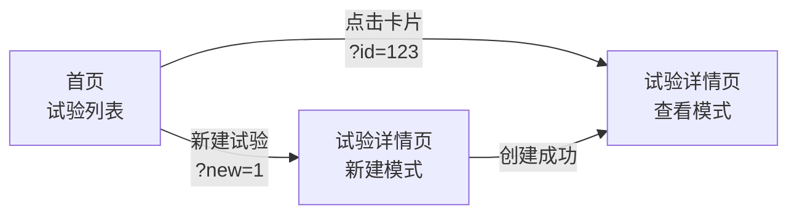
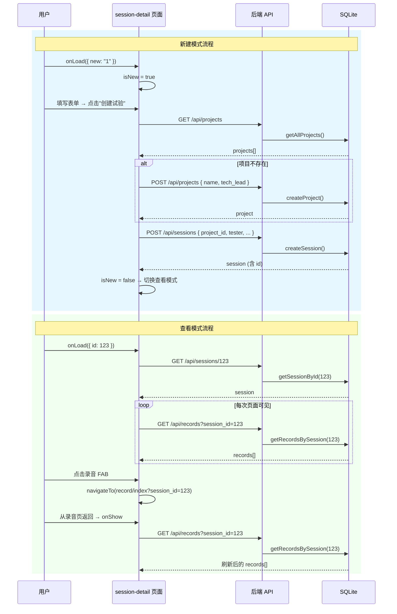
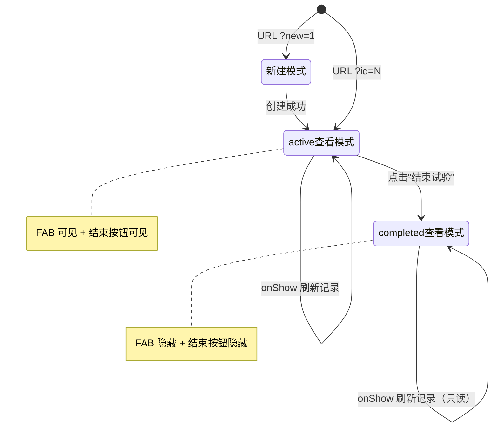

**试验详情页**（`session-detail/index`）是路测助手中承上启下的核心页面——它既承担"新建试验"的表单职责，又在创建完成后无缝切换为"试验信息 + 记录列表"的查看管理视图。这种**单页面双模式**的设计通过 URL 查询参数驱动 `v-if/v-else` 条件渲染，将两个功能高度内聚在同一个 Vue 组件中，避免了页面碎片化。本文将从模式切换机制、数据流、记录管理交互和状态生命周期四个维度展开解析。

Sources: [index.vue](client/pages/session-detail/index.vue#L1-L112), [pages.json](client/pages.json#L10-L14)

## 页面路由与模式判定

试验详情页在 `pages.json` 中注册为 `pages/session-detail/index`，导航栏标题固定为"试验详情"。首页（`pages/index/index`）通过两种不同的 URL 参数驱动进入此页面：

**模式判定逻辑**在 `onLoad(options)` 生命周期钩子中一次性完成：当 `options.new === '1'` 时进入**新建模式**（`isNew = true`），此时渲染表单视图；当 `options.id` 存在时进入**查看模式**，解析 `sessionId` 并立即调用 `loadSession()` 拉取试验数据。两种模式互斥——`v-if="isNew"` 与 `v-else` 构成了模板层的全量分支。

Sources: [index.vue](client/pages/session-detail/index.vue#L135-L142), [index.vue](client/pages/index/index.vue#L72-L77)

## 新建模式：表单、项目自动创建与试验提交

新建模式的模板区域（`v-if="isNew"`）包含六个表单字段，其中 `projectName`（项目名称）和 `tester`（测试人员）标记为必填。表单数据模型定义在 `data()` 的 `form` 对象中，`testDate` 默认初始化为当天日期（通过 `new Date().toISOString().split('T')[0]` 截取 `YYYY-MM-DD` 格式），日期选择使用 UniApp 内置的 `<picker mode="date">` 组件。

**创建流程的核心设计在于"项目自动创建"机制**：`createNewSession()` 方法首先调用 `getProjects()` 获取全部项目列表，然后通过 `Array.find()` 在前端匹配项目名称——若匹配成功则复用已有 `project`，若不存在则调用 `createProject()` 在后端自动新建项目。这避免了用户需要预先在独立页面管理项目的额外步骤，将"项目"作为试验的隐式上下文自动处理。

| 表单字段 | 数据绑定 | 必填 | 备注 |
|---------|---------|------|------|
| `projectName` | `form.projectName` | ✅ | 用于匹配或创建 project |
| `techLead` | `form.techLead` | ❌ | 仅在创建新项目时传递 |
| `tester` | `form.tester` | ✅ | 写入 test_sessions.tester |
| `testDate` | `form.testDate` | 默认当天 | 使用 `<picker mode="date">` |
| `vehicleInfo` | `form.vehicleInfo` | ❌ | 如"沪A12345" |
| `route` | `form.route` | ❌ | 如"高速环线" |

创建成功后，页面通过 `this.isNew = false` 和 `this.session = sess` **就地切换**到查看模式，无需页面跳转，用户体验上从表单无缝过渡到详情视图。`submitting` 标志位在请求期间禁用按钮并显示"创建中..."文案，防止重复提交。

Sources: [index.vue](client/pages/session-detail/index.vue#L4-L42), [index.vue](client/pages/session-detail/index.vue#L118-L195), [api.js](client/services/api.js#L53-L68)

## 查看模式：试验信息展示与记录列表

### 试验信息卡片

查看模式的核心视图由**信息卡片**和**记录列表**两部分构成。信息卡片通过 `v-if/v-else` 控制的条件渲染，仅在字段有值时显示对应行（如 `session.vehicle_info`、`session.route`），保持界面简洁。**状态字段**通过颜色区分语义——`active`（进行中）显示为蓝色 `#1890ff`，`completed`（已结束）显示为绿色 `#52c41a`，与数据库中 `CHECK(status IN ('active', 'completed'))` 的约束保持一致。

Sources: [index.vue](client/pages/session-detail/index.vue#L45-L70), [database.js](server/src/models/database.js#L34-L45)

### 记录列表的加载时机

记录列表采用**双生命周期加载策略**：`onLoad` 中通过 `this.sessionId` 判断后调用 `loadSession()` 加载试验元数据；`onShow` 中再次调用 `loadRecords()`——这是关键设计。由于 UniApp 的 `navigateBack` 会触发目标页面的 `onShow`（而非 `onLoad`），当用户从录音记录页（`record/index`）返回时，`onShow` 确保记录列表自动刷新，无需手动触发。

每条记录以卡片形式展示，包含三层数据：**状态标签**（`draft` 为橙色草稿、`submitted` 为蓝色已提交）、**摘要文本**（优先显示 `record.summary`，其次 `raw_text`，兜底"未处理"）、**标签区**（`problem_type` 和 `severity`）。点击记录卡片通过 `goToRecord(record.id)` 导航到 `/pages/record/index?id=<recordId>&session_id=<sessionId>`。

Sources: [index.vue](client/pages/session-detail/index.vue#L72-L98), [index.vue](client/pages/session-detail/index.vue#L143-L147), [index.vue](client/pages/session-detail/index.vue#L212-L214)

## 记录管理的交互设计

### 浮动录音按钮（FAB）

当试验处于 `active` 状态时，页面底部居中显示一个固定的**浮动操作按钮**（Floating Action Button），红色渐变背景配以 🎙 图标和"录音"文字。点击后导航到 `/pages/record/index?session_id=<sessionId>`（不传 `id` 参数，录音页识别为新建记录）。FAB 通过 `v-if="!isNew && session.status === 'active'"` 双重守卫，仅在查看模式且试验进行中时可见。该按钮的固定定位（`position: fixed; bottom: 120rpx`）确保无论列表多长都触手可及。

### 结束试验

"结束试验"按钮仅在试验状态为 `active` 时显示，点击后弹出 `uni.showModal` 确认对话框，提示"结束后将无法继续录音"。确认后调用 `updateSession(sessionId, { status: 'completed' })`，后端的 `updateSession` 查询函数会将 `status` 字段更新为 `completed`，同时通过 `datetime('now','localtime')` 自动更新 `updated_at` 时间戳。操作成功后 FAB 和结束按钮同时隐藏（因为 `session.status` 已变为 `completed`），界面自然收敛为只读状态。

Sources: [index.vue](client/pages/session-detail/index.vue#L100-L111), [index.vue](client/pages/session-detail/index.vue#L196-L221), [queries.js](server/src/models/queries.js#L51-L66)

## 数据流与 API 调用全景

以下 Mermaid 序列图展示了试验详情页在两种模式下的完整 API 调用链路：

后端路由层（`server/src/routes/sessions.js`）对请求进行参数校验：`POST /api/sessions` 要求 `project_id`、`tester`、`test_date` 三项必填，缺失则返回 `400`；`GET /api/sessions/:id` 在找不到记录时返回 `404`。前端通过 `try/catch` 统一捕获异常，以 `uni.showToast` 呈现错误提示。

Sources: [sessions.js](server/src/routes/sessions.js#L1-L41), [queries.js](server/src/models/queries.js#L30-L66), [api.js](client/services/api.js#L53-L85)

## 状态生命周期：从 active 到 completed

试验的 `status` 字段是控制页面行为的**核心状态变量**。数据库层通过 `CHECK(status IN ('active', 'completed'))` 约束保证状态值的合法性。在查看模式中，`session.status` 的值直接影响三个 UI 元素的可见性：

| UI 元素 | 显示条件 | 对应代码 |
|---------|---------|---------|
| 浮动录音按钮 | `!isNew && session.status === 'active'` | `v-if="!isNew && session.status === 'active'"` |
| 结束试验按钮 | `session.status === 'active'` | `v-if="session.status === 'active'"` |
| 记录卡片点击 | 无限制（始终可查看） | `@click="goToRecord(record.id)"` |

这意味着当一个试验被标记为 `completed` 后，页面自动进入**只读归档模式**——用户仍可浏览已有记录的详情，但无法新增录音或修改试验状态。

Sources: [index.vue](client/pages/session-detail/index.vue#L100-L111), [database.js](server/src/models/database.js#L41)

## 组件级数据模型

试验详情页的 `data()` 定义了五个核心状态属性，各司其职：

| 属性 | 类型 | 初始值 | 用途 |
|------|------|--------|------|
| `isNew` | Boolean | `false` | 模式切换开关 |
| `sessionId` | Number | `null` | 当前试验 ID（查看模式） |
| `session` | Object | `{}` | 试验元数据（tester, test_date, status 等） |
| `records` | Array | `[]` | 当前试验下的记录列表 |
| `submitting` | Boolean | `false` | 提交锁（防重复点击） |
| `form` | Object | `{ projectName: '', testDate: 当天, ... }` | 新建表单数据 |

值得注意的设计细节：`form` 对象的字段命名（驼峰式 `projectName`、`vehicleInfo`）与后端数据库字段命名（下划线式 `project_id`、`vehicle_info`）存在映射差异。`createNewSession()` 方法在调用 `createSession()` API 时手动完成字段转换（如 `form.vehicleInfo → vehicle_info: f.vehicleInfo`），这是一种典型的**前端适配器模式**，将 UI 层的数据模型与 API 层的序列化格式解耦。

Sources: [index.vue](client/pages/session-detail/index.vue#L118-L134), [index.vue](client/pages/session-detail/index.vue#L166-L195)

## 延伸阅读

- 了解试验详情页在整个应用中的位置，参见 [从新建试验到提交记录的完整工作流](4-cong-xin-jian-shi-yan-dao-ti-jiao-ji-lu-de-wan-zheng-gong-zuo-liu)
- 深入录音记录页的完整实现（录音 → 上传 → ASR → AI 分析），参见 [核心录音页：录音 → 上传 → ASR → AI 分析的完整实现](20-he-xin-lu-yin-ye-lu-yin-shang-chuan-asr-ai-fen-xi-de-wan-zheng-shi-xian)
- 理解三层实体关系（项目 → 试验 → 记录）的数据模型设计，参见 [三层实体关系：项目 → 试验 → 记录](8-san-ceng-shi-ti-guan-xi-xiang-mu-shi-yan-ji-lu)
- 前端 API 封装细节，参见 [前端 API 服务层封装与请求代理机制](23-qian-duan-api-fu-wu-ceng-feng-zhuang-yu-qing-qiu-dai-li-ji-zhi)
- 后端 Session 和 Record 的 CRUD 实现，参见 [原始 SQL 查询层：无 ORM 的 CRUD 实现](12-yuan-shi-sql-cha-xun-ceng-wu-orm-de-crud-shi-xian)