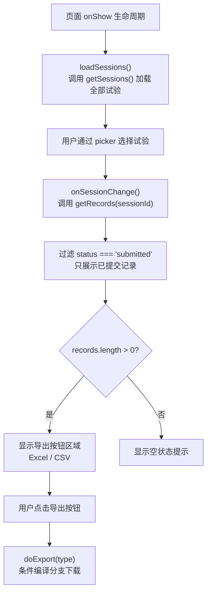
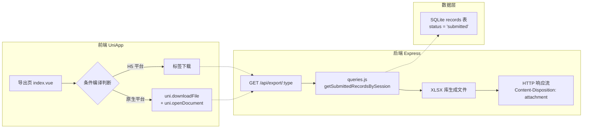

导出页是路测助手中负责将试验记录批量导出为 Excel 或 CSV 文件的 Tab 页面。其核心技术难点在于：UniApp 编译目标涵盖 H5 浏览器、App 原生和小程序等多种运行时，而文件下载在不同平台的 API 支持上存在根本性差异。本页通过 UniApp 的**条件编译**（Conditional Compilation）机制，在同一个 `doExport` 方法内为不同平台编写各自的下载实现，对外保持统一的用户交互。页面整体采用「选择试验 → 预览记录 → 触发导出」的三步式交互流程，后端通过 `xlsx` 库在服务端实时生成文件并以 HTTP 流的形式返回。

Sources: [index.vue](client/pages/export/index.vue#L1-L49), [pages.json](client/pages.json#L22-L26), [pages.json](client/pages.json#L44-L47)

## 页面路由与 Tab 配置

导出页被注册为应用的底部 Tab 页之一，与首页（试验列表）并列展示。在 `pages.json` 中，它以 `"path": "pages/export/index"` 注册，导航栏标题为"导出"。Tab 配置中，其 `pagePath` 指向同一路径，显示文字为"导出"。这意味着用户在任何页面都可以通过底部 Tab 栏直接切换到导出页，无需额外导航跳转。

Sources: [pages.json](client/pages.json#L1-L50)

## 页面交互流程：选择 → 预览 → 导出

导出页的交互逻辑可以拆解为三个阶段，每个阶段对应组件中的一个核心功能块：



**第一阶段：加载试验列表。** 页面在 `onShow` 生命周期中调用 `loadSessions()`，通过 [api.js](client/services/api.js) 中的 `getSessions()` 发起 `GET /api/sessions` 请求获取全部试验数据。试验列表以 `picker` 组件的形式呈现，显示格式为 `"测试人员 - 测试日期 - 测试路线"`。

**第二阶段：选择试验与预览记录。** 用户在 picker 中选择某个试验后，触发 `onSessionChange`，该方法获取该试验下的全部记录，并通过 `.filter(r => r.status === 'submitted')` 筛选出**已提交**状态的记录。这些记录以卡片列表的形式展示摘要（summary）、问题类型（problem_type）和严重程度（severity），供用户在导出前确认数据内容。

**第三阶段：触发文件导出。** 当存在可导出记录时，页面渲染两个导出按钮——"导出 Excel"和"导出 CSV"。点击后进入 `doExport` 方法，这是条件编译的核心所在。

Sources: [index.vue](client/pages/export/index.vue#L51-L147), [api.js](client/services/api.js#L54-L56), [api.js](client/services/api.js#L71-L73)

## 条件编译：H5 与原生平台的差异化实现

`doExport` 方法是理解本页架构的关键。它首先根据导出类型（excel / csv）确定文件扩展名，然后拼接出后端导出接口的完整 URL：

```javascript
const ext = type === 'excel' ? 'xlsx' : 'csv';
const url = `${BASE_URL}/api/export/${type}?session_id=${this.selectedSession}`;
```

此后，代码通过 UniApp 的条件编译注释指令 `#ifdef H5` 和 `#ifndef H5` 分裂为两条完全不同的下载路径。下表对比了两条路径的实现差异：

| 维度 | H5 平台（`#ifdef H5`） | 原生 / 小程序平台（`#ifndef H5`） |
|---|---|---|
| **下载机制** | 创建 `<a>` 标签，设置 `href` 和 `download` 属性，模拟点击 | 调用 `uni.downloadFile` 下载到临时路径 |
| **文件保存** | 浏览器自动弹出"另存为"对话框或下载到默认目录 | `uni.openDocument` 打开系统文档查看器 |
| **用户反馈** | 无显式提示（浏览器自带下载进度） | `uni.showToast` 显示"导出成功"或失败提示 |
| **加载状态** | 未设置 `exporting` 标志 | 通过 `exporting` 标志禁用按钮，防止重复点击 |
| **错误处理** | 无（依赖浏览器默认行为） | 三层嵌套：下载失败 → 打开失败 → HTTP 状态码非 200 |

Sources: [index.vue](client/pages/export/index.vue#L98-L144)

### H5 分支：浏览器原生下载

```javascript
// #ifdef H5
const link = document.createElement('a');
link.href = url;
link.download = `roadtest-${this.selectedSession}.${ext}`;
document.body.appendChild(link);
link.click();
document.body.removeChild(link);
// #endif
```

H5 分支的实现极其精简——利用浏览器 DOM API 创建一个临时的 `<a>` 元素，为其设置 `href` 指向后端导出接口，再通过 `download` 属性指定浏览器下载时使用的文件名。`document.body.appendChild(link)` → `link.click()` → `document.body.removeChild(link)` 这三步是一个经典的"虚拟点击下载"模式。浏览器接收到后端返回的 `Content-Disposition: attachment` 响应头后，会自动触发文件保存。此方式**无需额外的加载状态管理**，因为浏览器地址栏或下载管理器会自行展示下载进度。

Sources: [index.vue](client/pages/export/index.vue#L102-L110)

### 原生分支：下载 + 打开文档的双步操作

```javascript
// #ifndef H5
this.exporting = true;
uni.downloadFile({
  url,
  success: (res) => {
    if (res.statusCode === 200) {
      const fileType = type === 'excel' ? 'xlsx' : 'csv';
      uni.openDocument({
        filePath: res.tempFilePath,
        fileType,
        showMenu: true,
        // ...
      });
    }
  },
  complete: () => { this.exporting = false; }
});
// #endif
```

原生分支采用 `uni.downloadFile` → `uni.openDocument` 的**两步链式调用**。`uni.downloadFile` 将远程文件下载到本地临时路径 `res.tempFilePath`，随后 `uni.openDocument` 调用系统原生文档查看器打开该文件。`showMenu: true` 参数会在打开文档后显示系统分享菜单，用户可以通过系统分享功能将文件发送到微信、邮件等应用。

此分支需要显式管理 `exporting` 状态：在下载开始时设为 `true` 禁用按钮，在 `complete` 回调中恢复为 `false`，防止用户在网络延迟期间重复触发下载。

Sources: [index.vue](client/pages/export/index.vue#L112-L143)

## 条件编译指令详解

UniApp 的条件编译通过特殊的注释语法实现，编译器在构建时会根据目标平台**物理剔除**不匹配的代码块，而非运行时判断。这意味着：

- 编译为 H5 时，`#ifndef H5` 包裹的 `uni.downloadFile` 代码会**完全不存在**于产物中
- 编译为 App 时，`#ifdef H5` 包裹的 DOM 操作代码同样**不存在**

下面列出了本页使用的两条指令及其作用：

| 指令 | 含义 | 作用范围 |
|---|---|---|
| `// #ifdef H5` | 仅在 H5 平台编译此块代码 | 浏览器 DOM 下载方案 |
| `// #ifndef H5` | 在除 H5 外的所有平台编译此块代码 | App / 小程序的 uni API 下载方案 |

这种编译期隔离的优势在于：H5 产物中不会残留 `uni.downloadFile` 的死代码（减小包体积），App 产物中也不会引用 `document.createElement` 等浏览器专有 API（避免运行时报错）。值得注意的是，代码中 H5 分支使用了 `document` 对象——这在 UniApp 的其他平台中是不存在的，正是条件编译保证了这段代码不会被编译到非 H5 产物中。

Sources: [index.vue](client/pages/export/index.vue#L102-L143)

## 后端导出接口的设计契约

前端 `doExport` 构造的 URL 指向后端的 `GET /api/export/:type` 端点。后端路由挂载在 `/api/export` 前缀下，提供 `excel` 和 `csv` 两个子路由。两者的核心处理逻辑高度对称：

```mermaid
sequenceDiagram
    participant Client as 前端导出页
    participant Server as Express 后端
    participant DB as SQLite
    
    Client->>Server: GET /api/export/excel?session_id=5
    Server->>DB: getSessionById(5)
    DB-->>Server: session 数据
    Server->>DB: getSubmittedRecordsBySession(5)
    DB-->>Server: 已提交记录数组
    Server->>Server: XLSX.utils.json_to_sheet(data)
    Server->>Server: XLSX.write(wb, {type:'buffer'})
    Server-->>Client: HTTP 200<br/>Content-Type: application/vnd.openxmlformats-...<br/>Content-Disposition: attachment; filename=...
```

两个端点的处理流程完全一致：验证 `session_id` → 查询试验是否存在 → 查询该试验下的已提交记录 → 数据映射为中文表头 → 生成文件 → 设置响应头后返回。关键的响应头设置决定了前端如何处理返回内容：

- **Excel 端点**：`Content-Type` 为 `application/vnd.openxmlformats-officedocument.spreadsheetml.sheet`，`Content-Disposition` 包含 `attachment` 指令，提示浏览器下载而非在线显示。文件通过 `XLSX.write(wb, { type: 'buffer', bookType: 'xlsx' })` 生成二进制 Buffer。
- **CSV 端点**：`Content-Type` 为 `text/csv; charset=utf-8`，同样设置 `attachment` 响应头。一个值得注意的细节是响应体以 `\ufeff`（UTF-8 BOM）开头——这确保了 Microsoft Excel 打开 CSV 文件时能正确识别中文编码。

Sources: [export.js](server/src/routes/export.js#L1-L114)

### Excel 与 CSV 导出的字段差异

两个导出格式在字段覆盖范围上存在差异。Excel 导出包含 **14 个字段**（含试验信息工作表），CSV 导出则精简为 **10 个核心字段**：

| 字段 | Excel | CSV | 说明 |
|---|:---:|:---:|---|
| 记录ID | ✓ | ✓ | |
| 问题描述 | ✓ | ✓ | |
| 问题类型 | ✓ | ✓ | |
| 严重程度 | ✓ | ✓ | |
| 详细描述 | ✓ | ✓ | |
| 原始文字 | ✓ | ✓ | AI 转写的原始文本 |
| 编辑后文字 | ✓ | ✗ | 用户手动编辑后的文本 |
| GPS纬度 / 经度 | ✓ | ✓ | 各一列 |
| 地址 | ✓ | ✗ | GPS 反向解析地址 |
| 天气 | ✓ | ✓ | |
| 发生时间 | ✓ | ✗ | |
| 状态 | ✓ | ✓ | |
| 创建时间 | ✓ | ✗ | |

Excel 导出还额外包含一个 **"试验信息"工作表**，记录项目 ID、测试人员、测试日期、车辆信息、测试路线等元数据。这种多工作表结构是 Excel 格式的独有优势。

Sources: [export.js](server/src/routes/export.js#L23-L68), [export.js](server/src/routes/export.js#L89-L112)

## 数据查询层：仅导出已提交记录

导出的数据源通过 `getSubmittedRecordsBySession` 函数获取，该函数在 SQL 查询中硬编码了 `status = 'submitted'` 条件。这意味着只有状态为 **"已提交"** 的记录才会出现在导出文件中——草稿状态的记录被明确排除。这一设计保证了导出数据的质量一致性，避免将未完成的记录混入正式报表。

前端导出页在预览阶段也采用了相同的过滤逻辑（`records.filter(r => r.status === 'submitted')`），确保用户在导出前看到的预览内容与最终导出的文件内容完全一致。

Sources: [queries.js](server/src/models/queries.js#L137-L141), [index.vue](client/pages/export/index.vue#L92-L93)

## API 层的冗余设计与导出页的绕行策略

一个值得关注的架构细节是：[api.js](client/services/api.js) 中定义了 `exportExcel` 和 `exportCsv` 两个函数，它们通过 `POST` 方法调用 `/api/export/excel` 和 `/api/export/csv`。然而导出页**并未使用这两个函数**，而是自行构造 `BASE_URL` 并拼接 GET 请求 URL 直接下载。

这是因为 `api.js` 中的通用 `request` 函数基于 `uni.request`，适用于 JSON 数据交互，而文件下载需要的是 **二进制流处理**——无论是 H5 的 `<a>` 标签下载还是原生的 `uni.downloadFile`，都依赖完整的 URL 字符串而非请求封装。因此导出页选择了绕过 API 服务层，直接与后端导出端点交互。页面内的 `BASE_URL` 硬编码（`http://192.168.1.10:3000`）与 [api.js](client/services/api.js#L2) 中的定义保持一致，但存在维护分散的风险。

Sources: [api.js](client/services/api.js#L119-L127), [index.vue](client/pages/export/index.vue#L54-L100)

## 整体架构回顾

将前端导出页与后端导出接口合并审视，整个数据导出的端到端架构可以概括为以下分层：



**前端的职责**是平台适配：根据编译目标选择合适的文件下载机制，并管理用户交互状态。**后端的职责**是数据聚合与文件生成：从 SQLite 查询已提交记录，映射为中文表头结构，通过 `xlsx` 库生成对应的文件格式，最后以 HTTP 附件流的形式返回。两者之间通过简单的 GET 请求 + query 参数耦合，保持了清晰的关注点分离。

Sources: [index.vue](client/pages/export/index.vue#L98-L144), [export.js](server/src/routes/export.js#L1-L114), [queries.js](server/src/models/queries.js#L137-L141)

---

**相关阅读**：

- 想了解导出接口在整体 API 路由中的位置？参阅 [RESTful API 路由设计](11-restful-api-lu-you-she-ji-projects-sessions-records-upload-export-ai)
- 想了解前端 API 服务层的通用请求封装？参阅 [前端 API 服务层封装与请求代理机制](23-qian-duan-api-fu-wu-ceng-feng-zhuang-yu-qing-qiu-dai-li-ji-zhi)
- 想了解原始 SQL 查询层的整体设计？参阅 [原始 SQL 查询层：无 ORM 的 CRUD 实现](12-yuan-shi-sql-cha-xun-ceng-wu-orm-de-crud-shi-xian)
- 想了解完整的导出业务流程？参阅 [数据导出（Excel / CSV）流程](6-shu-ju-dao-chu-excel-csv-liu-cheng)