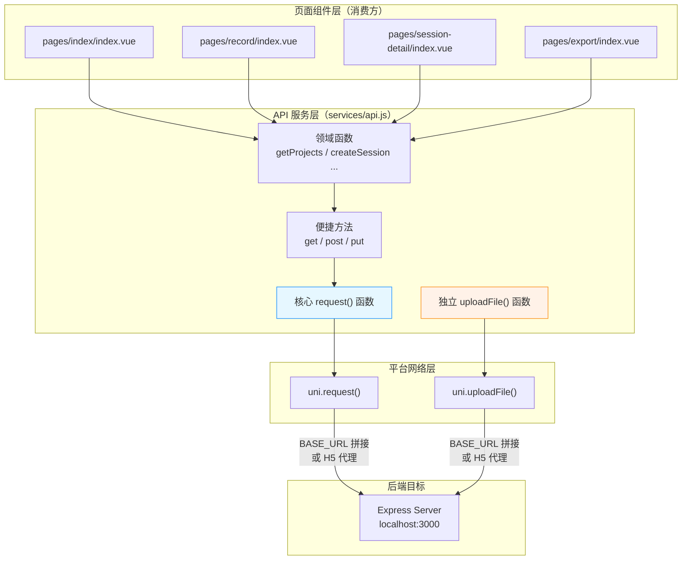
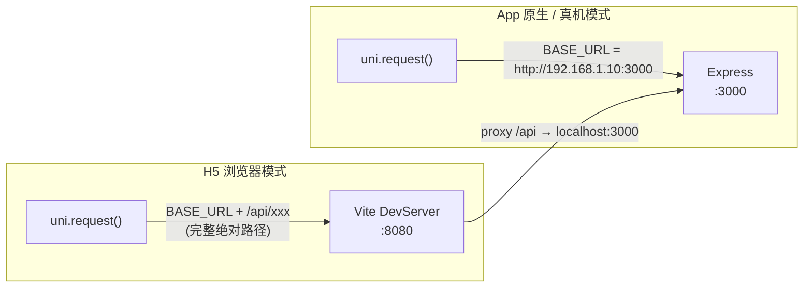

本文档深入解析路测助手前端如何将 UniApp 的 `uni.request` 网络接口封装为统一的 API 服务层，以及 H5 开发模式下通过 Vite devServer proxy 实现请求代理的完整机制。内容涵盖核心请求函数的设计哲学、按领域划分的 API 函数签名、文件上传的特殊处理路径、跨平台请求地址的双模式策略，以及页面组件的消费模式。

Sources: [api.js](client/services/api.js#L1-L127)

## 架构总览：服务层的分层设计

前端网络请求层遵循 **三层封装** 原则——从底层 UniApp 原生 API，到通用请求函数，再到领域化业务函数。这种分层将平台细节、HTTP 协议细节和业务语义彻底解耦，使得各页面组件只需关注"调哪个函数、传什么参数"。



每个页面组件通过 `import { 函数名 } from '../../services/api'` 按需引入所需的 API 函数，不直接接触任何 HTTP 细节。整个服务层集中在 [services/api.js](client/services/api.js) 这一个文件中，保持了 MVP 阶段"单文件服务层"的极简架构风格。

Sources: [api.js](client/services/api.js#L1-L26), [index.vue (首页)](client/pages/index/index.vue#L46), [record/index.vue](client/pages/record/index.vue#L123-L126), [session-detail/index.vue](client/pages/session-detail/index.vue#L115), [export/index.vue](client/pages/export/index.vue#L52)

## 核心请求函数：request() 的设计

`request()` 是整个服务层的中枢引擎，所有常规 JSON API 调用最终都汇聚于此。它将 UniApp 回调式的 `uni.request()` 包装为 Promise 接口，同时内置了默认请求头和分层错误处理。

```javascript
const BASE_URL = 'http://192.168.1.10:3000';

function request(options) {
  return new Promise((resolve, reject) => {
    uni.request({
      url: BASE_URL + options.url,
      method: options.method || 'GET',
      data: options.data,
      header: {
        'Content-Type': 'application/json',
        ...options.header,
      },
      success: (res) => {
        if (res.statusCode >= 200 && res.statusCode < 300) {
          resolve(res.data);
        } else {
          reject(new Error(res.data?.error || `请求失败: ${res.statusCode}`));
        }
      },
      fail: (err) => {
        reject(new Error(err.errMsg || '网络请求失败'));
      },
    });
  });
}
```

其设计包含以下关键决策：

| 设计点 | 实现方式 | 设计意图 |
|--------|---------|---------|
| **URL 拼接** | `BASE_URL + options.url` | 所有 API 路径使用相对路径（如 `/api/projects`），由 `BASE_URL` 统一控制目标服务器地址 |
| **默认方法** | `options.method \|\| 'GET'` | 省略 method 时默认为 GET，减少调用方样板代码 |
| **请求头合并** | `'Content-Type': 'application/json'` 加 `...options.header` 展开 | 默认 JSON 序列化，同时保留个别请求覆盖请求头的能力 |
| **成功判断** | `statusCode >= 200 && < 300` | 标准的 HTTP 2xx 语义，将所有非 2xx 响应统一归为错误 |
| **错误提取** | 优先取 `res.data?.error`，兜底用状态码文本 | 与后端 Express 路由中 `res.status(xxx).json({ error: '...' })` 的错误格式对齐 |
| **网络失败** | `fail` 回调取 `err.errMsg` | 区分"服务器返回错误"和"请求根本没发出去"两种故障场景 |

Sources: [api.js](client/services/api.js#L1-L26)

### 便捷方法的进一步封装

在 `request()` 之上，三个便捷方法进一步消除 HTTP 方法参数的重复书写：

```javascript
function get(url, data)   { return request({ url, method: 'GET',  data }); }
function post(url, data)  { return request({ url, method: 'POST', data }); }
function put(url, data)   { return request({ url, method: 'PUT',  data }); }
```

这种 `(url, data)` 二元签名模式意味着调用方永远只需要关心"请求哪个路径"和"传什么数据"，无需记忆 HTTP 方法名。值得注意的是，项目未封装 `DELETE` 方法——因为当前业务场景中不存在删除操作的需求，体现了 **按需封装** 的务实原则。

Sources: [api.js](client/services/api.js#L28-L38)

## 领域 API 函数：按实体分组导出

所有面向页面组件的业务函数以 `export function` 形式定义，并用注释分隔为六个领域分组，与后端路由模块一一对应：

| 分组 | 导出函数 | HTTP 映射 | 后端路由模块 |
|------|---------|-----------|-------------|
| **Projects** | `getProjects()`, `createProject(data)`, `getProject(id)` | GET/POST/GET `/api/projects[/:id]` | [routes/projects.js](server/src/routes/projects.js) |
| **Sessions** | `getSessions(projectId?)`, `createSession(data)`, `getSession(id)`, `updateSession(id, data)` | GET/POST/GET/PUT `/api/sessions[/:id]` | [routes/sessions.js](server/src/routes/sessions.js) |
| **Records** | `getRecords(sessionId)`, `createRecord(data)`, `getRecord(id)`, `updateRecord(id, data)` | GET/POST/GET/PUT `/api/records[/:id]` | [routes/records.js](server/src/routes/records.js) |
| **AI** | `transcribeAudio(audioUrl)`, `extractFields(text)`, `processRecord(recordId, audioUrl)` | POST `/api/ai/transcribe`, `/api/ai/extract`, `/api/ai/process-record` | [routes/ai.js](server/src/routes/ai.js) |
| **Upload** | `uploadFile(filePath)` | POST `/api/upload` (multipart) | [routes/upload.js](server/src/routes/upload.js) |
| **Export** | `exportExcel(sessionId)`, `exportCsv(sessionId)` | POST `/api/export/excel`, `/api/export/csv` | [routes/export.js](server/src/routes/export.js) |

观察 `getSessions(projectId?)` 的实现，当传入 `projectId` 时会附加 `{ project_id: projectId }` 作为查询参数，否则传空对象——这就是 GET 请求中条件性查询参数的优雅处理方式：

```javascript
export function getSessions(projectId) {
  return get('/api/sessions', projectId ? { project_id: projectId } : {});
}
```

Sources: [api.js](client/services/api.js#L40-L126)

## 文件上传：独立于 request() 的特殊路径

文件上传是整个服务层中唯一不走 `request()` → `uni.request()` 管道的分支。这是因为 `uni.uploadFile()` 需要处理 multipart/form-data，其调用签名和返回格式与 `uni.request()` 完全不同：

```javascript
export function uploadFile(filePath) {
  return new Promise((resolve, reject) => {
    uni.uploadFile({
      url: BASE_URL + '/api/upload',
      filePath,
      name: 'file',
      success: (res) => {
        if (res.statusCode === 201) {
          resolve(JSON.parse(res.data));   // ← 关键：手动 JSON 解析
        } else {
          reject(new Error('上传失败'));
        }
      },
      fail: (err) => reject(new Error(err.errMsg || '上传失败')),
    });
  });
}
```

与 `request()` 相比，`uploadFile()` 有两个本质差异：

1. **响应体需要手动 `JSON.parse`**：`uni.uploadFile()` 的 `success` 回调中 `res.data` 是字符串而非已解析对象，因为上传请求的响应没有被 UniApp 自动反序列化。后端返回 `{ url, filename, size, mimetype }` 这一结构，需要显式解析才能使用。[api.js](client/services/api.js#L107)

2. **`name: 'file'` 硬编码**：对应后端 Multer 中间件的 `upload.single('file')` 字段名，前后端通过此字符串契约绑定。[upload.js](server/src/routes/upload.js#L40)

3. **成功状态码为 201**：后端文件上传路由使用 `res.status(201)` 返回，而非通用的 200，遵循 RESTful 中"资源创建返回 201 Created"的语义。[upload.js](server/src/routes/upload.js#L45)

录音页和试验详情页中，拍照、录像、录音文件的上传都走这条路径，上传成功后获得服务器端的相对 URL（如 `/uploads/1775830553318-r5rcr9.mp3`），再通过 `updateRecord()` 持久化到记录中。[record/index.vue](client/pages/record/index.vue#L228-L237)

Sources: [api.js](client/services/api.js#L101-L117), [upload.js](server/src/routes/upload.js#L40-L51)

## 双模式请求寻址：硬编码 IP 与 H5 代理

本项目的网络请求目标地址存在 **两种寻址模式**，分别对应两种开发和运行环境：



### 模式一：App 原生模式——硬编码 BASE_URL

当应用运行在 Android/iOS 真机或模拟器上时，不存在同源策略限制，`uni.request()` 直接向 `BASE_URL` 指定的完整地址发送请求。这个地址硬编码在 [api.js 第 2 行](client/services/api.js#L2)：

```javascript
const BASE_URL = 'http://192.168.1.10:3000';
```

开发者需要将此 IP 改为自己电脑的局域网 IP（如 `ipconfig` 查看的 IPv4 地址），确保手机与电脑在同一 WiFi 网段下。这是真机调试的核心配置点。[快速搭建开发环境](2-kuai-su-da-jian-kai-fa-huan-jing)

### 模式二：H5 开发模式——Vite DevServer 代理

在 H5 浏览器模式下，前端运行在 `http://localhost:8080`，后端运行在 `http://localhost:3000`，存在跨域问题。UniApp 在 [manifest.json](client/manifest.json#L17-L26) 中配置了 Vite devServer 代理来透明解决：

```json
"h5": {
  "devServer": {
    "port": 8080,
    "proxy": {
      "/api": {
        "target": "http://localhost:3000",
        "changeOrigin": true
      }
    }
  }
}
```

这意味着当前端代码请求 `http://192.168.1.10:3000/api/projects` 时，浏览器实际发出的请求会先到 Vite DevServer（8080 端口），由 DevServer 根据 `/api` 前缀匹配规则转发到 `http://localhost:3000/api/projects`。`changeOrigin: true` 确保转发请求时修改 `Host` 头为目标地址，避免后端 CORS 校验失败。

> **值得注意的是**：当前代码中 `BASE_URL` 使用了绝对路径（含 IP 地址），因此即使在 H5 模式下，请求也是直接发向该 IP 而非走相对路径代理。若要让 H5 代理真正生效，需要将 `BASE_URL` 改为空字符串 `''`，使请求变为相对路径 `/api/xxx`，这样才会被 Vite DevServer 拦截并代理。这是当前代码中一个值得留意的配置耦合点。

Sources: [manifest.json](client/manifest.json#L16-L27), [api.js](client/services/api.js#L1-L2)

## 页面消费模式：按需导入与本地错误处理

每个页面组件遵循统一的 API 消费模式——**按需解构导入 + async/await 调用 + try/catch 本地处理**：

```javascript
// 按需导入——只引入本页用到的函数
import { getSessions, getProjects } from '../../services/api';

// 在 async 方法中调用
async loadData() {
  try {
    const results = await Promise.all([getSessions(), getProjects()]);
    this.sessions = results[0];
    this.projects = results[1];
  } catch (err) {
    uni.showToast({ title: '加载失败', icon: 'none' });
  }
}
```

各页面的 API 使用情况汇总如下：

| 页面 | 导入的 API 函数 | 关键调用场景 |
|------|----------------|-------------|
| **首页** [index.vue](client/pages/index/index.vue#L46) | `getSessions`, `getProjects` | `onShow` 时并行加载试验列表和项目列表 |
| **录音页** [record/index.vue](client/pages/record/index.vue#L123-L126) | `getRecord`, `createRecord`, `updateRecord`, `uploadFile`, `transcribeAudio`, `extractFields` | 最重的消费者：录音→上传→ASR→AI分析的完整链路 |
| **试验详情** [session-detail/index.vue](client/pages/session-detail/index.vue#L115) | `getSession`, `createSession`, `updateSession`, `getRecords`, `createProject`, `getProjects` | 新建试验时的项目自动查找/创建逻辑 |
| **导出页** [export/index.vue](client/pages/export/index.vue#L52) | `getSessions`, `getRecords` | 列表选择与预览；导出本身不走 API 函数（见下文） |

录音页是 API 调用最密集的页面，在 [handleRecordingDone()](client/pages/record/index.vue#L218-L241) 方法中展示了典型的串行异步链路：`createRecord` → `uploadFile` → `updateRecord` → `transcribeAudio` → `updateRecord`，每一步都依赖上一步的返回结果，形成了严格有序的 Promise 链。

Sources: [index.vue](client/pages/index/index.vue#L46-L71), [record/index.vue](client/pages/record/index.vue#L123-L126), [session-detail/index.vue](client/pages/session-detail/index.vue#L115), [export/index.vue](client/pages/export/index.vue#L52)

## 导出页的请求特例：绕过服务层的直接下载

导出页 [export/index.vue](client/pages/export/index.vue#L98-L144) 是唯一一个不完全走 API 服务层的页面。数据导出需要触发浏览器原生下载行为或调用平台原生文件打开功能，这与 JSON API 的请求-响应模式完全不同：

```javascript
// 直接拼 URL，不走 request() 函数
const url = `${BASE_URL}/api/export/${type}?session_id=${this.selectedSession}`;
```

导出页还额外声明了一个独立的 `BASE_URL` 常量（[第 54 行](client/pages/export/index.vue#L54)），与 `api.js` 中的 `BASE_URL` 形成了重复定义。这会导致若服务器地址变更，需要同时修改两处——是当前架构中值得优化的点。

通过 UniApp 条件编译，导出行为在两个平台上走了完全不同的分支：

| 平台 | 编译指令 | 实现方式 | 原理 |
|------|---------|---------|------|
| **H5** | `// #ifdef H5` | 创建 `<a>` 标签并触发 `click()` | 利用浏览器原生下载能力，`download` 属性指定文件名 |
| **App/小程序** | `// #ifndef H5` | `uni.downloadFile()` + `uni.openDocument()` | 先下载到临时文件，再调用系统文档查看器打开 |

Sources: [export/index.vue](client/pages/export/index.vue#L54), [export/index.vue](client/pages/export/index.vue#L98-L144)

## 设计权衡与改进方向

当前服务层架构在 MVP 阶段做到了极简实用，但也存在一些值得关注的权衡：

**✅ 优点**

- **零依赖**：不依赖 axios、flyio 等第三方网络库，完全基于 UniApp 原生 API，避免跨端兼容性风险
- **按需导入**：页面只引入实际使用的函数，tree-shaking 友好
- **统一错误格式**：`request()` 将网络错误和业务错误统一转为 `Error` 对象，页面侧用统一的 `catch` 处理
- **单一文件**：127 行代码覆盖全部 API，新开发者一眼看清所有接口

**⚠️ 可优化点**

| 问题 | 当前状况 | 改进建议 |
|------|---------|---------|
| `BASE_URL` 重复定义 | `api.js` 和 `export/index.vue` 各定义一次 | 抽取为 `config.js` 统一导出 |
| 无全局请求/响应拦截 | 无 loading 状态管理、无 token 注入 | 引入请求/响应拦截器模式 |
| 错误处理无分级 | 所有错误统一为 `uni.showToast` | 区分网络超时、认证失败、业务错误等场景 |
| 无请求取消机制 | 页面卸载后可能仍有未完成请求 | 结合 `onUnload` 使用 `uni.request` 的 `requestTask.abort()` |

Sources: [api.js](client/services/api.js#L1-L127), [export/index.vue](client/pages/export/index.vue#L54)

## 延伸阅读

- 要理解 API 函数背后实际触发的后端路由处理逻辑，参见 [RESTful API 路由设计](11-restful-api-lu-you-she-ji-projects-sessions-records-upload-export-ai)
- 文件上传到达后端后的 Multer 处理细节，参见 [Multer 文件上传与静态资源托管](13-multer-wen-jian-shang-chuan-yu-jing-tai-zi-yuan-tuo-guan)
- 录音页如何串联多个 API 调用完成完整的语音采集到 AI 分析流程，参见 [核心录音页：录音 → 上传 → ASR → AI 分析的完整实现](20-he-xin-lu-yin-ye-lu-yin-shang-chuan-asr-ai-fen-xi-de-wan-zheng-shi-xian)
- 真机调试时如何配置 `BASE_URL` 的 IP 地址，参见 [真机调试与 HBuilderX 跨端运行指南](26-zhen-ji-diao-shi-yu-hbuilderx-kua-duan-yun-xing-zhi-nan)