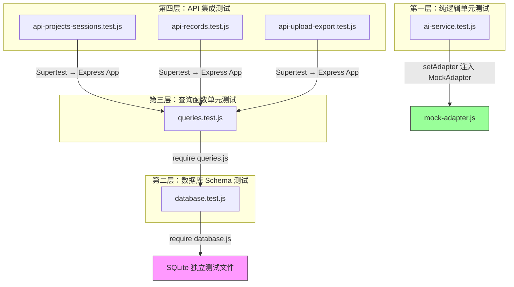
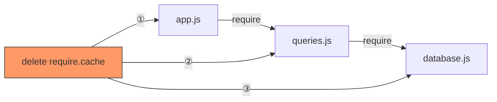

路测助手后端采用 **Jest + Supertest** 组合构建了一套轻量但层次分明的测试体系。这套体系的核心挑战在于：项目使用 `better-sqlite3` 同步 SQLite 驱动，数据库连接以 **模块级单例** 形式存在于 Node.js 的 `require` 缓存中——这意味着如果不做特殊处理，所有测试文件将共享同一个数据库实例，导致数据互相污染。本文将深入解析项目的四层测试分层架构、`require.cache` 驱动的数据库隔离机制，以及 AI 适配器在测试环境中的降级策略。

Sources: [jest.config.js](server/jest.config.js#L1-L5), [package.json](server/package.json#L1-L25)

## 测试架构总览

项目的六个测试文件按职责划分为四个层次，从底层的数据库 Schema 验证到顶层的 API 集成测试，形成清晰的测试金字塔：



| 测试层次 | 文件 | 测试对象 | 是否需要数据库 | 隔离策略 |
|---------|------|---------|:------------:|---------|
| Schema 验证 | `database.test.js` | 建表语句、约束条件 | ✅ | 独立 `test.db` |
| 查询函数单元测试 | `queries.test.js` | CRUD 函数正确性 | ✅ | 独立 `queries-test.db` |
| API 集成测试 | `api-*.test.js`（3 个文件） | HTTP 路由端到端流程 | ✅ | 各自独立的 `api-*-test.db` |
| 纯逻辑单元测试 | `ai-service.test.js` | 适配器模式、接口切换 | ❌ | `setAdapter()` 注入 Mock |

Sources: [database.test.js](server/tests/database.test.js#L1-L6), [queries.test.js](server/tests/queries.test.js#L1-L12), [ai-service.test.js](server/tests/ai-service.test.js#L1-L8)

## Jest 配置与运行机制

项目使用极简的 Jest 配置，仅声明了两个关键选项：

```js
module.exports = {
  testEnvironment: 'node',        // 使用 Node.js 原生环境，非 jsdom
  testMatch: ['**/tests/**/*.test.js'],  // 仅匹配 tests 目录下的 .test.js 文件
};
```

`testEnvironment: 'node'` 是一个重要选择——由于后端测试不涉及浏览器 DOM，使用 `node` 环境避免了不必要的 jsdom 模拟开销。这意味着测试中可以直接使用 `fs`、`path` 等 Node.js 原生模块，与生产代码行为完全一致。

`package.json` 中的测试脚本附加了 `--forceExit` 标志：`"test": "jest --forceExit"`。这个标志的存在是因为 `better-sqlite3` 的数据库连接在测试结束后不会自动关闭，Jest 会检测到仍有打开的句柄而持续等待。`--forceExit` 强制 Jest 在所有测试完成后终止进程，避免测试套件挂起。

Sources: [jest.config.js](server/jest.config.js#L1-L5), [package.json](server/package.json#L7-L9)

## 数据库隔离的核心机制：require.cache 热重载

数据库隔离是本测试体系中最精巧的部分。理解它的前提是理解 `database.js` 模块的单例模式设计。

### 单例陷阱

[database.js](server/src/models/database.js#L5-L20) 中的 `db` 变量是模块级作用域的：

```js
const DB_PATH = process.env.DB_PATH || path.join(__dirname, '..', '..', 'data', 'roadtest.db');
let db;  // 模块级单例

function getDB() {
  if (!db) {
    db = new Database(DB_PATH);  // 仅首次调用时创建
  }
  return db;
}
```

Node.js 的 `require()` 具有缓存机制——当 `database.js` 被首次 `require` 后，其模块作用域中的 `db` 变量和 `DB_PATH` 常量都会被保留在缓存中。此后无论多少个模块调用 `require('./models/database')`，拿到的都是同一个模块实例。这意味着一旦 `getDB()` 被调用，`DB_PATH` 就被**固化**了——即使后续修改 `process.env.DB_PATH`，模块内部已经捕获的 `DB_PATH` 常量不会改变。

### 三步隔离协议

每个涉及数据库的测试文件都执行完全相同的三步隔离协议：

**第一步：设置独立的 DB_PATH（`beforeAll` 中）**

```js
const TEST_DB_PATH = path.join(__dirname, 'api-test.db');  // 每个文件不同的路径

beforeAll(() => {
  process.env.DB_PATH = TEST_DB_PATH;  // ① 覆盖环境变量
  delete require.cache[require.resolve('../src/models/database')];  // ② 清除缓存
  delete require.cache[require.resolve('../src/models/queries')];   // ③ 清除依赖模块缓存
  delete require.cache[require.resolve('../src/app')];              // ④ 清除应用入口缓存
});
```

`process.env.DB_PATH = TEST_DB_PATH` 将环境变量指向测试专用路径。但仅此一步是不够的——`database.js` 已经在缓存中，其模块级 `DB_PATH` 常量已经绑定了生产路径。

**第二步：清除 `require.cache`（关键操作）**

`delete require.cache[...]` 操作强制 Node.js 在下次 `require` 这些模块时重新执行模块代码。清除顺序形成了**依赖链的反向解除**：



必须清除 `database.js`，让 `DB_PATH` 常量重新从 `process.env.DB_PATH` 读取。必须清除 `queries.js`，因为它 `require` 了 `database.js`，如果不清除，`queries.js` 持有的仍然是旧的 `getDB` 引用。必须清除 `app.js`，因为它在加载时执行了 `initDB()`，会触发 `getDB()` 创建数据库连接。

**第三步：测试完成后清理文件（`afterAll` 中）**

```js
afterAll(() => {
  try {
    const { getDB } = require('../src/models/database');
    getDB().close();  // 关闭数据库连接
  } catch (e) { /* ignore */ }
  [TEST_DB_PATH, TEST_DB_PATH + '-wal', TEST_DB_PATH + '-shm'].forEach(f => {
    try { if (fs.existsSync(f)) fs.unlinkSync(f); } catch (e) { /* ignore */ }
  });
});
```

清理操作不仅删除 `.db` 主文件，还需要删除 SQLite WAL 模式产生的 `-wal`（预写日志）和 `-shm`（共享内存）两个辅助文件。用 `try-catch` 包裹是因为 Windows 平台上如果数据库连接未完全释放，文件删除可能失败——此时选择静默忽略而非中断测试。

Sources: [database.js](server/src/models/database.js#L5-L20), [api-projects-sessions.test.js](server/tests/api-projects-sessions.test.js#L5-L22), [api-records.test.js](server/tests/api-records.test.js#L5-L22), [database.test.js](server/tests/database.test.js#L6-L26)

### 各测试文件的隔离数据库分布

每个测试文件使用独立的数据库文件路径，确保文件级别的完全隔离：

| 测试文件 | 数据库路径 | 测试范围 |
|---------|-----------|---------|
| `database.test.js` | `tests/test.db` | Schema 验证、约束检查 |
| `queries.test.js` | `tests/queries-test.db` | CRUD 函数正确性 |
| `api-projects-sessions.test.js` | `tests/api-test.db` | 项目与试验 API |
| `api-records.test.js` | `tests/api-records-test.db` | 记录 API |
| `api-upload-export.test.js` | `tests/api-upload-export-test.db` | 上传与导出 API |

这种"每文件一库"的策略意味着测试文件可以并行运行而不会互相干扰。但需要注意：同一文件内的 `describe` 块共享数据库，因此测试数据可能存在累积效应。例如 `queries.test.js` 中 `getAllProjects` 测试期望"至少 2 条记录"（`toBeGreaterThanOrEqual(2)`）而非"恰好 2 条"，就是对此的防御性编写。

Sources: [database.test.js](server/tests/database.test.js#L6), [queries.test.js](server/tests/queries.test.js#L4), [api-projects-sessions.test.js](server/tests/api-projects-sessions.test.js#L5), [api-records.test.js](server/tests/api-records.test.js#L5), [api-upload-export.test.js](server/tests/api-upload-export.test.js#L5)

## 第一层：数据库 Schema 验证测试

[database.test.js](server/tests/database.test.js) 直接调用 `getDB()` 获取底层 `better-sqlite3` 实例，用原始 SQL 语句验证 Schema 的正确性。这层测试关注的是**数据完整性约束**，而非业务逻辑：

**表结构验证**——确认 `initDB()` 创建了全部三张核心表（projects、test_sessions、records），通过查询 `sqlite_master` 系统表实现。

**级联插入验证**——测试三层实体的外键关系：project → session → record，确认 `FOREIGN KEY` 约束下的级联插入可以正常工作。

**CHECK 约束验证**——验证 `status` 字段的枚举约束。当尝试插入 `status = 'invalid'` 的记录或试验时，数据库会抛出异常，测试断言 `expect(() => {...}).toThrow()` 捕获这一行为。

Sources: [database.test.js](server/tests/database.test.js#L28-L104)

## 第二层：查询函数单元测试

[queries.test.js](server/tests/queries.test.js) 直接调用 [queries.js](server/src/models/queries.js) 导出的函数，不经过 HTTP 层。这层测试关注的是 **SQL 查询逻辑的正确性**：

- **创建与读取**：`createProject` 返回的对象包含自增 `id`，`getProjectById` 能根据 id 取回完整记录
- **更新操作**：`updateProject` 只更新传入的字段，`updated_at` 自动刷新为本地时间
- **过滤查询**：`getAllSessions(projectId)` 按 `project_id` 过滤结果
- **状态流转**：`updateSession` 可将 `status` 从 `active` 变为 `completed`
- **提交记录过滤**：`getSubmittedRecordsBySession` 仅返回 `status = 'submitted'` 的记录，自动排除 `draft` 状态

这层测试在 `beforeAll` 中额外调用了 `initDB()` 来确保表结构已创建：

```js
beforeAll(() => {
  process.env.DB_PATH = TEST_DB_PATH;
  delete require.cache[require.resolve('../src/models/database')];
  delete require.cache[require.resolve('../src/models/queries')];
  const { initDB } = require('../src/models/database');
  initDB();  // 显式初始化，因为 queries.js 不会自动建表
});
```

Sources: [queries.test.js](server/tests/queries.test.js#L6-L12), [queries.js](server/src/models/queries.js#L1-L147)

## 第三层：API 集成测试

三个 API 测试文件通过 Supertest 向 Express 应用发送真实的 HTTP 请求，验证从路由解析、参数校验到数据库读写的完整链路。它们共享相同的测试结构模式：

### getApp() 延迟加载模式

```js
function getApp() {
  return require('../src/app');
}
```

`getApp()` 函数封装了对 `app.js` 的 `require` 调用。由于 `beforeAll` 中已经清除了 `app.js` 的缓存，每次 `getApp()` 都会重新加载应用——这意味着数据库路径、中间件、路由全部使用测试配置重新初始化。这个设计确保了测试环境与应用状态的完全可控。

### 测试辅助函数

API 测试中常见一种**测试数据工厂函数**模式，用于快速创建前置依赖数据。例如 [api-records.test.js](server/tests/api-records.test.js#L28-L37) 中的 `createTestSession()`：

```js
async function createTestSession() {
  const app = getApp();
  const project = await request(app).post('/api/projects').send({ name: 'RecordTest' });
  const session = await request(app).post('/api/sessions').send({
    project_id: project.body.id,
    tester: '测试员',
    test_date: '2026-04-10',
  });
  return session.body;
}
```

这个函数通过 API 调用创建 project → session 的完整依赖链，返回 `session.body` 供后续测试使用。类似地，[api-upload-export.test.js](server/tests/api-upload-export.test.js#L28-L46) 的 `createTestSessionWithRecords()` 进一步创建了已提交的记录，满足导出 API 的前置条件。

### 测试覆盖的 API 端点

| 测试文件 | 覆盖端点 | 关键断言 |
|---------|---------|---------|
| `api-projects-sessions.test.js` | `GET /api/health`, `POST/GET /api/projects`, `GET /api/projects/:id`, `POST/GET/PUT /api/sessions`, `GET /api/sessions?project_id=` | 健康检查、CRUD 完整流程、参数校验（400）、资源不存在（404）、按项目过滤 |
| `api-records.test.js` | `POST/GET/PUT /api/records`, `GET /api/records/:id`, `GET /api/records?session_id=` | draft 默认状态、GPS 坐标持久化、附件 JSON 序列化、状态变更 |
| `api-upload-export.test.js` | `POST /api/upload`, `POST /api/export/excel`, `POST /api/export/csv` | 文件上传必填校验（400）、Content-Type 头部验证（`spreadsheetml`/`text/csv`）、Content-Disposition 文件名、缺失会话（404） |

Sources: [api-projects-sessions.test.js](server/tests/api-projects-sessions.test.js#L24-L148), [api-records.test.js](server/tests/api-records.test.js#L24-L133), [api-upload-export.test.js](server/tests/api-upload-export.test.js#L24-L91)

## 第四层：AI 适配器纯逻辑测试

[ai-service.test.js](server/tests/ai-service.test.js) 是唯一不依赖数据库的测试文件。它验证的是 [可插拔适配器模式：BaseAdapter 抽象与单例选择器](14-ke-cha-ba-gua-pei-qi-mo-shi-baseadapter-chou-xiang-yu-dan-li-xuan-ze-qi) 的核心行为：

**适配器注入机制**——通过 `setAdapter(new MockAdapter())` 在 `beforeEach` 中将全局适配器替换为 Mock 实现，确保测试不依赖任何外部 AI API：

```js
beforeEach(() => {
  setAdapter(new MockAdapter());  // 每个测试前重置为 Mock
});
```

**接口契约验证**——确认 `speechToText` 返回包含预期关键字的文本，`extractFields` 返回包含 `summary`、`problemType`、`severity` 三个必需字段的结构化对象。

**可插拔性验证**——测试中动态创建一个自定义的 MockAdapter 实例，覆盖 `speechToText` 方法后通过 `setAdapter` 注入，验证返回自定义结果，证明适配器可以在运行时被任意替换。

**QwenAdapter 构造函数测试**——验证 `QwenAdapter` 在无配置参数时使用默认值（`asrModel: 'qwen3-asr-flash'`，`chatModel: 'qwen-plus'`），且具备 `speechToText` 和 `extractFields` 两个必要方法。

Sources: [ai-service.test.js](server/tests/ai-service.test.js#L1-L45), [ai-service.js](server/src/services/ai-service.js#L35-L37)

## 数据库隔离方案的设计权衡

当前的"每文件一库 + require.cache 清除"方案是一个**务实的选择**，它在简洁性和隔离性之间取得了平衡。以下是该方案的优缺点分析：

| 维度 | 优势 | 局限 |
|------|------|------|
| **隔离性** | 文件级完全隔离，可并行运行 | 同一文件内 `describe` 块共享数据 |
| **实现复杂度** | 无需测试框架插件，纯 Node.js API | 依赖 `require.cache` 这一 V8 内部机制 |
| **可维护性** | 每个测试文件的隔离逻辑完全一致，易于复制 | 修改 `database.js` 的导出结构需同步更新所有 `delete` 语句 |
| **跨平台** | WAL/SHM 文件清理有 `try-catch` 保护 | Windows 上可能因文件锁导致临时文件残留 |
| **性能** | SQLite 内存级操作，毫秒级完成 | 每个文件重新加载模块有微小开销 |

### 潜在改进方向

如果项目规模增长，有几个方向值得考虑：

**方案 A：内存数据库**——将 `DB_PATH` 设为 `:memory:` 可以完全避免文件 I/O 和清理问题，但 SQLite 内存数据库在连接关闭后数据即丢失，且无法在多个 `require` 链中共享同一内存库实例（除非严格管理单例连接）。

**方案 B：全局 Setup/Teardown**——使用 Jest 的 `globalSetup` 和 `globalTeardown` 配置项集中管理数据库生命周期，减少每个文件的重复代码。

**方案 C：测试工具函数抽取**——将 `beforeAll/afterAll` 中的隔离逻辑提取为共享的 `setupTestDB(filePath)` 工具函数，统一管理缓存清除和文件清理。

Sources: [database.test.js](server/tests/database.test.js#L6-L26), [api-projects-sessions.test.js](server/tests/api-projects-sessions.test.js#L7-L22)

## 运行测试

执行全部测试：

```bash
cd server
npm test
```

此命令等价于 `jest --forceExit`，会自动发现 `tests/` 目录下所有 `.test.js` 文件并运行。

运行单个测试文件：

```bash
npx jest tests/queries.test.js --forceExit
```

观察详细输出：

```bash
npx jest --verbose --forceExit
```

Sources: [package.json](server/package.json#L9)

## 延伸阅读

- 了解 Express 应用入口如何初始化数据库连接：[Express 入口与应用初始化](10-express-ru-kou-yu-ying-yong-chu-shi-hua)
- 理解查询层如何封装原始 SQL：[原始 SQL 查询层：无 ORM 的 CRUD 实现](12-yuan-shi-sql-cha-xun-ceng-wu-orm-de-crud-shi-xian)
- 查看 Mock 适配器如何支撑无 API Key 场景：[Mock 适配器：无 API Key 时的降级方案](17-mock-gua-pei-qi-wu-api-key-shi-de-jiang-ji-fang-an)
- 了解适配器模式的整体设计：[可插拔适配器模式：BaseAdapter 抽象与单例选择器](14-ke-cha-ba-gua-pei-qi-mo-shi-baseadapter-chou-xiang-yu-dan-li-xuan-ze-qi)