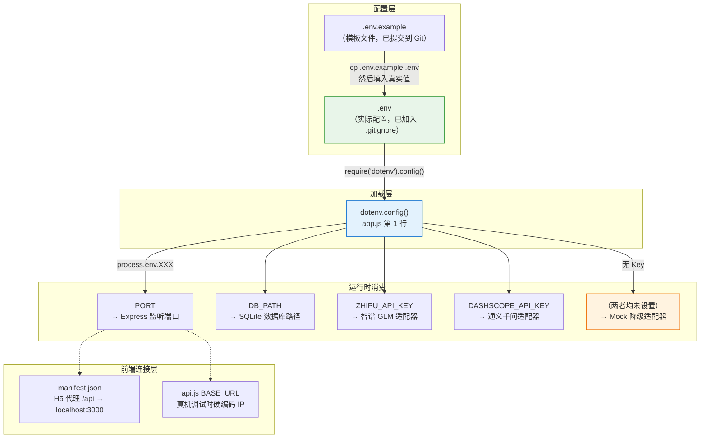
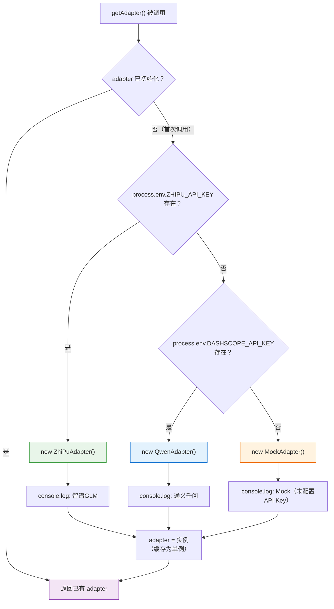

本文档详细讲解路测助手项目中**环境变量**的加载机制、全部配置项的含义、API Key 对 AI 适配器选择的影响，以及开发与测试场景下的最佳实践。阅读完本文后，你将能独立完成 `.env` 文件的创建与调试验证，并理解"改一个环境变量就能切换 AI 服务商"背后的设计原理。

Sources: [CLAUDE.md](CLAUDE.md#L74-L79), [README.md](README.md#L66-L76)

## 全局视角：环境变量在架构中的位置

路测助手采用**前后端分离**架构，环境变量集中管理在后端 Express 服务中。前端不直接读取任何环境变量，而是通过 HBuilderX 的开发服务器代理（H5 模式）或硬编码 `BASE_URL`（真机模式）连接后端。下图展示了从"配置文件"到"运行时行为"的完整数据流：



Sources: [app.js](server/src/app.js#L1-L8), [.env.example](server/.env.example#L1-L10), [database.js](server/src/models/database.js#L5)

## 第一步：创建 .env 文件

后端项目提供了 `.env.example` 作为模板，它**已经提交到 Git 仓库**，所有人都能看到需要配置哪些变量。而真正的 `.env` 文件包含敏感信息，已被 `.gitignore` 排除，永远不会进入版本控制。创建步骤如下：

```bash
cd server
cp .env.example .env
```

然后使用你喜欢的编辑器打开 `.env`，填入真实的 API Key。`.env.example` 的完整内容只有 10 行，结构非常清晰：

```env
# AI 服务配置 (二选一)
# 智谱 GLM (推荐)
ZHIPU_API_KEY=your_zhipu_api_key_here

# 通义千问 (备选)
# DASHSCOPE_API_KEY=your_dashscope_api_key_here

# 服务端口
PORT=3000
```

注意 `.env` 文件中的注释以 `#` 开头，被注释掉的变量**不会被加载**到 `process.env` 中。如果你想切换到通义千问，只需取消注释 `DASHSCOPE_API_KEY` 那一行并填入真实值，同时注释掉或删除 `ZHIPU_API_KEY`。

Sources: [.env.example](server/.env.example#L1-L10), [.gitignore](server/.gitignore#L7)

## 全部环境变量一览

下表汇总了项目中使用的全部环境变量，包括在 `.env.example` 中未列出但代码中实际支持的 `DB_PATH`：

| 变量名 | 是否必填 | 默认值 | 说明 |
|:---|:---:|:---|:---|
| `ZHIPU_API_KEY` | 二选一 | — | 智谱 GLM 平台的 API Key，用于语音转文字（ASR）和结构化文本提取 |
| `DASHSCOPE_API_KEY` | 二选一 | — | 阿里云通义千问 DashScope 平台的 API Key，作为备选 AI 服务 |
| `PORT` | 否 | `3000` | Express 服务监听的端口号 |
| `DB_PATH` | 否 | `data/roadtest.db`（相对于 server 目录） | SQLite 数据库文件路径，仅在测试场景中需要手动设置 |

**关键规则**：`ZHIPU_API_KEY` 和 `DASHSCOPE_API_KEY` 是**二选一**关系。如果两个都设置了，系统优先使用智谱 GLM。如果两个都不设置，系统会自动降级到 Mock 适配器（返回模拟数据），不会报错，可以正常开发调试。

Sources: [ai-service.js](server/src/services/ai-service.js#L17-L33), [app.js](server/src/app.js#L8), [database.js](server/src/models/database.js#L5)

## dotenv 加载机制详解

环境变量的加载发生在后端 Express 应用的**第一行代码**：

```js
require('dotenv').config();
```

这行代码位于 [app.js](server/src/app.js#L1)，在所有 `require`、路由挂载和数据库初始化**之前**执行。`dotenv` 包的工作原理很简单：它在当前工作目录（即 `server/`）下查找名为 `.env` 的文件，逐行解析 `KEY=VALUE` 格式的键值对，并将它们注入到 `process.env` 对象中。如果 `.env` 文件不存在或某行格式有误，dotenv 会静默跳过，不会抛出错误。

加载完成后，后续代码就可以通过 `process.env.ZHIPU_API_KEY` 等方式读取配置值。需要注意的是，dotenv 只会在启动时读取一次 `.env` 文件，运行期间修改文件不会自动生效——你需要重启后端服务。

Sources: [app.js](server/src/app.js#L1), [package.json](server/package.json#L14)

## API Key 如何驱动适配器自动选择

这是本项目 AI 模块的核心设计——**环境变量驱动的单例适配器选择**。[ai-service.js](server/src/services/ai-service.js) 中的 `getAdapter()` 函数实现了一个懒加载单例模式，根据环境变量的存在情况自动选择合适的 AI 适配器：



**选择优先级**为：`ZHIPU_API_KEY` > `DASHSCOPE_API_KEY` > Mock 降级。这意味着即使你同时设置了两个 Key，系统也只会使用智谱 GLM。一旦适配器被实例化并缓存到 `adapter` 变量中，后续所有调用（包括 `speechToText` 和 `extractFields`）都会复用同一个实例，不会重新检测环境变量。

Sources: [ai-service.js](server/src/services/ai-service.js#L15-L33)

## 各适配器如何使用 API Key

三种适配器在构造函数中通过相同模式获取 API Key——优先使用传入的 `config.apiKey` 参数，否则从 `process.env` 中读取：

| 适配器 | 环境变量来源 | API 调用方式 | 模型配置 |
|:---|:---|:---|:---|
| **ZhiPuAdapter** | `process.env.ZHIPU_API_KEY` | `Authorization: Bearer <key>` 请求头 | ASR: `glm-asr-2512`，Chat: `glm-4-flash` |
| **QwenAdapter** | `process.env.DASHSCOPE_API_KEY` | `Authorization: Bearer <key>` 请求头 | ASR: `qwen3-asr-flash`，Chat: `qwen-plus` |
| **MockAdapter** | 不需要任何 Key | 直接返回硬编码模拟数据 | — |

两个真实适配器都将 API Key 存储在 `this.apiKey` 属性中，在每次发起 HTTP 请求时通过 `Authorization: Bearer` 头传递给远程 API。构造函数的设计允许在测试时通过 `config.apiKey` 注入测试值，避免依赖真实的环境变量。

Sources: [zhipu-adapter.js](server/src/services/zhipu-adapter.js#L22-L28), [qwen-adapter.js](server/src/services/qwen-adapter.js#L20-L26), [mock-adapter.js](server/src/services/mock-adapter.js#L3-L16)

## 前端连接配置（非环境变量）

前端 UniApp 项目**不使用 `.env` 文件**，而是通过两种方式连接后端。理解这个区别非常重要——你不需要在前端配置任何 API Key，所有 AI 调用都在后端完成。

| 场景 | 配置位置 | 连接方式 |
|:---|:---|:---|
| **H5 浏览器调试** | [manifest.json](client/manifest.json#L16-L27) | 开发服务器自动将 `/api` 请求代理到 `http://localhost:3000` |
| **真机调试** | [api.js](client/services/api.js#L2) | 硬编码 `BASE_URL = 'http://192.168.1.10:3000'`，需手动改为电脑内网 IP |

H5 模式下，HBuilderX 内置的开发服务器在端口 8080 启动，并通过 `manifest.json` 中配置的代理规则将所有 `/api` 开头的请求转发到后端 `localhost:3000`。真机模式下由于手机无法访问 `localhost`，需要将 `BASE_URL` 改为开发电脑的局域网 IP 地址。

Sources: [api.js](client/services/api.js#L1-L2), [manifest.json](client/manifest.json#L16-L27)

## 测试场景中的环境变量处理

项目测试使用 Jest 框架，通过两种机制隔离环境变量的影响：

**数据库隔离**：每个测试文件在 `beforeAll` 钩子中设置 `process.env.DB_PATH` 指向临时测试数据库，并清除 `database.js` 模块的 require 缓存，确保重新加载时使用测试路径。测试完成后在 `afterAll` 中清理临时文件。

**AI 适配器隔离**：测试通过 `setAdapter()` 函数直接注入 MockAdapter 实例，完全绕过环境变量检测逻辑。这样即使你的 `.env` 中配置了真实的 API Key，测试也不会发起任何网络请求。

Sources: [database.test.js](server/tests/database.test.js#L6-L12), [ai-service.test.js](server/tests/ai-service.test.js#L6-L8), [ai-service.js](server/src/services/ai-service.js#L35-L37)

## 常见问题排查

| 现象 | 可能原因 | 解决方法 |
|:---|:---|:---|
| 启动后日志显示 `AI适配器: Mock` | `.env` 文件未创建，或 Key 值为空 | 检查 `server/.env` 是否存在且包含有效的 `ZHIPU_API_KEY` 或 `DASHSCOPE_API_KEY` |
| 语音识别返回模拟文本而非真实转写 | 适配器被选为 Mock | 确认 `.env` 中 Key 行未被 `#` 注释掉 |
| `ZhiPu ASR error: 401` | API Key 无效或已过期 | 登录智谱开放平台重新获取 Key |
| 修改 `.env` 后行为未变化 | dotenv 仅在启动时读取 | 重启后端服务（`npm run dev` 会自动重启） |
| 测试文件找不到数据库 | `DB_PATH` require 缓存未清除 | 确认 `delete require.cache[...]` 在 `beforeAll` 中执行 |
| 真机无法连接后端 | `BASE_URL` IP 不匹配 | 将 `api.js` 中的 IP 改为电脑当前内网 IP，确保手机与电脑在同一局域网 |

Sources: [ai-service.js](server/src/services/ai-service.js#L21-L29), [api.js](client/services/api.js#L2), [CLAUDE.md](CLAUDE.md#L87-L89)

## 安全注意事项

**永远不要将 `.env` 文件提交到 Git**。项目的 [.gitignore](server/.gitignore#L7) 已包含 `.env` 规则，但作为开发者你仍需注意以下几点：

- 复制项目时只复制 `.env.example`，然后各自创建自己的 `.env`
- 如果不小心将 `.env` 推送到了远程仓库，需要立即轮换（重新生成）所有泄露的 API Key
- `DB_PATH` 默认将数据库文件存放在 `server/data/` 目录下，该目录同样不应纳入版本控制（`.gitignore` 中的 `*.db` 规则已覆盖）

Sources: [.gitignore](server/.gitignore#L1-L7), [README.md](README.md#L27-L34)

## 延伸阅读

- 了解适配器模式的设计原理：[可插拔适配器模式：BaseAdapter 抽象与单例选择器](14-ke-cha-ba-gua-pei-qi-mo-shi-baseadapter-chou-xiang-yu-dan-li-xuan-ze-qi)
- 了解 Mock 降级方案的具体实现：[Mock 适配器：无 API Key 时的降级方案](17-mock-gua-pei-qi-wu-api-key-shi-de-jiang-ji-fang-an)
- 了解测试中的数据库隔离策略：[Jest + Supertest 测试策略与数据库隔离方案](24-jest-supertest-ce-shi-ce-lue-yu-shu-ju-ku-ge-chi-fang-an)
- 了解真机调试时如何配置网络连接：[真机调试与 HBuilderX 跨端运行指南](26-zhen-ji-diao-shi-yu-hbuilderx-kua-duan-yun-xing-zhi-nan)
- 回顾完整的开发环境搭建流程：[快速搭建开发环境](2-kuai-su-da-jian-kai-fa-huan-jing)