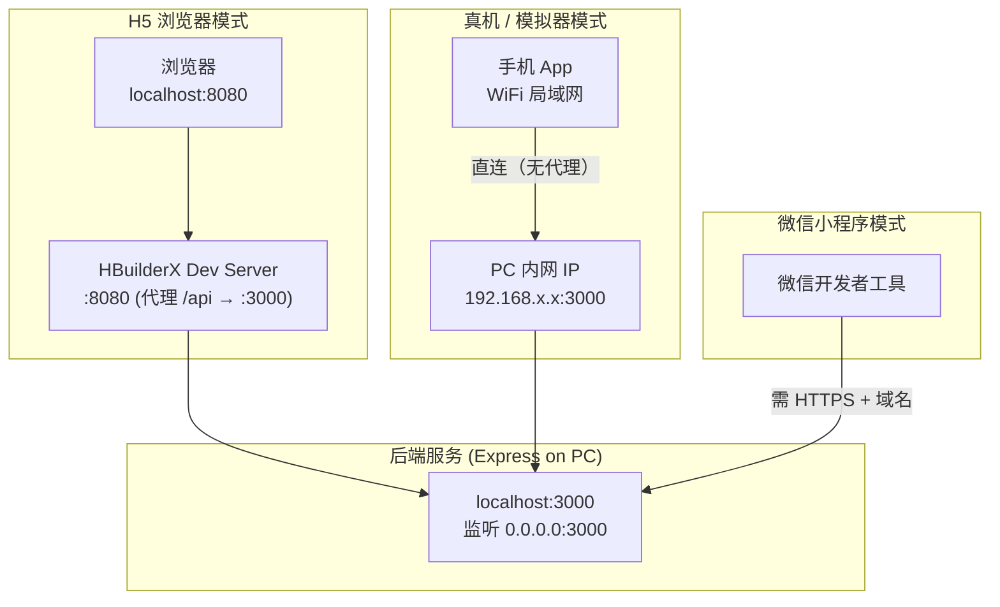
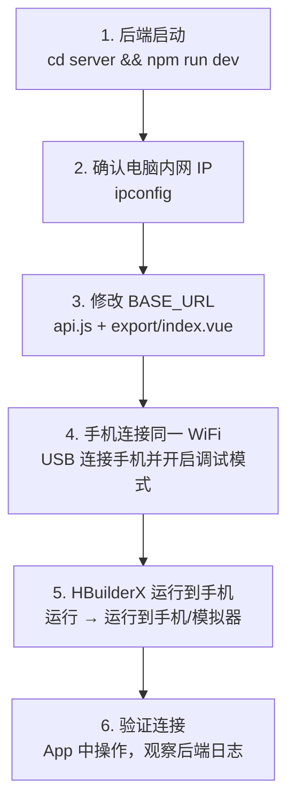

路测助手前端基于 **UniApp + Vue3** 构建，通过 HBuilderX 编译运行。这套技术栈使同一套代码能够运行在 H5 浏览器、Android/iOS 原生 App、甚至微信小程序等多个平台。本文将系统讲解三种主要运行模式——H5 浏览器调试、Android 真机调试、以及其他平台适配——的配置方法、网络通信差异、条件编译机制，以及常见问题的排查路径。阅读本文前，建议先完成 [快速搭建开发环境](2-kuai-su-da-jian-kai-fa-huan-jing) 中的 HBuilderX 安装。

Sources: [README.md](README.md#L41-L56), [CLAUDE.md](CLAUDE.md#L53-L64)

## 跨端运行全景图

路测助手是一个前后端分离的典型架构：后端 Express 服务运行在电脑上，前端 UniApp 通过 HTTP 请求与后端通信。跨端的关键差异在于 **网络请求的寻址方式** 和 **平台原生 API 的可用性**。下面的流程图展示了三种运行模式下前端如何与后端建立连接：



H5 模式通过 HBuilderX 内置开发服务器的代理机制转发请求，无需关心后端 IP；真机模式下 App 直接向电脑内网 IP 发起请求，跳过了代理层；小程序模式则要求后端提供 HTTPS 域名，在 MVP 阶段通常不作为首选调试路径。

Sources: [manifest.json](client/manifest.json#L16-L26), [api.js](client/services/api.js#L1-L2)

## H5 浏览器模式：开发调试的起点

H5 模式是开发过程中最高效的调试方式——无需真机、无需 USB 连接，浏览器 DevTools 直接可用。其网络通信依赖 `manifest.json` 中配置的 H5 开发服务器代理：

| 配置项 | 值 | 作用 |
|--------|-----|------|
| `h5.devServer.port` | `8080` | 前端开发服务器端口 |
| `h5.devServer.proxy./api.target` | `http://localhost:3000` | 将 `/api` 前缀的请求代理到后端 |
| `h5.devServer.proxy./api.changeOrigin` | `true` | 修改请求头中的 Origin |

这意味着在 H5 模式下，前端代码中的 `BASE_URL` 实际上可以留空或设为空字符串——所有 `/api/*` 的请求会被 HBuilderX 的 dev server 自动转发到 `localhost:3000`。然而，项目当前的 `api.js` 中 `BASE_URL` 被硬编码为 `http://192.168.1.10:3000`，这使得即使在 H5 模式下也绕过了代理而直接请求后端。开发时如果在本机浏览器调试，可以将 `BASE_URL` 改为 `http://localhost:3000` 或直接改为空字符串以利用代理。

Sources: [manifest.json](client/manifest.json#L16-L26), [api.js](client/services/api.js#L1-L2)

**启动步骤**：

1. 启动后端：在 `server/` 目录执行 `npm run dev`，确认终端输出 `路测助手服务运行在 http://localhost:3000`
2. 打开 HBuilderX，菜单选择 **文件 → 打开目录**，选中项目的 `client/` 文件夹
3. 菜单选择 **运行 → 运行到浏览器 → Chrome**（或任意浏览器）
4. HBuilderX 自动编译并在浏览器打开 `http://localhost:8080`

Sources: [README.md](README.md#L39-F46), [app.js](server/src/app.js#L40-F44)

## Android 真机调试：从桌面到手机的关键跨越

真机调试是验证录音、GPS 定位、文件下载等原生 API 在实际设备上行为的必要步骤。与 H5 模式相比，真机模式有三项核心差异：

**差异一：网络寻址——从 localhost 到内网 IP**

真机上没有 HBuilderX 的代理服务，App 必须直接通过电脑的局域网 IP 访问后端。需要修改 `client/services/api.js` 中的 `BASE_URL`：

```js
// 修改前（H5 模式可用 localhost）
const BASE_URL = 'http://localhost:3000';

// 修改后（真机模式：替换为你的电脑内网 IP）
const BASE_URL = 'http://192.168.x.x:3000';
```

获取电脑内网 IP 的方法：在命令行执行 `ipconfig`（Windows）或 `ifconfig`（macOS/Linux），找到与手机同一网段的 IPv4 地址。**手机和电脑必须连接同一个 WiFi 网络**，否则请求无法到达。

Sources: [api.js](client/services/api.js#L1-F2), [README.md](README.md#L49-F56)

> ⚠️ **重要提示**：项目中还有一处硬编码的 `BASE_URL`——在 [export/index.vue](client/pages/export/index.vue#L54) 第 54 行。真机调试时这两处 IP 都需要同步修改，否则导出功能将无法工作。

**差异二：后端监听地址**

后端 Express 使用 `app.listen(PORT)` 且未指定 host 参数，Node.js 默认绑定 `0.0.0.0`（即所有网络接口），这意味着局域网内的设备天然可以访问后端——无需额外配置。控制台显示的 `http://localhost:3000` 仅是提示文本，不代表服务只监听 localhost。

Sources: [app.js](server/src/app.js#L41-F43)

**差异三：原生 API 激活**

以下 API 仅在真机（或模拟器）上完整可用，H5 浏览器中会失败或行为不一致：

| API | 用途 | 页面 | H5 表现 |
|-----|------|------|---------|
| `uni.getRecorderManager()` | MP3 录音 | record | 部分浏览器支持，行为不稳定 |
| `uni.getLocation()` | GPS 定位 | record | 需要 HTTPS + 浏览器授权 |
| `uni.chooseImage()` | 拍照 | record | 弹出文件选择框而非相机 |
| `uni.chooseVideo()` | 录像 | record | 弹出文件选择框而非相机 |
| `uni.downloadFile()` | 下载文件 | export | 不可用（H5 使用 `<a>` 标签） |
| `uni.openDocument()` | 打开文件 | export | 不可用（H5 使用浏览器预览） |

Sources: [record/index.vue](client/pages/record/index.vue#L147-F216), [export/index.vue](client/pages/export/index.vue#L98-F143)

**真机调试启动步骤**：



HBuilderX 的运行配置已预设为 Android 设备模式。在 [launch.json](client/.hbuilderx/launch.json#L1-F10) 中，`type` 设为 `uni-app:app-android`，`customPlaygroundType` 为 `device`，这意味着 HBuilderX 会优先将编译产物推送到连接的 Android 设备上。如果是 iOS 真机，需要在 HBuilderX 中手动切换运行目标。

Sources: [launch.json](client/.hbuilderx/launch.json#L1-F10)

## 条件编译：一套代码适配多个平台

UniApp 的条件编译（Conditional Compilation）是在编译阶段根据目标平台选择性包含或排除代码的机制。路测助手在导出页中使用了这套机制来处理 H5 与原生平台的下载差异：

```js
// #ifdef H5
// H5 平台：利用浏览器原生 <a> 标签触发下载
const link = document.createElement('a');
link.href = url;
link.download = `roadtest-${this.selectedSession}.${ext}`;
document.body.appendChild(link);
link.click();
document.body.removeChild(link);
// #endif

// #ifndef H5
// 非 H5 平台（App / 小程序）：使用 uni.downloadFile + uni.openDocument
uni.downloadFile({
  url,
  success: (res) => {
    if (res.statusCode === 200) {
      uni.openDocument({
        filePath: res.tempFilePath,
        fileType: type === 'excel' ? 'xlsx' : 'csv',
        showMenu: true,
      });
    }
  },
});
// #endif
```

上方的 `// #ifdef H5` 块仅在编译目标为 H5 时被包含，`// #ifndef H5` 块则在除 H5 之外的所有平台生效。这种设计的核心逻辑是：H5 环境中有 `document` 等 DOM API，可以直接创建下载链接；而原生 App 和小程序中没有 DOM，必须依赖 UniApp 的 `downloadFile` + `openDocument` API。

Sources: [export/index.vue](client/pages/export/index.vue#L102-F143)

UniApp 条件编译的常用宏定义如下表所示：

| 宏 | 含义 | 适用场景 |
|----|------|---------|
| `#ifdef H5` | 仅 H5 浏览器 | DOM 操作、浏览器特有 API |
| `#ifndef H5` | 除 H5 外的所有平台 | 原生 API（录音、文件系统等） |
| `#ifdef APP-PLUS` | 仅 App（Android + iOS） | App 特有功能如推送 |
| `#ifdef MP-WEIXIN` | 仅微信小程序 | 小程序特有 API |
| `#ifdef APP-PLUS \|\| MP-WEIXIN` | App 或微信小程序 | 多平台组合 |

Sources: [CLAUDE.md](CLAUDE.md#L66)

## BASE_URL 管理策略与优化建议

当前项目的网络地址管理存在一个需要关注的工程问题：`BASE_URL` 在两处被分别硬编码。

| 文件 | 位置 | 当前值 |
|------|------|--------|
| [services/api.js](client/services/api.js#L2) | 第 2 行 | `http://192.168.1.10:3000` |
| [pages/export/index.vue](client/pages/export/index.vue#L54) | 第 54 行 | `http://192.168.1.10:3000` |

`api.js` 中的 `BASE_URL` 被所有 API 调用函数（`request`、`uploadFile` 等）共享，但导出页的 `doExport` 方法直接拼接了独立的 URL 常量，没有复用 `api.js` 的 `BASE_URL`。这意味着每次切换开发环境时需要修改两个文件。

**推荐的统一方案**：将 `BASE_URL` 从 `api.js` 中 export 出来，在导出页中 import 使用：

```js
// services/api.js — 导出常量
export const BASE_URL = 'http://192.168.1.10:3000';

// pages/export/index.vue — 导入复用
import { getSessions, getRecords, BASE_URL } from '../../services/api';
```

这样只需修改一处即可全局生效，同时也避免了两个文件 IP 不一致的隐患。

Sources: [api.js](client/services/api.js#L1-F2), [export/index.vue](client/pages/export/index.vue#L52-F54)

## 常见问题排查

| 症状 | 可能原因 | 排查方法 |
|------|---------|---------|
| 真机打开 App 后页面空白 | BASE_URL IP 错误，API 请求全部失败 | 检查 `api.js` 中 IP 是否为本机当前 IP |
| 录音按钮点击无反应 | H5 浏览器限制或不支持 RecorderManager | 切换到真机测试录音功能 |
| 导出文件下载失败（真机） | `export/index.vue` 中的 BASE_URL 未同步修改 | 确认导出页的 IP 与 `api.js` 一致 |
| GPS 坐标为空 | Android 未授予位置权限 | 手机设置 → 应用权限 → 开启位置权限 |
| 上传文件失败 | 手机无法访问电脑 3000 端口 | 浏览器访问 `http://电脑IP:3000/api/health` 验证连通性 |
| HBuilderX 找不到设备 | USB 调试未开启或驱动未安装 | 手机开启开发者选项 → USB 调试；安装手机厂商驱动 |
| 控制台报 CORS 错误 | 后端 CORS 中间件配置问题 | 确认 `app.use(cors())` 已加载（已默认配置） |

Sources: [app.js](server/src/app.js#L11), [record/index.vue](client/pages/record/index.vue#L190-F216), [api.js](client/services/api.js#L1-F26)

**网络连通性验证四步法**：遇到真机网络问题时，按以下顺序排查：

1. **Ping 测试**：在手机浏览器地址栏输入 `http://192.168.x.x:3000/api/health`，如果返回 `{"status":"ok",...}` 则网络通畅
2. **防火墙检查**：Windows 防火墙可能阻止 3000 端口的入站连接，临时关闭防火墙或添加入站规则
3. **IP 变动确认**：电脑重启或重新连接 WiFi 后内网 IP 可能变化，每次开发前执行 `ipconfig` 确认
4. **代理/VPN 干扰**：如果电脑开启了 VPN 或代理，可能导致局域网通信异常

Sources: [app.js](server/src/app.js#L27-F29)

## 跨平台能力矩阵总结

下表总结了路测助手各功能在不同平台上的支持情况，帮助你决策在哪个平台上进行特定功能的调试：

| 功能模块 | H5 浏览器 | Android 真机 | iOS 真机 | 微信小程序 |
|---------|-----------|-------------|---------|-----------|
| 试验列表/详情 | ✅ | ✅ | ✅ | ✅ |
| 表单填写/提交 | ✅ | ✅ | ✅ | ✅ |
| MP3 录音 | ⚠️ 不稳定 | ✅ | ✅ | ✅ |
| GPS 定位 | ⚠️ 需 HTTPS | ✅ | ✅ | ✅ |
| 拍照/录像 | ⚠️ 文件选择 | ✅ | ✅ | ✅ |
| 文件上传 | ✅ | ✅ | ✅ | ✅ |
| AI 语音转写 | ✅ | ✅ | ✅ | ✅ |
| Excel/CSV 导出 | ✅ `<a>` 下载 | ✅ `openDocument` | ✅ `openDocument` | ⚠️ 受限 |
| 网络代理 | DevServer 代理 | 直连 IP | 直连 IP | 需 HTTPS 域名 |

建议的调试策略：**日常 UI 和逻辑开发用 H5 快速迭代，录音和定位等原生功能切换到 Android 真机验证**。

Sources: [export/index.vue](client/pages/export/index.vue#L98-F143), [record/index.vue](client/pages/record/index.vue#L147-F216)

---

**下一步阅读**：了解前端 API 服务层如何封装网络请求与代理机制，请参阅 [前端 API 服务层封装与请求代理机制](23-qian-duan-api-fu-wu-ceng-feng-zhuang-yu-qing-qiu-dai-li-ji-zhi)；了解导出页中条件编译的完整实现细节，请参阅 [导出页：条件编译实现 H5 与原生平台的差异化下载](22-dao-chu-ye-tiao-jian-bian-yi-shi-xian-h5-yu-yuan-sheng-ping-tai-de-chai-yi-hua-xia-zai)。