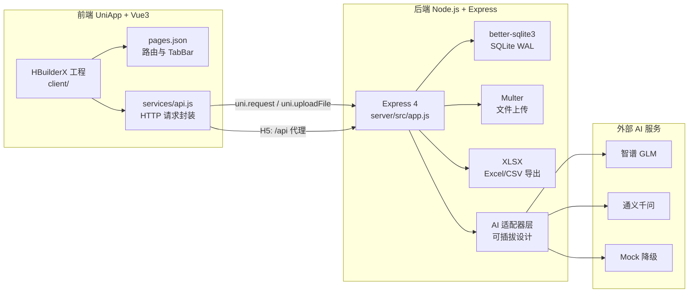
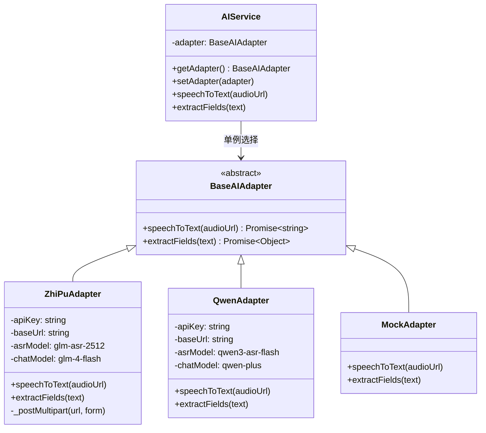
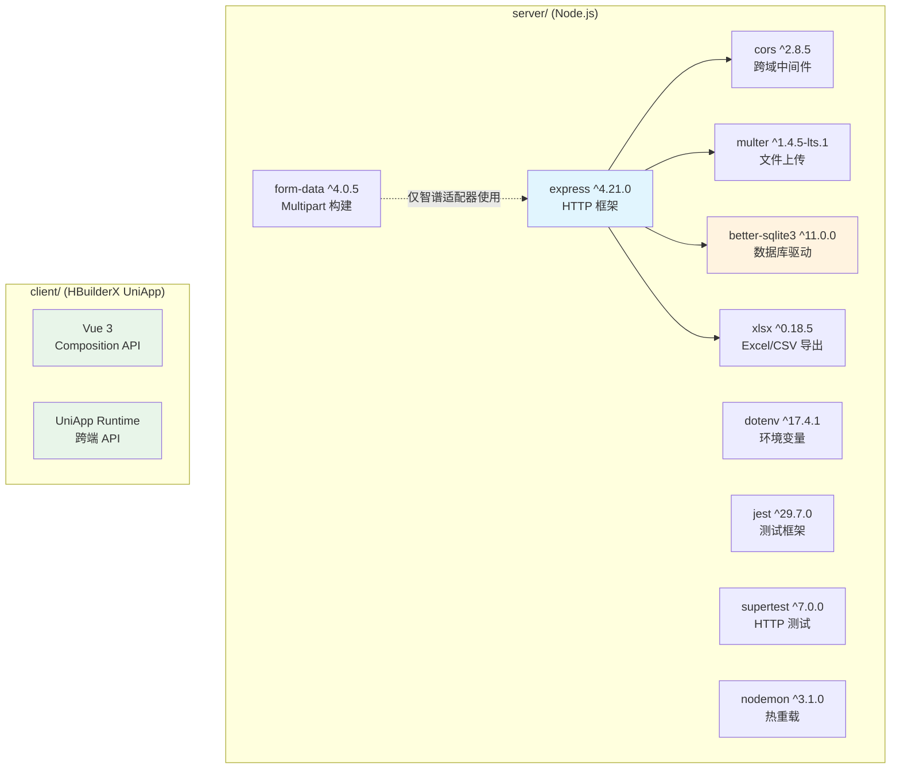

本文档对「路测助手」项目所采用的全部技术栈与依赖项进行系统性的梳理，覆盖后端服务、前端应用、AI 适配层、测试框架四个维度。阅读本文后，你将清楚知道项目"用了什么、为什么选它、版本约束是什么"，为后续阅读 [前后端分离架构总览](7-qian-hou-duan-fen-chi-jia-gou-zong-lan) 和 [环境变量配置与 API Key 管理](25-huan-jing-bian-liang-pei-zhi-yu-api-key-guan-li) 奠定基础。

Sources: [package.json](server/package.json#L1-L25), [CLAUDE.md](CLAUDE.md#L1-L91)

## 架构全景与技术选型概览

项目采用**前后端分离**的架构，后端与前端是两个完全独立的子工程——`server/` 通过 npm 管理，`client/` 由 HBuilderX IDE 管理（无 `package.json`）。两者通过 RESTful JSON API 通信，前端在 H5 开发模式下通过 UniApp 内置 devServer 代理将 `/api` 请求转发至后端。

**设计意图**：项目以 MVP 为目标，追求零基础设施依赖（SQLite 文件数据库、无 Redis/消息队列）和最少外部服务集成，同时通过适配器模式保留 AI 供应商的可替换性。

Sources: [manifest.json](client/manifest.json#L16-L26), [app.js](server/src/app.js#L1-L46), [CLAUDE.md](CLAUDE.md#L26-L64)

## 后端依赖详解

后端工程位于 `server/`，其运行时依赖仅 **7 个包**，开发依赖 **3 个包**，体现了"最少依赖"的选型原则。

### 运行时依赖（dependencies）

| 包名 | 版本 | 用途 | 在项目中的角色 |
|------|------|------|----------------|
| **express** | `^4.21.0` | HTTP 服务框架 | 应用骨架，挂载路由、中间件、静态文件托管 [app.js](server/src/app.js#L7) |
| **better-sqlite3** | `^11.0.0` | SQLite3 同步驱动 | 数据库层，单实例连接，WAL 模式 + 外键约束 [database.js](server/src/models/database.js#L15-L17) |
| **multer** | `^1.4.5-lts.1` | multipart 文件上传中间件 | 处理音频/图片上传，磁盘存储 + 文件类型白名单 [upload.js](server/src/routes/upload.js#L14-L37) |
| **xlsx** | `^0.18.5` | Excel/CSV 读写库 | 将路测记录导出为 `.xlsx` 或 `.csv` 文件 [export.js](server/src/routes/export.js#L3) |
| **cors** | `^2.8.5` | 跨域资源共享中间件 | 允许前端 H5 页面跨域访问后端 API [app.js](server/src/app.js#L11) |
| **dotenv** | `^17.4.1` | 环境变量加载 | 从 `server/.env` 读取 `ZHIPU_API_KEY` 等配置 [app.js](server/src/app.js#L1) |
| **form-data** | `^4.0.5` | 构建multipart/form-data 请求体 | 智谱 GLM 适配器向 ASR API 发送音频文件 [zhipu-adapter.js](server/src/services/zhipu-adapter.js#L56) |

**关键技术决策说明**：

**better-sqlite3 而非 ORM**：项目不使用 Sequelize、Prisma 等 ORM，所有数据库操作均通过 `better-sqlite3` 的 `prepared statement` 手写原始 SQL。这带来了几个直接影响——SQL 与业务逻辑高度耦合于 [queries.js](server/src/models/queries.js)，但换取了零配置、零迁移脚本的极简部署体验，以及同步调用模型的代码可读性（无需 async/await）。

**form-data 而非 axios**：后端使用 Node.js 原生 `fetch` API 调用外部 AI 接口（不依赖 axios 或 node-fetch），但在向智谱 ASR 发送 multipart 音频数据时，原生 `fetch` 不支持 Node.js stream 作为 body，因此引入 `form-data` 包并配合 `getBuffer()` + 显式 `Content-Length` 头来构建请求体。这是项目文档中标注的 **Key gotcha**。

**xlsx (SheetJS)**：用于在导出路由中动态生成 Excel 工作簿。支持多 Sheet 页——一个"路测记录"表和一个"试验信息"表，并通过 `XLSX.write()` 输出 Buffer 直接写入 HTTP 响应流。

Sources: [package.json](server/package.json#L11-L19), [zhipu-adapter.js](server/src/services/zhipu-adapter.js#L30-L43), [queries.js](server/src/models/queries.js#L1-L147), [export.js](server/src/routes/export.js#L40-L70)

### 开发依赖（devDependencies）

| 包名 | 版本 | 用途 |
|------|------|------|
| **jest** | `^29.7.0` | 单元/集成测试框架 |
| **supertest** | `^7.0.0` | HTTP 断言库，对 Express app 发送模拟请求 |
| **nodemon** | `^3.1.0` | 文件监听自动重启开发服务器 |

测试策略采用 **每个测试文件独占临时 SQLite 数据库** 的隔离方案——通过设置 `process.env.DB_PATH` 指向独立的 `.db` 文件，测试结束后关闭连接并删除数据库文件，确保测试之间完全无状态泄漏。Express `app` 对象以模块导出方式（不调用 `app.listen`）供 supertest 直接使用。

Sources: [jest.config.js](server/jest.config.js#L1-L4), [api-projects-sessions.test.js](server/tests/api-projects-sessions.test.js#L1-L22), [app.js](server/src/app.js#L40-L46)

## 前端技术栈详解

前端工程位于 `client/`，这是一个 **HBuilderX 管理的 UniApp 项目**，不存在 `package.json`——所有编译、依赖解析、多端适配均由 HBuilderX 内部处理。

### 核心框架与平台能力

| 技术 | 版本/规格 | 说明 |
|------|-----------|------|
| **UniApp** | HBuilderX 管理 | 跨端框架，一套代码编译到 H5、微信小程序、原生 App |
| **Vue 3** | `vueVersion: "3"` | 使用 Composition API + `createSSRApp` 创建应用实例 |
| **UniApp 条件编译** | `#ifdef H5` / `#ifndef H5` | 在导出页等处实现平台差异化代码 |
| **uni.request / uni.uploadFile** | UniApp 内置 API | 前端统一使用 UniApp 运行时 API 发起网络请求 |

### 前端关键配置

**manifest.json** 中定义了两项关键配置：H5 开发服务器的反向代理（将 `/api` 转发到 `http://localhost:3000`）和微信小程序的基础设置（`urlCheck: false` 关闭域名校验以支持本地开发）。

**pages.json** 定义了四个页面路由和底部 TabBar。TabBar 包含"试验"和"导出"两个入口，其中"试验"对应的首页即为试验列表页。

**services/api.js** 是前端唯一的网络通信层，封装了 `uni.request` 为 Promise 接口，提供 `get` / `post` / `put` 三个通用方法，以及按业务领域（Projects、Sessions、Records、AI、Upload、Export）组织的具名导出函数。值得注意的是，`BASE_URL` 当前硬编码为 `http://192.168.1.10:3000`（用于真机调试），H5 开发时可通过代理机制使用相对路径。

Sources: [manifest.json](client/manifest.json#L1-L27), [main.js](client/main.js#L1-L7), [pages.json](client/pages.json#L1-L50), [api.js](client/services/api.js#L1-L26)

## AI 服务适配层

AI 能力是路测助手的核心差异化功能——通过语音转文字（ASR）和结构化信息提取，将录音自动转化为结构化的路测记录。项目采用**可插拔适配器模式**，通过环境变量自动选择 AI 供应商。

### 适配器架构

### 三个适配器对比

| 维度 | 智谱 GLM | 通义千问 | Mock |
|------|----------|----------|------|
| **环境变量** | `ZHIPU_API_KEY` | `DASHSCOPE_API_KEY` | 无需配置 |
| **ASR 模型** | `glm-asr-2512` | `qwen3-asr-flash` | 硬编码模拟文本 |
| **Chat 模型** | `glm-4-flash` | `qwen-plus` | 硬编码 JSON |
| **ASR 输入方式** | multipart 文件上传（需 form-data 包） | Chat 接口内嵌 audio input | 无 |
| **音频限制** | 约 30 秒（项目已知限制） | 无明确限制 | 无 |
| **JSON 解析保障** | 正则兜底提取 | `response_format: json_object` + 正则兜底 | 直接返回对象 |
| **选择优先级** | 第一优先 | 第二优先 | 无 API Key 时降级 |

**选择逻辑**：`ai-service.js` 中的 `getAdapter()` 函数以单例模式运行——首次调用时检查环境变量，按 `ZHIPU_API_KEY` → `DASHSCOPE_API_KEY` → Mock 的优先级链选择适配器，后续调用直接返回已初始化的实例。

Sources: [base-adapter.js](server/src/services/base-adapter.js#L1-L24), [ai-service.js](server/src/services/ai-service.js#L14-L33), [zhipu-adapter.js](server/src/services/zhipu-adapter.js#L21-L28), [qwen-adapter.js](server/src/services/qwen-adapter.js#L19-L26), [mock-adapter.js](server/src/services/mock-adapter.js#L1-L18)

## 运行时环境与 Node.js 版本约束

后端使用了 **Node.js 原生 `fetch` API**（无 polyfill），这一特性从 Node.js 18 起默认可用（实验性），Node.js 20 起稳定。同时 `form-data` 包配合 `getBuffer()` 的写法适用于 Node.js 16+。综合来看，建议后端运行环境为 **Node.js ≥ 18**。

后端启动命令为 `node src/app.js`（生产）或 `nodemon src/app.js`（开发），监听端口由 `PORT` 环境变量控制，默认 3000。

前端通过 HBuilderX IDE 打开 `client/` 目录后选择运行目标（浏览器 / Android 设备 / 微信开发者工具），HBuilderX 自动完成编译与热更新。

Sources: [zhipu-adapter.js](server/src/services/zhipu-adapter.js#L34), [package.json](server/package.json#L6-L9), [launch.json](client/.hbuilderx/launch.json#L1-L10)

## 完整依赖关系图

## 继续阅读

- 想了解这些依赖如何在代码中组装为可运行的应用？→ [Express 入口与应用初始化](10-express-ru-kou-yu-ying-yong-chu-shi-hua)
- 想了解前端如何组织和调用这些依赖？→ [UniApp + Vue3 项目结构与页面路由配置](18-uniapp-vue3-xiang-mu-jie-gou-yu-ye-mian-lu-you-pei-zhi)
- 想了解 AI 适配器的详细实现？→ [可插拔适配器模式：BaseAdapter 抽象与单例选择器](14-ke-cha-ba-gua-pei-qi-mo-shi-baseadapter-chou-xiang-yu-dan-li-xuan-ze-qi)
- 准备搭建开发环境？→ [快速搭建开发环境](2-kuai-su-da-jian-kai-fa-huan-jing)