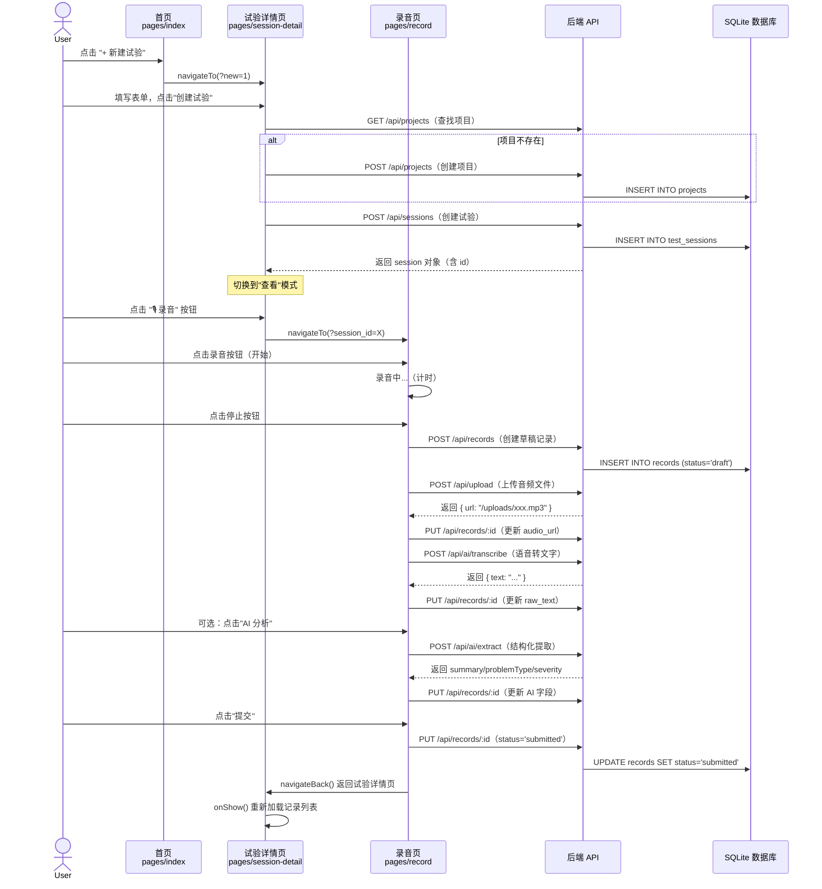
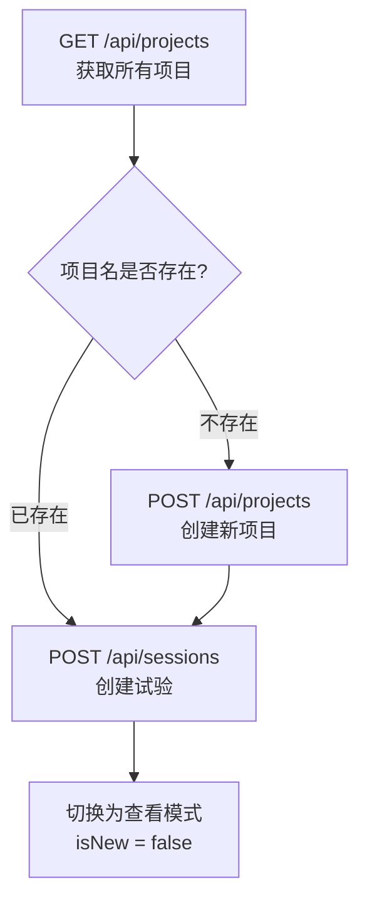
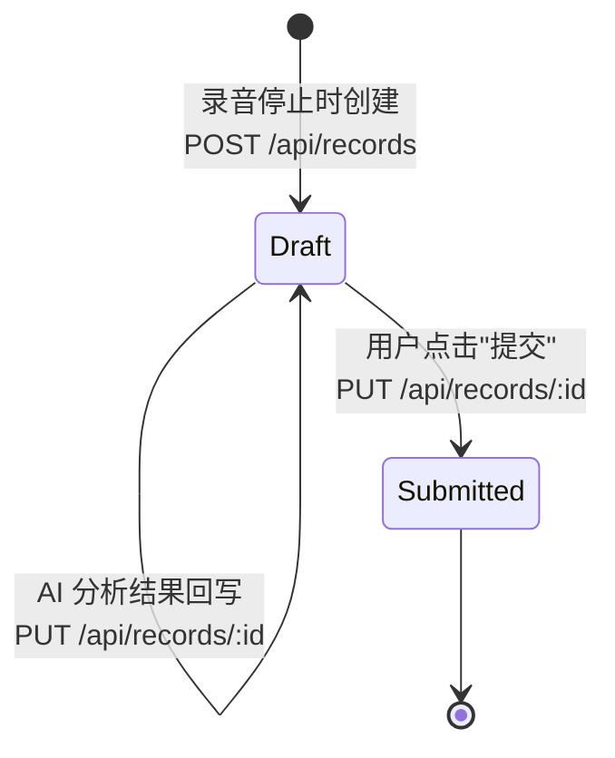
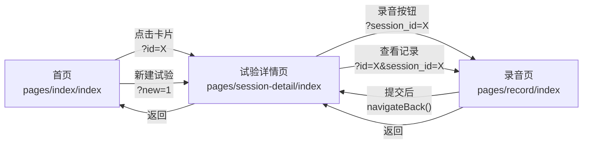

本文以**端到端的视角**还原一个核心业务场景：用户打开路测助手，创建一次新的试验会话，在试验中录音、采集信息，最终提交一条结构化记录。整条链路横跨三个前端页面和六组后端 API，是理解系统数据流和前后端协作模式的最佳切入点。阅读本文后，你将清晰地掌握 **Project → Session → Record** 三层实体的创建顺序、前端页面之间的导航参数传递机制、以及录音到 AI 处理的异步管道设计。

Sources: [app.js](server/src/app.js#L18-L24), [pages.json](client/pages.json#L1-L50)

## 全局流程概览

在深入每一步细节之前，先建立对整体链路的直觉认知。下面的时序图展示了从用户点击"新建试验"到最终提交记录的完整交互过程，涵盖前端页面跳转、API 调用和后端数据库写入的每一个环节。

Sources: [index.vue](client/pages/index/index.vue#L72-L77), [session-detail/index.vue](client/pages/session-detail/index.vue#L166-L194), [record/index.vue](client/pages/record/index.vue#L218-L280)

## 三层数据实体与生命周期

整个工作流的核心数据模型由三层嵌套实体构成，每一层通过外键关联上一层，形成 **Project → Session → Record** 的树状结构。理解它们的生命周期是把握工作流的关键。

| 实体 | 对应数据表 | 创建时机 | 状态流转 | 关键外键 |
|------|-----------|---------|---------|---------|
| **项目 (Project)** | `projects` | 创建试验时按需创建 | 无状态，永久存在 | — |
| **试验 (Session)** | `test_sessions` | 用户在表单中填写后提交 | `active` → `completed` | `project_id → projects.id` |
| **记录 (Record)** | `records` | 用户完成第一次录音时创建 | `draft` → `submitted` | `session_id → test_sessions.id` |

值得注意的设计细节：**项目的创建是隐式的**——用户在新建试验的表单中输入"项目名称"，前端会先查询已有项目列表，若名称匹配则复用已有 `project_id`，否则才调用 `POST /api/projects` 创建新项目。这意味着同一个项目下可以包含多次试验。

Sources: [database.js](server/src/models/database.js#L25-L67), [session-detail/index.vue](client/pages/session-detail/index.vue#L173-L178)

## 第一步：首页与试验列表

首页是整个应用的入口，它承担两个职责：**展示所有已有的试验会话**（以卡片列表形式呈现），以及**提供"新建试验"的入口按钮**。页面使用 UniApp 的 `onShow` 生命周期钩子——而非 `onLoad`——来加载数据，这意味着每次从子页面返回时列表都会自动刷新，确保新增的试验和最新状态能即时反映。

数据加载使用 `Promise.all` 并发请求会话列表和项目列表两组数据，避免串行等待。每张卡片通过 `getProjectName` 方法将 `project_id` 反查为可读的项目名称，并依据 `session.status` 显示"进行中"或"已结束"的标签。

Sources: [index.vue](client/pages/index/index.vue#L46-L78)

### 页面导航参数约定

首页的两个导航目标通过 URL 参数区分模式：

| 触发动作 | 导航目标 | URL 参数 | 含义 |
|---------|---------|---------|------|
| 点击卡片 | 试验详情页 | `?id=<sessionId>` | 查看已有试验 |
| 点击"+ 新建试验" | 试验详情页 | `?new=1` | 进入新建模式 |

这种**用一个页面承担两种模式**的设计在 `session-detail/index.vue` 中通过 `isNew` 数据字段控制 `v-if/v-else` 条件渲染实现。

Sources: [index.vue](client/pages/index/index.vue#L72-L77)

## 第二步：新建试验（表单 → 创建）

进入试验详情页时，`onLoad` 钩子解析路由参数：当 `options.new === '1'` 时将 `isNew` 置为 `true`，页面渲染表单视图；当 `options.id` 存在时加载已有会话数据，渲染详情视图。这两个模式**共享同一个页面组件**，通过模板中的 `v-if="isNew"` 和 `<view v-else>` 实现视图切换。

表单包含六个字段，其中"项目名称"和"测试人员"为必填项（前端通过 `createNewSession` 方法中的空值检查实现校验），日期字段默认取当天并使用 UniApp 的 `<picker mode="date">` 组件提供日历选择。

Sources: [session-detail/index.vue](client/pages/session-detail/index.vue#L4-L42), [session-detail/index.vue](client/pages/session-detail/index.vue#L135-L194)

### 创建试验的 API 调用序列

点击"创建试验"按钮后，前端按以下顺序执行三次 API 调用，形成一条紧凑的依赖链：

后端的 `POST /api/sessions` 路由对 `project_id`、`tester`、`test_date` 三个字段做了必填校验，返回 `400` 状态码和错误消息。创建成功后返回 `201` 状态码和完整的 session 对象（包含数据库生成的 `id` 和默认的 `status: 'active'`）。

Sources: [session-detail/index.vue](client/pages/session-detail/index.vue#L166-L194), [sessions.js](server/src/routes/sessions.js#L13-L19), [queries.js](server/src/models/queries.js#L43-L49)

## 第三步：录音与记录创建

试验创建成功后，页面底部出现浮动的"🎙 录音"按钮（仅在 `session.status === 'active'` 时显示）。点击后导航到录音页，URL 参数携带 `session_id` 标明这条记录归属于哪个试验。

录音页是整个工作流中**交互最复杂、涉及 API 调用最多**的页面。它的核心状态通过 `record` 对象管理——初始为空对象 `{}`，随着用户操作的推进逐步填充字段。

Sources: [session-detail/index.vue](client/pages/session-detail/index.vue#L107-L110), [record/index.vue](client/pages/record/index.vue#L146-L159)

### 录音与异步处理管道

用户按下录音按钮后，页面调用 `uni.getRecorderManager()` 获取平台原生的录音管理器，以 MP3 格式、16kHz 采样率、单声道进行录制。录音停止后触发 `onStop` 回调，进入一条精心编排的异步管道：

| 步骤 | 操作 | API 调用 | 说明 |
|------|------|---------|------|
| 1 | 创建草稿记录 | `POST /api/records` | 仅携带 `session_id` 和 `occurred_at`，status 默认为 `draft` |
| 2 | 上传音频文件 | `POST /api/upload` | 使用 `uni.uploadFile` 发送 multipart/form-data |
| 3 | 关联音频地址 | `PUT /api/records/:id` | 将上传返回的 `url` 写入 `audio_url` 字段 |
| 4 | 语音转文字 | `POST /api/ai/transcribe` | 传入 `audio_url`，后端调用 ASR 服务 |
| 5 | 保存转写文本 | `PUT /api/records/:id` | 将识别结果写入 `raw_text` 字段 |

这个管道的设计体现了**渐进式数据积累**的理念：每完成一个异步步骤就立即将结果持久化到数据库，即使后续步骤失败，已保存的数据也不会丢失。前端在 `handleRecordingDone` 方法中用 `try/catch` 包裹整个管道，确保任何环节的异常都能向用户展示明确的错误提示。

Sources: [record/index.vue](client/pages/record/index.vue#L218-L241), [upload.js](server/src/routes/upload.js#L40-L51), [ai.js](server/src/routes/ai.js#L7-L18)

### 草稿自动保存机制

录音页还内置了一个**每 3 秒执行一次的自动保存定时器**（`draftTimer`），当 `record.id` 存在且 `editableText` 非空时，自动调用 `PUT /api/records/:id` 将用户编辑中的文本和附件列表持久化。这是一个典型的**防丢失设计**——即使用户意外退出页面，已输入的内容也已写入数据库。定时器在页面的 `onUnload` 钩子中被清理，避免内存泄漏。

Sources: [record/index.vue](client/pages/record/index.vue#L158-L162), [record/index.vue](client/pages/record/index.vue#L281-L289)

### GPS 位置采集

录音开始时，页面同步调用 `uni.getLocation({ type: 'wgs84' })` 获取设备当前 GPS 坐标。但这里有一个**时序保护**：只有当 `this.record.id` 已经存在时才会将坐标写入后端（因为 GPS 回调可能在记录创建之前就返回）。采集到的 `gps_lat` 和 `gps_lng` 直接通过 `updateRecord` 更新到数据库，最终在记录的 `info-card` 区域展示。

Sources: [record/index.vue](client/pages/record/index.vue#L203-L217)

## 第四步：AI 结构化提取（可选）

录音转写完成后，页面上展示可编辑的文本区域和一个"AI 分析"按钮。用户可以先手动修正转写文本，再触发 AI 提取。点击按钮后前端调用 `POST /api/ai/extract`，传入当前编辑区中的文本内容，后端返回四个结构化字段：

| AI 提取字段 | 对应数据库列 | 含义 |
|------------|------------|------|
| `summary` | `summary` | 问题摘要 |
| `problemType` | `problem_type` | 问题类型分类 |
| `severity` | `severity` | 严重程度评级 |
| `details` | `details` | 详细描述信息 |

提取结果立即通过 `PUT /api/records/:id` 写入数据库，并在页面的 `ai-card` 区域以标签和文本形式展示。这一步是**完全可选的**——用户完全可以跳过 AI 分析直接提交，此时记录中将没有结构化字段。

Sources: [record/index.vue](client/pages/record/index.vue#L243-L261), [ai.js](server/src/routes/ai.js#L22-L34)

## 第五步：提交记录与状态流转

用户点击"提交"按钮后，前端将 `status` 字段更新为 `'submitted'`，同时保存最终编辑文本 `edited_text` 和附件列表 `attachments`。后端的 `updateRecord` 方法采用**动态字段构建**模式——它遍历一个白名单字段数组，仅为请求体中实际存在的字段生成 `SET` 子句，自动追加 `updated_at = datetime('now','localtime')` 实现时间戳自动更新。

提交成功后，前端延迟 1 秒调用 `uni.navigateBack()` 返回试验详情页。由于详情页在 `onShow` 钩子中重新加载记录列表，用户能立即看到刚提交的记录出现在列表中，其状态标签从橙色的"草稿"变为蓝色的"已提交"。

Sources: [record/index.vue](client/pages/record/index.vue#L263-L279), [queries.js](server/src/models/queries.js#L108-L135)

### 记录状态的完整生命周期

数据库通过 `CHECK(status IN ('draft', 'submitted'))` 约束确保状态值的有效性，任何尝试写入非法状态值的操作都会被 SQLite 拒绝。

Sources: [database.js](server/src/models/database.js#L63)

## 结束试验

当一次试验的所有记录都已完成，用户可以在试验详情页点击"结束试验"按钮。这会弹出一个确认对话框（使用 `uni.showModal`），确认后调用 `PUT /api/sessions/:id` 将 `status` 更新为 `'completed'`。试验一旦结束，底部的录音浮动按钮自动隐藏（因为模板条件为 `session.status === 'active'`），防止用户在已关闭的试验中创建新记录。

Sources: [session-detail/index.vue](client/pages/session-detail/index.vue#L196-L211), [session-detail/index.vue](client/pages/session-detail/index.vue#L107)

## API 调用汇总表

以下是完整工作流中涉及的全部 API 端点，按首次调用顺序排列：

| 序号 | 方法 | 端点 | 触发场景 | 请求体/参数 | 返回内容 |
|------|------|------|---------|-----------|---------|
| 1 | GET | `/api/sessions` | 首页加载 | — | 会话列表 |
| 2 | GET | `/api/projects` | 首页加载 | — | 项目列表 |
| 3 | GET | `/api/projects` | 创建试验时 | — | 用于查找已有项目 |
| 4 | POST | `/api/projects` | 项目名不存在时 | `{ name, tech_lead }` | 新建项目对象 |
| 5 | POST | `/api/sessions` | 点击"创建试验" | `{ project_id, tester, test_date, vehicle_info, route }` | 新建会话对象 |
| 6 | POST | `/api/records` | 录音停止后 | `{ session_id, occurred_at }` | 新建记录对象（draft） |
| 7 | POST | `/api/upload` | 录音停止后 | multipart file | `{ url, filename, size }` |
| 8 | PUT | `/api/records/:id` | 多次调用 | 动态字段 | 更新后的记录对象 |
| 9 | POST | `/api/ai/transcribe` | 录音停止后 | `{ audio_url }` | `{ text }` |
| 10 | POST | `/api/ai/extract` | 点击"AI 分析" | `{ text }` | `{ summary, problemType, severity, details }` |
| 11 | PUT | `/api/sessions/:id` | 点击"结束试验" | `{ status: 'completed' }` | 更新后的会话对象 |

Sources: [api.js](client/services/api.js#L40-L98), [app.js](server/src/app.js#L18-L24)

## 前端页面导航关系

三个核心页面之间的导航关系构成了一个清晰的有向图：

Sources: [pages.json](client/pages.json#L1-L27), [index.vue](client/pages/index/index.vue#L72-L77), [session-detail/index.vue](client/pages/session-detail/index.vue#L212-L217)

## 关键设计模式总结

**渐进式数据持久化**：录音页不等待所有处理完成才写入数据库，而是在每个步骤完成后立即持久化。这种模式在移动端尤为重要——网络不稳定或应用意外退出时，已保存的数据不会丢失。

**隐式项目创建**：项目实体对用户不可见，系统根据用户输入的项目名称自动判断是复用还是新建。这简化了用户的心智模型，让工作流聚焦于"试验"和"记录"两个概念。

**页面模式复用**：试验详情页通过 URL 参数 `new` 和 `id` 切换"新建"与"查看"两种模式，避免了两个高度相似页面的代码重复。同样的模式也体现在录音页——通过 `record.status` 区分"编辑中"和"已提交"两种视图。

**自动草稿保存**：3 秒间隔的定时器确保用户编辑中的内容实时持久化，配合 `onUnload` 生命周期清理定时器，是移动端表单防数据丢失的经典实践。

Sources: [record/index.vue](client/pages/record/index.vue#L158-L162), [session-detail/index.vue](client/pages/session-detail/index.vue#L135-L142), [queries.js](server/src/models/queries.js#L108-L135)

---

### 推荐阅读顺序

本文覆盖了从用户视角的完整操作链路。若你想深入理解每个环节的技术实现细节，建议按以下顺序继续阅读：

1. [语音采集与 AI 结构化提取流程](5-yu-yin-cai-ji-yu-ai-jie-gou-hua-ti-qu-liu-cheng) —— 深入了解 ASR 语音识别和 AI 结构化提取的后端实现
2. [三层实体关系：项目 → 试验 → 记录](8-san-ceng-shi-ti-guan-xi-xiang-mu-shi-yan-ji-lu) —— 理解数据库表结构和外键关系的设计哲学
3. [原始 SQL 查询层：无 ORM 的 CRUD 实现](12-yuan-shi-sql-cha-xun-ceng-wu-orm-de-crud-shi-xian) —— 掌握后端数据访问层的实现模式