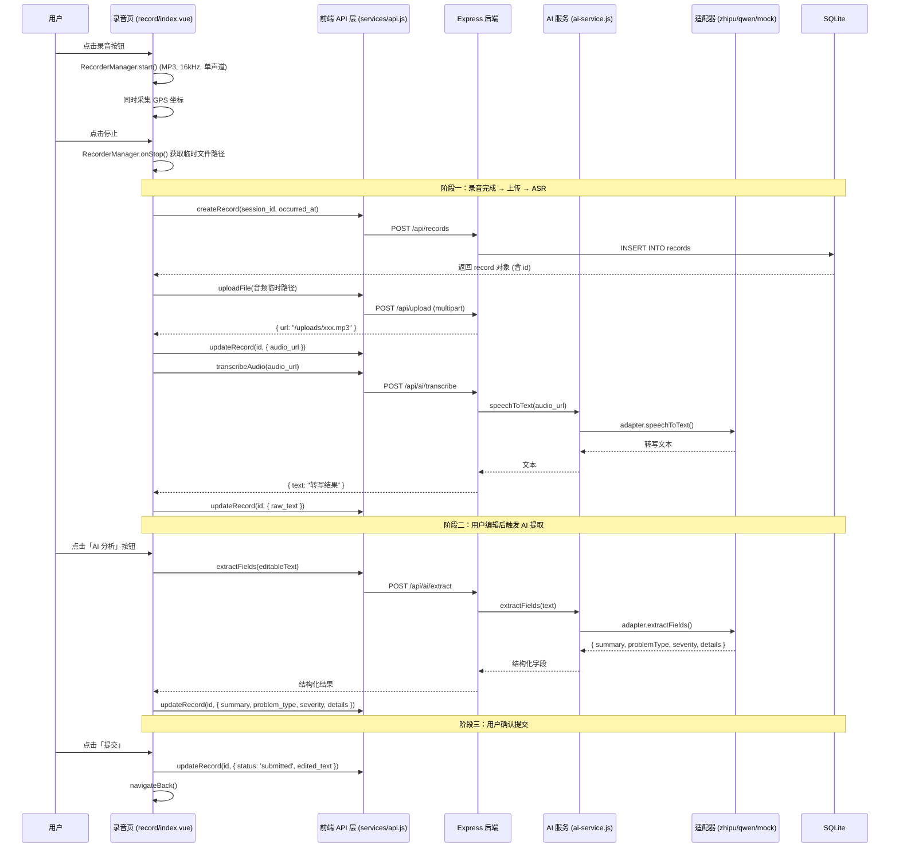

本文档解析路测助手的核心业务链路——从用户按下录音按钮到 AI 自动完成结构化字段提取的全过程。这一链路横跨前端 UniApp 录音采集、文件上传、后端 ASR（语音转文字）、LLM 结构化提取四个阶段，是系统中最具技术深度的端到端流程。

## 整体流程概览

语音采集与 AI 结构化提取的本质是一条**数据增值管线**：原始音频 → 文字转录 → 结构化字段。用户在录音页完成一次语音采集后，系统自动触发 ASR 将音频转为文字，用户可手动编辑修正，再一键触发 AI 提取，最终获得 `summary`（问题摘要）、`problemType`（问题类型）、`severity`（严重程度）、`details`（补充细节）四个结构化字段。

下面的流程图展示了从录音到 AI 分析完成的全链路，包含前端交互、API 调用和后端服务三个层面的数据流转：

Sources: [index.vue](client/pages/record/index.vue#L122-L325), [ai.js](server/src/routes/ai.js#L1-L74), [ai-service.js](server/src/services/ai-service.js#L1-L47)

## 阶段一：语音采集与文件上传

### 录音参数与采集机制

录音页使用 UniApp 内置的 `RecorderManager` 进行音频采集。录音参数在 `toggleRecording()` 方法中配置：输出格式为 **MP3**，采样率 **16000Hz**，单声道。这些参数的选择兼顾了 ASR 服务的输入要求和移动端存储空间限制。录音开始时，页面同时调用 `uni.getLocation()` 获取 WGS84 坐标，并通过 `updateRecord()` 将 GPS 数据写入数据库。

Sources: [index.vue](client/pages/record/index.vue#L181-L217)

### 延迟创建记录的策略

录音停止后，`handleRecordingDone()` 被触发。此时系统才执行 `createRecord()` 在数据库中生成一条 draft 状态的记录。这是一个重要的设计决策：**只有在确认用户确实完成了一次录音后，才在数据库中创建实体**，避免了大量空记录的污染。记录的 `occurred_at` 字段使用 `new Date().toLocaleString('sv-SE')` 格式化为本地时区的 ISO 格式字符串。

Sources: [index.vue](client/pages/record/index.vue#L218-L242)

### 文件上传与 Multer 处理

音频文件通过 `uni.uploadFile()` 以 multipart/form-data 方式上传至 `POST /api/upload` 端点。后端使用 Multer 的 `diskStorage` 策略，生成 `{时间戳}-{6位随机字符串}{扩展名}` 格式的文件名，存储在 `server/uploads/` 目录。上传完成后返回相对 URL（如 `/uploads/1775828529478-42n0ls.mp3`），Express 通过静态文件中间件 `express.static` 托管该目录，使音频文件可通过 HTTP 直接访问。

Sources: [upload.js](server/src/routes/upload.js#L14-L51), [api.js](client/services/api.js#L100-L117), [app.js](server/src/app.js#L16)

## 阶段二：ASR 语音转文字

### AI 服务层的适配器分派

`ai-service.js` 是 AI 能力的门面（Facade），它通过环境变量自动检测应使用哪个适配器，实现了**零配置的运行时切换**：

| 环境变量 | 适配器 | ASR 模型 | LLM 模型 |
|---|---|---|---|
| `ZHIPU_API_KEY` | ZhiPuAdapter | glm-asr-2512 | glm-4-flash |
| `DASHSCOPE_API_KEY` | QwenAdapter | qwen3-asr-flash | qwen-plus |
| 均未设置 | MockAdapter | — | — |

`getAdapter()` 使用单例模式，首次调用时根据环境变量创建适配器实例，后续复用。`speechToText()` 函数在调用适配器之前，会通过 `resolveAudioUrl()` 将前端传来的相对 URL（如 `/uploads/xxx.mp3`）解析为服务器上的绝对文件系统路径，确保适配器能正确读取音频文件。

Sources: [ai-service.js](server/src/services/ai-service.js#L1-L47)

### 两种 ASR 实现的对比

**智谱 ZhiPuAdapter** 的 `speechToText()` 支持三种音频输入格式：本地文件路径、HTTP URL、Base64 data URI。对于本地文件，它使用 `form-data` 库构建 multipart 请求，通过 `_postMultipart()` 辅助方法发送至智谱的 `/audio/transcriptions` 端点。值得注意的是，代码中有一段关键注释说明了为何不直接使用 `form-data` 的 stream 模式——Node.js 原生 `fetch` 与 `form-data` 的 stream 不兼容，必须调用 `getBuffer()` 获取完整 buffer。

**通义千问 QwenAdapter** 的 ASR 实现走的是完全不同的技术路线：它通过 DashScope 的 `chat/completions` 端点，将音频作为 `input_audio` 类型的消息内容发送，本质上是用 Chat API 来完成语音识别。

Sources: [zhipu-adapter.js](server/src/services/zhipu-adapter.js#L30-L134), [qwen-adapter.js](server/src/services/qwen-adapter.js#L28-L62)

## 阶段三：AI 结构化提取

### Prompt 工程与输出规范

结构化提取的核心是一个精心设计的系统 Prompt。两个适配器使用完全相同的 `EXTRACT_PROMPT`，要求 AI 扮演"路测问题分析助手"角色，从路测记录文字中提取四个结构化字段。Prompt 明确约束了枚举值范围：`problemType` 限定为**感知异常、规划异常、控制异常、接管、系统故障、其他**六种之一；`severity` 限定为**致命、严重、一般、轻微**四级。输出格式严格要求为纯 JSON，不附带任何解释性文本。

Sources: [zhipu-adapter.js](server/src/services/zhipu-adapter.js#L5-L19)

### JSON 解析的防御策略

两个适配器的 `extractFields()` 都实现了双重 JSON 解析策略：首先尝试直接 `JSON.parse()`，失败后使用正则 `/\{[\s\S]*\}/` 从响应中提取 JSON 对象再解析。这是因为 LLM 输出可能在 JSON 前后附带 markdown 代码块标记或解释性文字。此外，通义千问适配器额外设置了 `response_format: { type: 'json_object' }`，从模型侧强制 JSON 输出格式。两个适配器都使用 `temperature: 0.1` 确保输出的稳定性和一致性。

Sources: [zhipu-adapter.js](server/src/services/zhipu-adapter.js#L136-L172), [qwen-adapter.js](server/src/services/qwen-adapter.js#L64-L99)

### 结构化字段的数据落位

AI 返回的字段通过前端 `runAI()` 方法映射并写入数据库，字段映射关系如下：

| AI 返回字段 | 数据库字段 | 含义 |
|---|---|---|
| `summary` | `summary` | 一句话问题描述 |
| `problemType` | `problem_type` | 问题分类（6 种枚举值） |
| `severity` | `severity` | 严重程度（4 级枚举） |
| `details` | `details` | 补充细节描述 |

`updateRecord()` 方法在 SQL 层使用了动态字段拼接策略：只更新请求中实际包含的字段，`attachments` 字段自动执行 `JSON.stringify()` 序列化，`updated_at` 字段始终刷新为当前本地时间。

Sources: [index.vue](client/pages/record/index.vue#L243-L261), [queries.js](server/src/models/queries.js#L108-L135)

## 一键管线：process-record 端点

除了前端分步调用（先 transcribe 再 extract），后端还提供了 `POST /api/ai/process-record` 端点，支持一次性完成 ASR + 结构化提取 + 数据库更新三个步骤。该端点接收 `record_id` 和可选的 `audio_url`，如果提供了音频地址则先执行语音转文字，然后基于文本执行结构化提取，最后将所有结果一次性写入记录。这个端点目前前端未直接使用，但为未来实现"一键完成全流程"的交互模式预留了能力。

Sources: [ai.js](server/src/routes/ai.js#L37-L72)

## 自动草稿保存与用户编辑机制

录音页在 `onLoad` 生命周期中启动了一个 **3 秒间隔**的定时器 (`draftTimer`)，持续调用 `saveDraft()` 方法。该方法仅在 `record.id` 存在且 `editableText` 非空时触发，将用户当前的文本编辑内容和附件列表静默保存至后端。用户在文本框中编辑转写结果时，`editableText` 会实时更新（通过 `v-model` 绑定），而 `raw_text` 保持不变——这种分离确保了原始转写结果和用户修改版本都能被完整保留。页面卸载时，定时器和录音状态都会被正确清理。

Sources: [index.vue](client/pages/record/index.vue#L158-L166), [index.vue](client/pages/record/index.vue#L281-L289)

## 数据模型中的字段承载

records 表的 schema 设计直接反映了语音采集与 AI 提取流程的数据需求。`audio_url` 存储上传后的音频文件路径，`raw_text` 存储 ASR 原始输出，`edited_text` 存储用户修正后的文本，`summary`、`problem_type`、`severity`、`details` 四个字段承载 AI 结构化提取的结果。`status` 字段使用 `CHECK` 约束限定为 `draft` 或 `submitted` 两种状态，构成了从草稿到提交的完整生命周期。

Sources: [database.js](server/src/models/database.js#L47-L67)

## 延伸阅读

- 想了解录音页更完整的交互设计细节，参阅 [核心录音页：录音 → 上传 → ASR → AI 分析的完整实现](20-he-xin-lu-yin-ye-lu-yin-shang-chuan-asr-ai-fen-xi-de-wan-zheng-shi-xian)
- 想深入理解适配器的可插拔架构设计，参阅 [可插拔适配器模式：BaseAdapter 抽象与单例选择器](14-ke-cha-ba-gua-pei-qi-mo-shi-baseadapter-chou-xiang-yu-dan-li-xuan-ze-qi)
- 想查看各适配器的具体实现差异，参阅 [智谱 GLM 适配器实现（ASR + 结构化提取）](15-zhi-pu-glm-gua-pei-qi-shi-xian-asr-jie-gou-hua-ti-qu) 与 [通义千问适配器实现与对比](16-tong-yi-qian-wen-gua-pei-qi-shi-xian-yu-dui-bi)
- 想了解文件上传的 Multer 配置与静态资源托管机制，参阅 [Multer 文件上传与静态资源托管](13-multer-wen-jian-shang-chuan-yu-jing-tai-zi-yuan-tuo-guan)