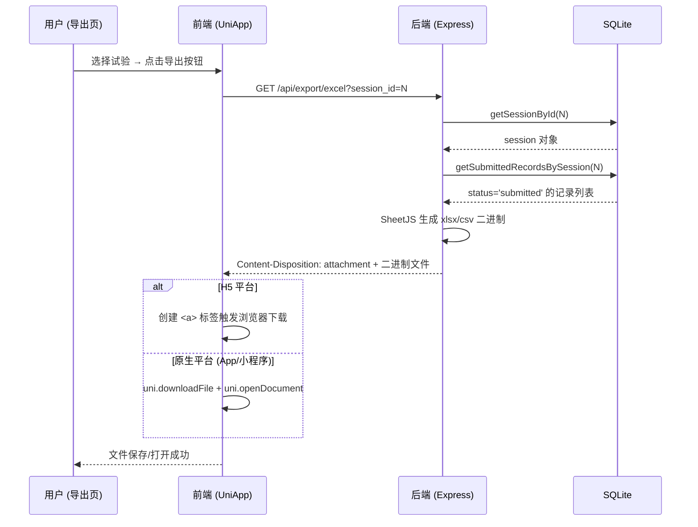
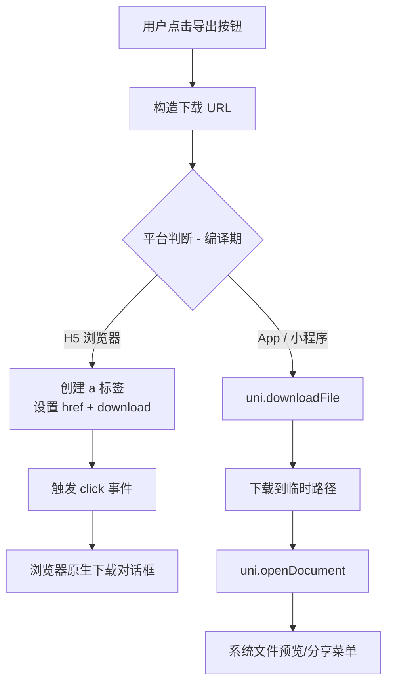

数据导出是路测助手业务闭环的最后一环——将试验中采集并经 AI 结构化提取的记录，从 SQLite 数据库中以标准表格文件格式输出，供后续分析、归档和交付使用。本文将完整拆解从「用户在导出页点击按钮」到「浏览器/原生应用弹出文件」的全链路实现，涵盖前端跨平台下载策略、后端 SheetJS 文件生成逻辑、数据过滤规则及字段映射关系。

Sources: [export.js](server/src/routes/export.js#L1-L115), [index.vue](client/pages/export/index.vue#L1-L266)

## 整体流程架构

在深入代码之前，先从宏观上理解数据导出的请求-响应生命周期。下方的 Mermaid 序列图展示了从前端触发导出到后端返回文件的完整交互过程：



整个流程的核心设计原则是**服务端渲染文件、客户端触发下载**。后端不存储导出文件（无缓存机制），每次请求都是实时从数据库查询并即时生成。这意味着导出结果始终反映最新的数据状态。

Sources: [export.js](server/src/routes/export.js#L1-L70), [index.vue](client/pages/export/index.vue#L98-L144)

## 后端路由：双端点、双格式

后端在 Express 路由中注册了两个独立的导出端点，均挂载在 `/api/export` 路径下：

| 端点 | HTTP 方法 | 输出格式 | Content-Type | 包含 Sheet 数量 |
|------|-----------|----------|--------------|----------------|
| `/api/export/excel` | GET | `.xlsx` | `application/vnd.openxmlformats-officedocument.spreadsheetml.sheet` | 2 个（路测记录 + 试验信息） |
| `/api/export/csv` | GET | `.csv` | `text/csv; charset=utf-8` | 1 个（路测记录） |

两个端点的**输入验证逻辑完全一致**，遵循三步校验链：

1. **参数校验** — 从 `req.query` 中提取 `session_id`，缺失则返回 `400`
2. **试验存在性校验** — 调用 `getSessionById()` 查询，不存在则返回 `404`
3. **记录非空校验** — 调用 `getSubmittedRecordsBySession()` 查询已提交记录，为空则返回 `400`

这个三步校验链的设计意味着：只有当试验存在**且**包含至少一条 `status = 'submitted'` 的记录时，导出才会成功执行。

Sources: [export.js](server/src/routes/export.js#L6-L21), [export.js](server/src/routes/export.js#L72-L87), [queries.js](server/src/models/queries.js#L137-L141)

### 关键业务规则：仅导出已提交记录

数据过滤由查询层函数 `getSubmittedRecordsBySession` 实现，它在 SQL 中通过 `WHERE status = 'submitted'` 条件精确筛选。这是一个重要的业务边界——处于 `draft`（草稿）状态的记录不会出现在导出结果中。这确保了导出数据的**审计完整性**：只有用户确认提交的记录才会被正式输出。

```sql
SELECT * FROM records
WHERE session_id = ? AND status = 'submitted'
ORDER BY created_at DESC
```

Sources: [queries.js](server/src/models/queries.js#L137-L141)

## Excel 导出的双 Sheet 设计

Excel 导出的特色在于它生成一个包含**两个工作表**的工作簿，这种设计将原始数据与上下文元数据分离，便于下游系统直接消费数据 Sheet 而不关心试验信息。

### Sheet 1：路测记录（14 列）

后端将数据库记录映射为中文列名的对象数组，字段映射关系如下表：

| 导出列名 | 数据库字段 | 数据类型 | 空值处理 |
|----------|-----------|----------|----------|
| 记录ID | `id` | INTEGER | - |
| 问题描述 | `summary` | TEXT | 默认 `''` |
| 问题类型 | `problem_type` | TEXT | 默认 `''` |
| 严重程度 | `severity` | TEXT | 默认 `''` |
| 详细描述 | `details` | TEXT | 默认 `''` |
| 原始文字 | `raw_text` | TEXT | 默认 `''` |
| 编辑后文字 | `edited_text` | TEXT | 默认 `''` |
| GPS纬度 | `gps_lat` | REAL | 默认 `''` |
| GPS经度 | `gps_lng` | REAL | 默认 `''` |
| 地址 | `gps_address` | TEXT | 默认 `''` |
| 天气 | `weather` | TEXT | 默认 `''` |
| 发生时间 | `occurred_at` | DATETIME | 默认 `''` |
| 状态 | `status` | TEXT | 无空值保护 |
| 创建时间 | `created_at` | DATETIME | 无空值保护 |

值得注意的是，`status` 和 `created_at` 两个字段**没有**做空值兜底处理（`|| ''`），因为它们在数据库中有默认值（`'draft'` 和 `datetime('now','localtime')`），在逻辑上不可能为空。而其余业务字段（如 `summary`、`gps_lat`）在 AI 提取失败或用户未填写时确实可能为 `null`，因此统一用 `|| ''` 转为空字符串。

Sources: [export.js](server/src/routes/export.js#L23-L38)

### Sheet 2：试验信息（5 列）

第二个 Sheet 只包含一行数据，描述该试验的上下文元信息：

| 导出列名 | 数据库字段 | 说明 |
|----------|-----------|------|
| 项目ID | `project_id` | 关联的项目编号 |
| 测试人员 | `tester` | 试验执行人 |
| 测试日期 | `test_date` | 试验执行日期 |
| 车辆信息 | `vehicle_info` | 试验车辆 |
| 测试路线 | `route` | 测试路线 |
| 状态 | `status` | 试验状态（active/completed） |

Sources: [export.js](server/src/routes/export.js#L53-L63)

### 列宽配置

Excel 导出还手动设置了列宽（`ws['!cols']`），从 8 到 40 字符不等，确保打开时中文内容不会被截断。例如「问题描述」和「详细描述」列宽为 30，「原始文字」和「编辑后文字」列宽为 40，而「记录ID」和「状态」等短字段仅 8 字符。

Sources: [export.js](server/src/routes/export.js#L44-L49)

## CSV 导出的精简设计

CSV 导出是 Excel 导出的精简版本，有两个显著差异：

**字段裁剪** — CSV 只输出 10 个字段，相比 Excel 的 14 个字段，省略了「编辑后文字」「地址」「发生时间」「创建时间」。这种设计体现了 CSV 的定位：作为轻量级数据交换格式，只保留最核心的结构化信息。

**UTF-8 BOM 前缀** — CSV 响应体在标准 CSV 内容前添加了 `\ufeff`（BOM 标记）。这是一个关键细节：Microsoft Excel 在打开 CSV 文件时默认使用系统 ANSI 编码，如果不加 BOM，中文字符会出现乱码。BOM 让 Excel 正确识别文件为 UTF-8 编码。

Sources: [export.js](server/src/routes/export.js#L89-L111)

## 前端导出页：跨平台条件编译

导出页在 UniApp 应用中注册为底部 TabBar 的第二个标签页（「导出」），这意味着它始终可以从首页一键直达。

Sources: [pages.json](client/pages.json#L38-L49)

### 页面交互流程

页面的交互设计遵循「选择 → 预览 → 导出」三步范式：

1. **选择试验** — 页面加载时（`onShow` 生命周期）调用 `getSessions()` 获取所有试验列表，用 UniApp `<picker>` 组件展示为下拉选择器，显示格式为「测试人员 - 日期 - 路线」
2. **预览记录** — 选中试验后，调用 `getRecords(sessionId)` 获取全部记录，前端再通过 `.filter(r => r.status === 'submitted')` 过滤出已提交记录，以卡片形式预览摘要和标签（问题类型、严重程度）
3. **触发导出** — 预览区域下方展示「导出 Excel」和「导出 CSV」两个按钮，仅在选中试验**且**存在已提交记录时才显示

Sources: [index.vue](client/pages/export/index.vue#L80-L97)

### 条件编译：H5 与原生的差异化下载策略

这是导出页最值得关注的架构设计。UniApp 的条件编译语法（`#ifdef` / `#ifndef`）允许在同一个 `.vue` 文件中为不同平台生成不同的代码路径：



**H5 平台**的下载实现非常简洁：动态创建一个 `<a>` 元素，将 `href` 设为导出 API 的完整 URL，设置 `download` 属性指定文件名，然后程序化触发 `click()` 事件。浏览器会自动处理 Content-Disposition 响应头，弹出保存对话框。这种方式无需将文件内容读入 JavaScript 内存，是纯浏览器端的流式下载。

**原生平台**（App / 小程序）则使用 UniApp 提供的 `uni.downloadFile` API，将文件下载到临时存储路径，然后通过 `uni.openDocument` 调用系统关联应用打开（如 WPS、Excel 等）。`showMenu: true` 参数还会弹出分享菜单，允许用户将文件发送到其他应用。

Sources: [index.vue](client/pages/export/index.vue#L98-L144)

### 一个值得注意的架构偏差

前端导出页的 `doExport` 方法直接通过硬编码的 `BASE_URL` 拼接请求 URL，绕过了 `client/services/api.js` 中封装的 `exportExcel` 和 `exportCsv` 函数。API 服务层中的这两个函数使用 POST 方法发送 JSON body：

```javascript
// api.js 中封装但未被导出页使用
export function exportExcel(sessionId) {
  return post('/api/export/excel', { session_id: sessionId });
}
```

而导出页实际使用的是 GET 请求 + query string 方式。后端路由同时兼容两种方式（`req.query.session_id || req.body?.session_id`），因此两者都能正常工作，但前端服务层中这两个函数实际上是**死代码**。在测试文件中，测试用例使用的是 POST 方式，与 API 层封装一致。

Sources: [api.js](client/services/api.js#L119-L126), [index.vue](client/pages/export/index.vue#L98-L100), [export.js](server/src/routes/export.js#L8), [api-upload-export.test.js](server/tests/api-upload-export.test.js#L57-L67)

## 文件生成技术选型：SheetJS

后端使用 [SheetJS](https://sheetjs.com/)（npm 包名 `xlsx`，版本 `^0.18.5`）作为唯一的文件生成引擎。它同时服务于 Excel 和 CSV 两种格式，避免了引入多个依赖。

核心 API 调用链如下：

| 步骤 | API | 用途 |
|------|-----|------|
| 创建工作簿 | `XLSX.utils.book_new()` | 初始化空工作簿 |
| 数据 → Sheet | `XLSX.utils.json_to_sheet(data)` | 将对象数组转为工作表 |
| 添加 Sheet | `XLSX.utils.book_append_sheet(wb, ws, name)` | 将工作表加入工作簿 |
| 导出 Buffer | `XLSX.write(wb, { type: 'buffer', bookType: 'xlsx' })` | 生成二进制 Buffer |
| 导出 CSV | `XLSX.utils.sheet_to_csv(ws)` | 将工作表转为 CSV 字符串 |

Excel 路径走的是 `json_to_sheet → book_append_sheet → XLSX.write(buffer)` 三步链路，最终通过 `res.send(buf)` 将 Buffer 写入 HTTP 响应。CSV 路径则是 `json_to_sheet → sheet_to_csv`，将结果字符串拼接 BOM 后返回。两种格式的生成过程共享了数据查询和字段映射逻辑，只在最终序列化阶段分道扬镳。

Sources: [export.js](server/src/routes/export.js#L40-L69), [export.js](server/src/routes/export.js#L102-L112)

## 导出文件命名与响应头

后端通过 `Content-Disposition` 响应头控制下载文件名，命名规则为 `roadtest-{session_id}-{timestamp}.{ext}`，其中 `timestamp` 使用 `Date.now()` 毫秒值，确保同一试验的多次导出不会互相覆盖。响应头配置如下：

```javascript
// Excel
res.setHeader('Content-Type', 'application/vnd.openxmlformats-officedocument.spreadsheetml.sheet');
res.setHeader('Content-Disposition', 'attachment; filename="roadtest-1-1718234567890.xlsx"');

// CSV
res.setHeader('Content-Type', 'text/csv; charset=utf-8');
res.setHeader('Content-Disposition', 'attachment; filename="roadtest-1-1718234567890.csv"');
```

需要注意的是，文件名中包含时间戳但没有做 URL 编码处理。在大多数场景下这不会造成问题，但如果未来需要支持中文文件名，需改用 `filename*=UTF-8''` 编码格式。

Sources: [export.js](server/src/routes/export.js#L65-L69), [export.js](server/src/routes/export.js#L107-L111)

## 测试覆盖

导出功能的测试位于 `server/tests/api-upload-export.test.js`，采用独立的 SQLite 数据库文件进行隔离。测试用例覆盖了以下场景：

| 测试场景 | 方法 | 预期结果 |
|----------|------|----------|
| 正常导出 Excel | POST | 200，Content-Type 含 `spreadsheetml`，Content-Disposition 含 `.xlsx` |
| 正常导出 CSV | POST | 200，Content-Type 含 `text/csv`，Content-Disposition 含 `.csv` |
| 缺失 session_id | POST | 400 |
| 不存在的 session_id | POST | 404 |

测试辅助函数 `createTestSessionWithRecords` 模拟了完整的业务链路：创建项目 → 创建试验 → 创建记录 → 提交记录（`PUT` 更新 `status` 为 `submitted`），确保导出接口能获取到有效数据。这种端到端的测试数据构造方式验证了从数据库写入到文件生成的完整路径。

Sources: [api-upload-export.test.js](server/tests/api-upload-export.test.js#L28-L91)

## 架构总结与阅读建议

数据导出流程的架构可以用「**薄前端、厚后端**」来概括——前端只负责 UI 交互和平台适配（条件编译），所有数据查询、格式化、文件生成的逻辑都集中在后端路由层。这种设计使得导出逻辑便于测试（可直接通过 HTTP 请求验证），也便于未来扩展（如新增 PDF 导出格式只需在后端添加新端点）。

关于此流程的扩展阅读：
- 了解导出数据来源于哪一层业务，参见 [语音采集与 AI 结构化提取流程](5-yu-yin-cai-ji-yu-ai-jie-gou-hua-ti-qu-liu-cheng)
- 深入前端条件编译的完整页面实现，参见 [导出页：条件编译实现 H5 与原生平台的差异化下载](22-dao-chu-ye-tiao-jian-bian-yi-shi-xian-h5-yu-yuan-sheng-ping-tai-de-chai-yi-hua-xia-zai)
- 了解路由注册方式与 API 整体设计，参见 [RESTful API 路由设计（Projects / Sessions / Records / Upload / Export / AI）](11-restful-api-lu-you-she-ji-projects-sessions-records-upload-export-ai)
- 了解查询层的无 ORM 实现细节，参见 [原始 SQL 查询层：无 ORM 的 CRUD 实现](12-yuan-shi-sql-cha-xun-ceng-wu-orm-de-crud-shi-xian)