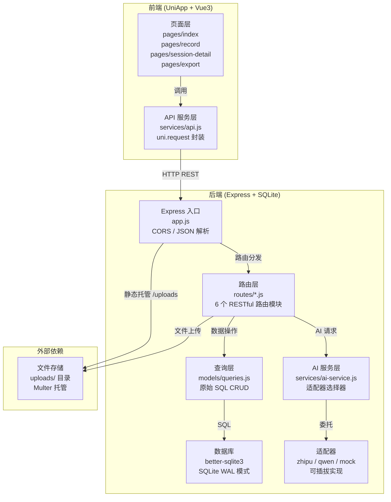

本文档从全局视角剖析路测助手的**前后端分离架构**，帮助你理解客户端（UniApp + Vue3）与服务端（Express + SQLite）之间的职责边界、通信机制和分层设计。阅读本文后，你将清晰掌握请求从用户操作到数据库落盘的完整链路，以及项目中每个模块在架构中的精确位置。

Sources: [app.js](server/src/app.js#L1-L47), [api.js](client/services/api.js#L1-L127)

## 架构全局视图

路测助手采用**经典的前后端分离模式**：前端负责 UI 渲染与用户交互，后端负责业务逻辑、数据持久化和 AI 服务集成。两端通过 RESTful JSON API 通信，文件上传通过 `multipart/form-data` 独立处理。下方架构图展示了完整的请求流转路径：



Sources: [app.js](server/src/app.js#L1-L47), [api.js](client/services/api.js#L1-L127), [database.js](server/src/models/database.js#L1-L74)

## 前端架构：UniApp + Vue3

前端基于 **UniApp 框架**构建，使用 Vue3 Composition Options API 风格编写，通过 `createSSRApp` 创建应用实例以保证跨端 SSR 兼容性。整个前端可编译为 H5 网页应用、微信小程序或原生 App，这是 UniApp 跨端能力的核心优势。

Sources: [main.js](client/main.js#L1-L8)

### 页面路由与 TabBar 结构

前端共 4 个页面，通过 `pages.json` 声明式配置路由。底部 TabBar 固定展示"试验"和"导出"两个入口，其余页面通过编程式导航（`uni.navigateTo`）进入：

| 页面路径 | 导航栏标题 | 进入方式 | 核心职责 |
|---|---|---|---|
| `pages/index/index` | 试验列表 | TabBar | 展示所有试验卡片，支持新建试验 |
| `pages/session-detail/index` | 试验详情 | `navigateTo` (带 `id` 或 `new` 参数) | 双模式：新建试验 / 查看试验详情与记录管理 |
| `pages/record/index` | 录音记录 | `navigateTo` (带 `session_id` 参数) | 录音 → 上传 → ASR → AI 分析的完整链路 |
| `pages/export/index` | 导出 | TabBar | 按试验筛选并导出 Excel / CSV |

Sources: [pages.json](client/pages.json#L1-L51)

### API 服务层：请求封装与代理机制

`services/api.js` 是前端与后端通信的**唯一出口**。它封装了基于 `uni.request` 的通用请求函数，并按业务域导出具名函数。关键设计决策有两点：

**第一，统一的 BASE_URL 配置**。硬编码为局域网 IP（`http://192.168.1.10:3000`），这是因为真机调试时移动设备无法通过 `localhost` 访问开发机。H5 调试时可改回 `localhost`，或利用 `manifest.json` 中配置的 H5 devServer 代理自动转发 `/api` 请求。

**第二，按业务域的函数式导出**。所有 API 调用以 `export function` 形式按 Projects / Sessions / Records / AI / Upload / Export 六大分组导出，页面通过 `import` 按需引入，形成清晰的依赖关系。

Sources: [api.js](client/services/api.js#L1-L127), [manifest.json](client/manifest.json#L16-L26)

## 后端架构：Express + SQLite

后端是一个**无 ORM 的轻量 Express 服务**，采用同步的 `better-sqlite3` 驱动 SQLite 数据库，省去了异步数据库驱动的复杂性。整个后端按照**入口 → 中间件 → 路由 → 查询 → 数据库**的分层结构组织。

Sources: [app.js](server/src/app.js#L1-L47), [package.json](server/package.json#L1-L26)

### 入口与应用初始化

`app.js` 作为后端入口，完成四项关键初始化工作：

1. **环境变量加载** — `dotenv` 从 `.env` 文件读取 API Key 和端口配置
2. **中间件注册** — `cors()` 允许跨域、`express.json()` 解析 JSON 请求体、`express.urlencoded()` 处理表单数据
3. **静态文件托管** — 将 `uploads/` 目录映射到 `/uploads` URL 路径，使前端可通过 HTTP 直接访问上传的音频和图片
4. **路由挂载** — 6 个业务路由模块统一挂载到 `/api/*` 前缀下，另加一个 `/api/health` 健康检查端点

值得注意的是，服务启动采用 `require.main === module` 守卫，这意味着 `app.js` 既可以直接运行启动服务，也可以被测试文件 `require` 导入而不触发 `listen`，实现了**应用实例与服务器启动的解耦**。

Sources: [app.js](server/src/app.js#L1-L47)

### RESTful 路由层

6 个路由模块各自对应一个业务域，遵循 RESTful 约定。下表汇总了全部 API 端点：

| 路由模块 | 挂载路径 | HTTP 方法 | 端点 | 功能 |
|---|---|---|---|---|
| **projects** | `/api/projects` | GET | `/` | 获取项目列表 |
| | | POST | `/` | 创建项目 |
| | | GET | `/:id` | 获取单个项目 |
| **sessions** | `/api/sessions` | GET | `/` | 获取试验列表（支持 `?project_id=` 筛选） |
| | | POST | `/` | 创建试验 |
| | | GET | `/:id` | 获取单个试验 |
| | | PUT | `/:id` | 更新试验 |
| **records** | `/api/records` | GET | `/?session_id=` | 获取某试验的记录列表 |
| | | POST | `/` | 创建记录 |
| | | GET | `/:id` | 获取单条记录 |
| | | PUT | `/:id` | 更新记录 |
| **upload** | `/api/upload` | POST | `/` | 单文件上传（Multer） |
| | | POST | `/multiple` | 多文件上传（最多 10 个） |
| **ai** | `/api/ai` | POST | `/transcribe` | 语音转文字 |
| | | POST | `/extract` | 结构化字段提取 |
| | | POST | `/process-record` | 完整流水线：ASR → 提取 → 更新记录 |
| **export** | `/api/export` | GET | `/excel?session_id=` | 导出 Excel 文件 |
| | | GET | `/csv?session_id=` | 导出 CSV 文件 |

Sources: [projects.js](server/src/routes/projects.js#L1-L31), [sessions.js](server/src/routes/sessions.js#L1-L41), [records.js](server/src/routes/records.js#L1-L44), [upload.js](server/src/routes/upload.js#L1-L68), [ai.js](server/src/routes/ai.js#L1-L75), [export.js](server/src/routes/export.js#L1-L115)

### 数据查询层：无 ORM 的原始 SQL

`models/queries.js` 是后端的数据访问层，直接使用 `better-sqlite3` 的 `prepare().all()` / `.get()` / `.run()` 同步 API 执行参数化 SQL。这种无 ORM 方案在路测助手这类中小规模项目中具有明确的优势：**零抽象开销、SQL 完全透明、调试直观**。

查询层向路由层暴露纯函数接口（如 `getAllProjects()`、`createRecord(data)`），路由层无需关心 SQL 细节和数据库连接管理。`updateRecord` 函数通过动态字段拼接实现灵活的部分更新，只更新请求中实际传入的字段。

Sources: [queries.js](server/src/models/queries.js#L1-L148)

### AI 服务层：可插拔适配器

AI 能力通过**适配器模式**实现多供应商切换。`BaseAIAdapter` 定义了 `speechToText()` 和 `extractFields()` 两个抽象方法，具体实现由 `ZhiPuAdapter`（智谱 GLM）、`QwenAdapter`（通义千问）和 `MockAdapter`（降级方案）提供。`ai-service.js` 作为单例选择器，根据环境变量 `ZHIPU_API_KEY` 或 `DASHSCOPE_API_KEY` 的存在自动选择适配器，均不存在时降级到 Mock。

Sources: [base-adapter.js](server/src/services/base-adapter.js#L1-L25), [ai-service.js](server/src/services/ai-service.js#L1-L48)

## 前后端通信模式

前后端之间的通信存在三种截然不同的模式，每种模式对应不同的数据序列化方式和内容类型：

| 通信模式 | 前端调用方式 | Content-Type | 后端处理方式 | 典型场景 |
|---|---|---|---|---|
| **JSON 数据请求** | `uni.request` | `application/json` | `express.json()` 中间件 | CRUD 操作、AI 调用 |
| **文件上传** | `uni.uploadFile` | `multipart/form-data` | `multer.single()` / `.array()` | 音频、图片上传 |
| **文件下载** | `window.open` / `plus.downloader` | `application/octet-stream` | `res.send(buffer)` | Excel / CSV 导出 |

JSON 请求通过 `api.js` 中统一的 `request()` 函数处理，自动注入 `Content-Type` 头并封装 Promise。文件上传则绕过通用请求函数，直接调用 `uni.uploadFile`。文件下载的实现在前端存在平台差异：H5 使用浏览器原生下载，原生 App 使用 `plus.downloader` API——这是 UniApp 条件编译的典型应用场景。

Sources: [api.js](client/services/api.js#L4-L26), [api.js](client/services/api.js#L101-L117), [api.js](client/services/api.js#L120-L127)

## 目录结构对照

理解架构的另一种方式是观察代码在文件系统中的组织。以下对照表将目录结构与架构层次逐一映射：

```
路测助手/
├── client/                          # ── 前端工程 ──
│   ├── main.js                      # 应用入口 (createSSRApp)
│   ├── App.vue                      # 根组件 (生命周期钩子)
│   ├── pages.json                   # 路由配置 + TabBar 声明
│   ├── manifest.json                # UniApp 配置 (H5 代理、平台设置)
│   ├── services/
│   │   └── api.js                   # API 服务层 (唯一通信出口)
│   ├── pages/
│   │   ├── index/index.vue          # 首页：试验列表
│   │   ├── session-detail/index.vue # 试验详情 (新建/查看双模式)
│   │   ├── record/index.vue         # 核心录音页 (录音→AI完整链路)
│   │   └── export/index.vue         # 数据导出页
│   └── components/                  # 可复用组件 (预留)
│
├── server/                          # ── 后端工程 ──
│   ├── src/
│   │   ├── app.js                   # Express 入口 (中间件 + 路由挂载)
│   │   ├── routes/                  # 路由层 (6 个业务模块)
│   │   │   ├── projects.js
│   │   │   ├── sessions.js
│   │   │   ├── records.js
│   │   │   ├── upload.js
│   │   │   ├── ai.js
│   │   │   └── export.js
│   │   ├── models/                  # 数据层
│   │   │   ├── database.js          # SQLite 连接 + 建表
│   │   │   └── queries.js           # 原始 SQL CRUD 函数
│   │   └── services/                # AI 服务层
│   │       ├── base-adapter.js      # 适配器抽象基类
│   │       ├── ai-service.js        # 单例选择器
│   │       ├── zhipu-adapter.js     # 智谱 GLM 实现
│   │       ├── qwen-adapter.js      # 通义千问实现
│   │       └── mock-adapter.js      # 降级 Mock
│   ├── tests/                       # 集成测试 (Jest + Supertest)
│   └── uploads/                     # 文件存储目录
```

Sources: [app.js](server/src/app.js#L1-L47), [main.js](client/main.js#L1-L8)

## 架构设计决策总结

下表归纳了路测助手在架构层面的关键决策及其理由：

| 决策 | 选择 | 理由 |
|---|---|---|
| 跨端框架 | UniApp + Vue3 | 一套代码同时编译 H5 / 小程序 / 原生 App |
| 后端运行时 | Express (Node.js) | 轻量、生态丰富、与前端同语言降低团队认知负担 |
| 数据库 | SQLite (better-sqlite3) | 零部署、单文件、适合本地工具类应用 |
| ORM 策略 | 无 ORM，原始 SQL | 透明可控、无学习成本、匹配项目规模 |
| AI 集成 | 可插拔适配器模式 | 解耦供应商依赖、支持降级、便于扩展新供应商 |
| 文件上传 | Multer + 本地磁盘 | 简单直接、无需额外对象存储服务 |
| 前后端通信 | RESTful JSON API | 标准化、易调试、UniApp 原生支持 |

Sources: [package.json](server/package.json#L1-L26), [database.js](server/src/models/database.js#L1-L74), [base-adapter.js](server/src/services/base-adapter.js#L1-L25)

## 延伸阅读

本文档提供了前后端分离架构的全景视图。若你需要深入某一层的实现细节，建议按以下顺序继续阅读：

- 了解数据实体之间的关联关系：[三层实体关系：项目 → 试验 → 记录](8-san-ceng-shi-ti-guan-xi-xiang-mu-shi-yan-ji-lu)
- 深入后端入口与初始化逻辑：[Express 入口与应用初始化](10-express-ru-kou-yu-ying-yong-chu-shi-hua)
- 理解 API 路由的完整设计：[RESTful API 路由设计（Projects / Sessions / Records / Upload / Export / AI）](11-restful-api-lu-you-she-ji-projects-sessions-records-upload-export-ai)
- 探索 AI 适配器的可插拔架构：[可插拔适配器模式：BaseAdapter 抽象与单例选择器](14-ke-cha-ba-gua-pei-qi-mo-shi-baseadapter-chou-xiang-yu-dan-li-xuan-ze-qi)
- 了解前端页面体系：[UniApp + Vue3 项目结构与页面路由配置](18-uniapp-vue3-xiang-mu-jie-gou-yu-ye-mian-lu-you-pei-zhi)