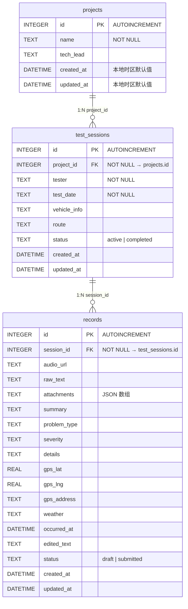
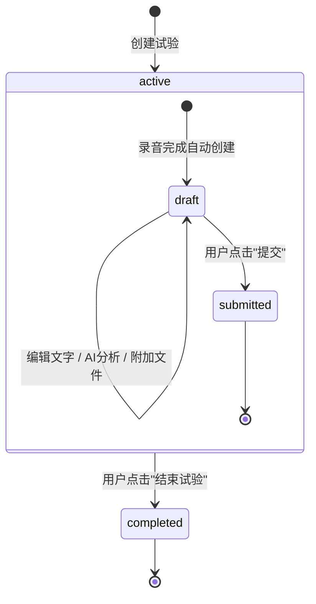
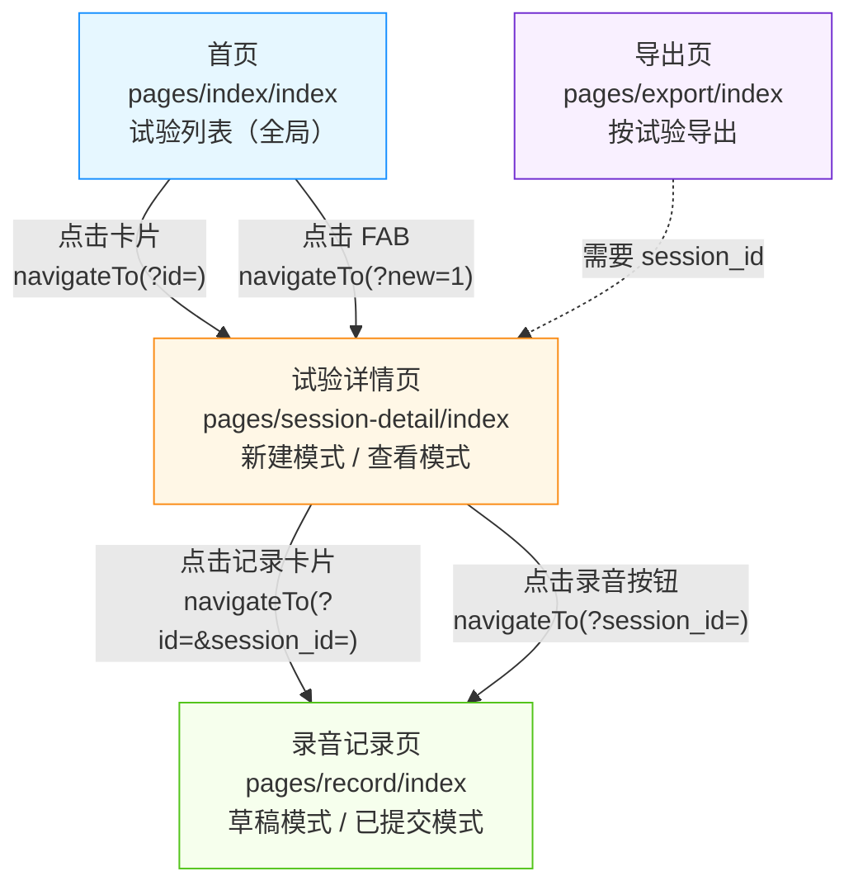
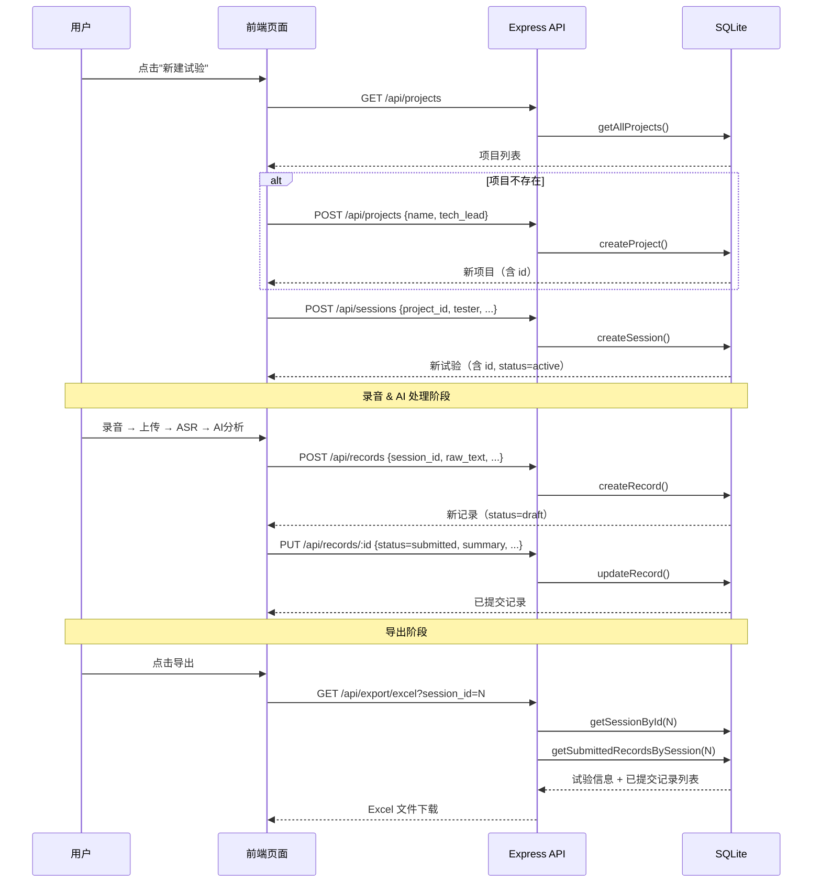

路测助手的核心数据模型遵循一条严格的层级链路：**Project（项目）→ Test Session（试验）→ Record（记录）**。这三个实体通过 SQLite 外键约束构成一对多的父子关系——一个项目可以包含多次试验，一次试验可以包含多条记录，但每条记录只归属于唯一试验，每次试验也只从属于唯一项目。理解这条层级链路是阅读后续所有后端与前端模块的前提，因为 API 路由设计、前端页面导航、数据导出乃至 AI 处理流程都围绕它展开。

Sources: [database.js](server/src/models/database.js#L25-L67)

---

## 实体关系全景图

下面的 Mermaid ER 图展示了三张表的字段定义、外键关系以及每个实体的状态约束。阅读此图时请注意三个要点：① 外键列（`project_id`、`session_id`）均为 `NOT NULL`，意味着子实体不能脱离父实体独立存在；② 每张表都有 `status` 字段实现轻量级状态机；③ 时间戳统一采用 `datetime('now','localtime')` 策略确保本地时区一致性。



Sources: [database.js](server/src/models/database.js#L25-L67)

---

## 三层实体字段详解

### 第一层：Project（项目）

**项目**是层级树的根节点，代表一个智驾测试项目。它只承载最基础的元信息——项目名称和技术负责人。设计上刻意保持精简，因为"项目"更多承担的是**组织归类**职能，而非业务数据载体。

| 字段 | 类型 | 约束 | 说明 |
|------|------|------|------|
| `id` | INTEGER | PK, AUTOINCREMENT | 自增主键 |
| `name` | TEXT | NOT NULL | 项目名称，前端以此做去重判断 |
| `tech_lead` | TEXT | 可空 | 技术负责人姓名 |
| `created_at` | DATETIME | 默认当前本地时间 | 创建时间戳 |
| `updated_at` | DATETIME | 默认当前本地时间 | 最后更新时间戳，UPDATE 时由 SQL 自动刷新 |

前端在创建试验时采用"按名称查找或新建项目"策略——如果用户输入的项目名已存在，则复用已有 `project_id`；否则先调用 `POST /api/projects` 新建项目再关联试验。这意味着项目表天然具有分组归类的语义。

Sources: [database.js](server/src/models/database.js#L26-L32), [session-detail/index.vue](client/pages/session-detail/index.vue#L174-L185)

### 第二层：Test Session（试验）

**试验**是数据采集的核心调度单元。一次试验对应"某天、某辆车、某条路线上由某位测试员执行的一轮路测"。它是连接项目（组织维度）与记录（数据维度）的桥梁。

| 字段 | 类型 | 约束 | 说明 |
|------|------|------|------|
| `id` | INTEGER | PK, AUTOINCREMENT | 自增主键 |
| `project_id` | INTEGER | FK → projects.id, NOT NULL | 所属项目，外键约束 |
| `tester` | TEXT | NOT NULL | 测试人员姓名 |
| `test_date` | TEXT | NOT NULL | 测试日期（字符串格式） |
| `vehicle_info` | TEXT | 可空 | 车辆信息，如"沪A12345" |
| `route` | TEXT | 可空 | 测试路线，如"高速环线" |
| `status` | TEXT | `active` / `completed` | 试验状态，默认 `active` |
| `created_at` | DATETIME | 默认当前本地时间 | 创建时间戳 |
| `updated_at` | DATETIME | 默认当前本地时间 | 最后更新时间戳 |

`status` 字段控制着试验的生命周期：创建时默认为 `active`，此时前端会展示"录音"悬浮按钮允许新建记录；当用户点击"结束试验"后，`status` 被更新为 `completed`，录音按钮随即消失。这种设计在 UI 层面防止了对已结束试验的误操作。

Sources: [database.js](server/src/models/database.js#L34-L45), [session-detail/index.vue](client/pages/session-detail/index.vue#L196-L210)

### 第三层：Record（记录）

**记录**是整个系统中数据密度最高的实体，承载了语音采集、AI 结构化提取、GPS 定位、附件管理等核心业务数据。每条记录对应"试验过程中的一次观察或发现"。

| 字段 | 类型 | 约束 | 说明 |
|------|------|------|------|
| `id` | INTEGER | PK, AUTOINCREMENT | 自增主键 |
| `session_id` | INTEGER | FK → test_sessions.id, NOT NULL | 所属试验，外键约束 |
| `audio_url` | TEXT | 可空 | 上传后的音频文件路径 |
| `raw_text` | TEXT | 可空 | ASR 语音转文字的原始结果 |
| `attachments` | TEXT | 默认 `'[]'` | JSON 数组，存储照片/视频附件 |
| `summary` | TEXT | 可空 | AI 提取的问题摘要 |
| `problem_type` | TEXT | 可空 | AI 提取的问题类型 |
| `severity` | TEXT | 可空 | AI 提取的严重程度 |
| `details` | TEXT | 可空 | AI 提取的详细信息 |
| `gps_lat` / `gps_lng` | REAL | 可空 | GPS 坐标（经纬度） |
| `gps_address` | TEXT | 可空 | GPS 逆地理编码地址 |
| `weather` | TEXT | 可空 | 采集时的天气信息 |
| `occurred_at` | DATETIME | 可空 | 问题发生时间 |
| `edited_text` | TEXT | 可空 | 用户手动编辑后的文字 |
| `status` | TEXT | `draft` / `submitted` | 记录状态，默认 `draft` |
| `created_at` | DATETIME | 默认当前本地时间 | 创建时间戳 |
| `updated_at` | DATETIME | 默认当前本地时间 | 最后更新时间戳 |

`status` 的 `draft` → `submitted` 转换是一条**单向状态机**：记录创建后处于草稿状态，用户可以在录音页编辑文字、触发 AI 分析、附加照片/视频；一旦点击"提交"，状态变为 `submitted`，前端将该记录切换为只读展示模式。`getSubmittedRecordsBySession` 查询专门过滤出已提交记录供数据导出使用。

Sources: [database.js](server/src/models/database.js#L47-L67), [queries.js](server/src/models/queries.js#L80-L106)

---

## 外键约束与引用完整性

数据库初始化时通过两条 PRAGMA 指令确立了引用完整性的底层保障：

```javascript
db.pragma('journal_mode = WAL');      // Write-Ahead Logging，提升并发读性能
db.pragma('foreign_keys = ON');       // 启用外键约束检查
```

`foreign_keys = ON` 是关键配置——SQLite 默认**不启用**外键约束，必须显式开启。启用后，以下行为得到保证：

- **插入 `test_sessions` 时**，`project_id` 必须指向 `projects` 表中已存在的行，否则 SQLite 抛出约束违例错误
- **插入 `records` 时**，`session_id` 必须指向 `test_sessions` 表中已存在的行
- **删除父实体时**，由于未声明 `ON DELETE CASCADE`，SQLite 会阻止删除仍被引用的父行

这种"严格外键 + 无级联删除"的策略是刻意为之的架构选择——在路测场景中，项目和试验属于高价值数据，不应因误操作而级联消失。如果需要清理数据，必须按照"先删记录 → 再删试验 → 最后删项目"的顺序手动操作。

Sources: [database.js](server/src/models/database.js#L16-L17), [database.js](server/src/models/database.js#L44-L44), [database.js](server/src/models/database.js#L66-L66)

---

## 状态机设计

三层实体各自拥有独立的 `status` 字段，形成嵌套的生命周期控制。试验的状态决定了其下记录是否可被创建，而记录的状态决定了自身是否可编辑以及是否可被导出。



| 实体 | 状态值 | 默认值 | 转换触发 | 业务含义 |
|------|--------|--------|----------|----------|
| test_sessions | `active` | ✅ | 创建时 | 试验进行中，允许新建记录 |
| test_sessions | `completed` | — | 用户手动结束 | 试验已结束，禁止新建记录 |
| records | `draft` | ✅ | 创建时 | 草稿，允许编辑和 AI 分析 |
| records | `submitted` | — | 用户手动提交 | 已提交，前端只读展示，可被导出 |

注意 `projects` 表**没有** `status` 字段——项目作为一个纯粹的分类容器，不存在生命周期管理的需求。这种不对称设计体现了"按需复杂度"原则：只有参与业务流程流转的实体才需要状态机。

Sources: [database.js](server/src/models/database.js#L41-L41), [database.js](server/src/models/database.js#L63-L63), [session-detail/index.vue](client/pages/session-detail/index.vue#L107-L110)

---

## API 路由与层级穿透

三组 RESTful 路由严格对齐三层实体，路由前缀即为实体名称的复数形式。下面的表格展示了每个端点如何通过 URL 参数实现层级穿透——即从上层数据中筛选下层结果。

| 层级 | 路由前缀 | 端点 | 层级穿透参数 | 说明 |
|------|----------|------|-------------|------|
| 项目 | `/api/projects` | `GET /` | — | 返回全部项目 |
| 项目 | `/api/projects` | `POST /` | — | 创建项目 |
| 项目 | `/api/projects` | `GET /:id` | — | 获取单个项目 |
| 试验 | `/api/sessions` | `GET /` | `?project_id=` | 按项目筛选试验 |
| 试验 | `/api/sessions` | `POST /` | body: `project_id` | 在指定项目下创建试验 |
| 试验 | `/api/sessions` | `GET /:id` | — | 获取单个试验 |
| 试验 | `/api/sessions` | `PUT /:id` | — | 更新试验（含状态变更） |
| 记录 | `/api/records` | `GET /` | `?session_id=` | 按试验筛选记录（必填参数） |
| 记录 | `/api/records` | `POST /` | body: `session_id` | 在指定试验下创建记录 |
| 记录 | `/api/records` | `GET /:id` | — | 获取单条记录 |
| 记录 | `/api/records` | `PUT /:id` | — | 更新记录（含状态变更） |

值得注意的设计细节：`GET /api/records` 将 `session_id` 设为**必填参数**（缺少时返回 400），而非像 `GET /api/sessions` 那样允许省略过滤条件。这是因为记录数据量可能很大且脱离试验上下文缺乏意义，所以强制要求调用方指定所属试验。

Sources: [records.js](server/src/routes/records.js#L6-L13), [sessions.js](server/src/routes/sessions.js#L6-L10), [app.js](server/src/app.js#L19-L21)

---

## 前端页面导航与层级映射

UniApp 的页面导航路径完美映射了三层实体的层级关系。用户从首页的试验列表出发，点击进入试验详情页查看记录列表，再点击进入具体记录页进行录音和编辑。这种"逐层下钻"的导航模式与数据模型的父子关系一一对应。



**首页（试验列表）** 通过 `Promise.all` 并行加载所有试验和所有项目数据，然后在前端通过 `getProjectName()` 方法做 `project_id` → 项目名称的本地关联。这意味着首页虽然展示的是第二层实体（试验），但需要向上穿透到第一层（项目）获取显示名称。

**试验详情页** 是唯一承担两种职责的页面——通过 URL 参数 `?new=1` 进入"新建模式"，通过 `?id=N` 进入"查看模式"。在新建模式下，页面同时负责创建项目（第一层）和试验（第二层）的联动：先查找或创建项目，再基于返回的 `project_id` 创建试验。

**录音记录页** 接收 `session_id` 作为必传参数，确保每条新创建的记录都能正确绑定到父试验。该页面还通过 `setInterval` 每 3 秒自动保存草稿，体现了"数据不丢失"的产品理念。

Sources: [index/index.vue](client/pages/index/index.vue#L63-L71), [session-detail/index.vue](client/pages/session-detail/index.vue#L135-L146), [record/index.vue](client/pages/record/index.vue#L147-L158), [pages.json](client/pages.json#L1-L27)

---

## 数据流：从创建到导出的完整链路

下面的时序图展示了三个实体在一次完整业务流程中的创建顺序和交互关系。观察箭头方向可以发现，数据创建严格遵循**自顶向下**原则——先有项目，再有试验，最后才有记录。而数据消费（导出）则采用**自底向上**聚合的方式——以试验为入口，向上获取项目元信息，向下拉取全部已提交记录。



Sources: [export.js](server/src/routes/export.js#L7-L70), [queries.js](server/src/models/queries.js#L137-L141)

---

## 查询层设计：无 ORM 的原始 SQL 模式

本项目的查询层在 [queries.js](server/src/models/queries.js) 中以**独立函数**的形式组织，每个函数对应一条预编译 SQL 语句。这种设计放弃了 ORM 的抽象便利，换来了以下优势：

- **SQL 完全透明**——开发者可以直接看到执行的 SQL，便于调试和性能分析
- **better-sqlite3 的 `prepare().all()/.get()/.run()` 模式**自动处理参数绑定，防止 SQL 注入
- **函数即文档**——函数名如 `getRecordsBySession` 直接表达了业务意图

三层实体的查询函数遵循统一的命名约定：

| 命名模式 | 含义 | 示例 |
|----------|------|------|
| `getAll{Entities}` | 获取全部（可带过滤参数） | `getAllSessions(projectId)` |
| `get{Entity}ById` | 按主键查询单条 | `getProjectById(id)` |
| `get{Entities}By{Parent}` | 按父实体外键查询 | `getRecordsBySession(sessionId)` |
| `create{Entity}` | 创建并返回完整实体 | `createRecord(data)` |
| `update{Entity}` | 更新并返回完整实体 | `updateSession(id, data)` |

每个 `create` 函数都遵循"INSERT → SELECT"两步模式——先执行插入获取 `lastInsertRowid`，再通过主键查询返回完整行数据，确保调用方拿到的永远是完整的实体对象而非仅影响行数。

Sources: [queries.js](server/src/models/queries.js#L1-L147)

---

## 与系统其他模块的关联

三层实体关系是路测助手的**架构骨架**，几乎所有其他模块都围绕它运作：

- **[SQLite 数据库设计与本地时区时间戳策略](9-sqlite-shu-ju-ku-she-ji-yu-ben-di-shi-qu-shi-jian-chuo-ce-lue)** 深入讲解 `database.js` 中的 WAL 模式、外键约束以及 `datetime('now','localtime')` 时间戳策略的工程决策
- **[RESTful API 路由设计](11-restful-api-lu-you-she-ji-projects-sessions-records-upload-export-ai)** 展示三层实体的路由如何在 Express 中挂载，以及中间件链的设计
- **[原始 SQL 查询层](12-yuan-shi-sql-cha-xun-ceng-wu-orm-de-crud-shi-xian)** 对 `queries.js` 中每条 SQL 的写法、预编译策略和动态字段更新机制进行逐行剖析
- **[语音采集与 AI 结构化提取流程](5-yu-yin-cai-ji-yu-ai-jie-gou-hua-ti-qu-liu-cheng)** 展示 Record 实体中的 `raw_text`、`summary`、`problem_type`、`severity` 等字段如何被 AI 管线填充
- **[数据导出流程](6-shu-ju-dao-chu-excel-csv-liu-cheng)** 演示如何以 Session 为锚点向上取项目信息、向下取已提交记录来生成 Excel/CSV 文件