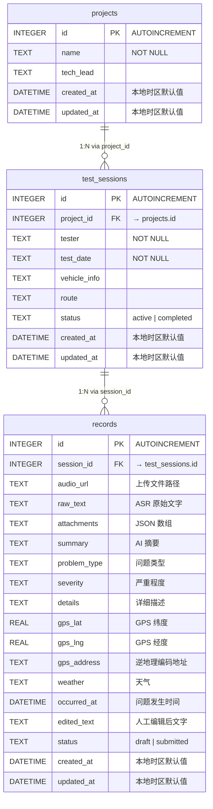

路测助手后端选择 SQLite 作为持久化方案，并通过 `better-sqlite3` 同步驱动在 Node.js 中直接操作数据库文件。本文将深入剖析三层表结构（projects → test_sessions → records）的 DDL 设计决策、**本地时区时间戳**策略（`datetime('now','localtime')`）的完整实现路径、以及无 ORM 的查询层如何与 Express 路由协作。如果你正在排查时间显示偏差、外键约束失效，或希望理解为什么这个项目拒绝 ORM 而选择原始 SQL，本文会给出精确答案。

Sources: [database.js](server/src/models/database.js#L1-L74), [queries.js](server/src/models/queries.js#L1-L148)

## 为什么是 SQLite 而不是 PostgreSQL / MySQL

路测助手的核心使用场景是**副驾记录员在车内用手机录音采集问题**——这意味着后端运行在开发者的笔记本电脑上，而非云服务器。SQLite 的零配置、单文件、无进程间通信开销的特性，完美匹配以下需求：不需要独立的数据库服务进程、部署时只需拷贝 `data/roadtest.db` 文件即可备份或迁移、`better-sqlite3` 的同步 API 让 CRUD 代码无需 `async/await` 就能写出线性可读的查询逻辑。

项目通过环境变量 `DB_PATH` 控制数据库文件位置，默认路径为 `server/data/roadtest.db`。当该目录不存在时，`getDB()` 函数会自动递归创建。这一设计使得**测试环境**可以通过设置 `DB_PATH` 指向临时文件来实现完全隔离，而生产环境使用默认路径——两个环境共享同一套 schema 初始化逻辑。

Sources: [database.js](server/src/models/database.js#L5-L20), [database.test.js](server/tests/database.test.js#L6-L11)

## 数据库初始化与单例连接管理

`database.js` 导出两个函数：`getDB()` 和 `initDB()`。`getDB()` 采用**模块级变量单例模式**——首次调用时创建 `better-sqlite3` 实例，后续调用直接返回缓存的 `db` 对象。初始化过程中设置了两个关键 PRAGMA：

| PRAGMA | 作用 | 默认行为（未设置时） |
|---|---|---|
| `journal_mode = WAL` | 启用 Write-Ahead Logging，读写不互斥 | `delete` 模式，写操作阻塞所有读操作 |
| `foreign_keys = ON` | 启用外键约束检查 | SQLite 默认**关闭**外键约束 |

`initDB()` 在 Express 应用启动时被调用（位于 [app.js](server/src/app.js#L38)），通过 `db.exec()` 执行完整的 DDL 语句。`CREATE TABLE IF NOT EXISTS` 确保重复调用不会抛异常——这对测试场景尤为重要，因为测试文件可能多次 require 同一模块。

Sources: [database.js](server/src/models/database.js#L1-L73), [app.js](server/src/app.js#L37-L38)

## 三层表结构：DDL 逐字段解析

路测助手的数据模型遵循严格的**层级关系**：一个项目（project）包含多个试验（test_session），一个试验包含多条记录（record）。下图展示了三个表之间的完整关系：



### projects 表——项目容器

```sql
CREATE TABLE IF NOT EXISTS projects (
  id INTEGER PRIMARY KEY AUTOINCREMENT,
  name TEXT NOT NULL,
  tech_lead TEXT,
  created_at DATETIME DEFAULT (datetime('now','localtime')),
  updated_at DATETIME DEFAULT (datetime('now','localtime'))
);
```

`projects` 是最轻量的表，仅记录项目名称和负责人。它是整棵实体树的根节点，没有外键依赖。`name` 字段设置了 `NOT NULL` 约束，而 `tech_lead` 允许为空——这反映了"先建项目、后指定负责人"的松散操作习惯。

Sources: [database.js](server/src/models/database.js#L25-L32)

### test_sessions 表——试验分组

```sql
CREATE TABLE IF NOT EXISTS test_sessions (
  id INTEGER PRIMARY KEY AUTOINCREMENT,
  project_id INTEGER NOT NULL,
  tester TEXT NOT NULL,
  test_date TEXT NOT NULL,
  vehicle_info TEXT,
  route TEXT,
  status TEXT DEFAULT 'active' CHECK(status IN ('active', 'completed')),
  created_at DATETIME DEFAULT (datetime('now','localtime')),
  updated_at DATETIME DEFAULT (datetime('now','localtime')),
  FOREIGN KEY (project_id) REFERENCES projects(id)
);
```

**状态约束**通过 `CHECK(status IN ('active', 'completed'))` 实现。SQLite 的 `CHECK` 约束在 INSERT 和 UPDATE 时都会被评估——如果尝试写入 `'invalid'` 等非法值，`better-sqlite3` 会直接抛出异常，测试用例 [database.test.js](server/tests/database.test.js#L94-L103) 验证了这一行为。

注意一个类型选择上的细节：`test_date` 的类型是 `TEXT` 而非 `DATE`。SQLite 没有原生的日期类型，所有日期时间值都以文本形式存储，格式为 ISO 8601 子集（如 `2026-04-10`）。这种设计让前端可以直接传入用户选择的日期字符串，无需在服务端做格式转换。

Sources: [database.js](server/src/models/database.js#L34-L45)

### records 表——核心业务实体

```sql
CREATE TABLE IF NOT EXISTS records (
  id INTEGER PRIMARY KEY AUTOINCREMENT,
  session_id INTEGER NOT NULL,
  audio_url TEXT,
  raw_text TEXT,
  attachments TEXT DEFAULT '[]',
  summary TEXT,
  problem_type TEXT,
  severity TEXT,
  details TEXT,
  gps_lat REAL,
  gps_lng REAL,
  gps_address TEXT,
  weather TEXT,
  occurred_at DATETIME,
  edited_text TEXT,
  status TEXT DEFAULT 'draft' CHECK(status IN ('draft', 'submitted')),
  created_at DATETIME DEFAULT (datetime('now','localtime')),
  updated_at DATETIME DEFAULT (datetime('now','localtime')),
  FOREIGN KEY (session_id) REFERENCES test_sessions(id)
);
```

`records` 是字段最多的表（17 个字段），承载了从语音采集到 AI 结构化提取的完整数据产物。以下是按数据来源分组的字段全景：

| 数据来源 | 字段 | 说明 |
|---|---|---|
| 系统自动 | `id`, `session_id`, `status`, `created_at`, `updated_at` | 主键、外键、状态机、时间戳 |
| 文件上传 | `audio_url`, `attachments` | 音频路径、附件 JSON 数组 |
| ASR 转写 | `raw_text` | 语音识别原始文字 |
| AI 结构化提取 | `summary`, `problem_type`, `severity`, `details` | AI 从 `raw_text` 中提取的结构化字段 |
| 环境/位置 | `gps_lat`, `gps_lng`, `gps_address`, `weather`, `occurred_at` | GPS 坐标、逆地理编码、天气、问题发生时间 |
| 人工编辑 | `edited_text` | 记录员在提交前修正的文字 |

**`attachments` 字段的 JSON 序列化策略**值得特别说明。SQLite 没有数组类型，项目选择将附件列表存储为 JSON 文本，默认值为 `'[]'`（空数组字符串）。在查询层 [queries.js](server/src/models/queries.js#L94) 中，写入时通过 `JSON.stringify(attachments || [])` 显式序列化。这意味着消费者在读取后需要自行 `JSON.parse()`——目前路由层并未做反序列化，前端接收到的是原始 JSON 字符串。

Sources: [database.js](server/src/models/database.js#L47-L67), [queries.js](server/src/models/queries.js#L80-L106)

## 本地时区时间戳策略：核心设计决策

这是本文最关键的技术决策点。路测助手在所有时间戳字段上统一使用 `datetime('now','localtime')` 而非 SQLite 的 `CURRENT_TIMESTAMP`：

```sql
-- ✅ 项目采用的方式
created_at DATETIME DEFAULT (datetime('now','localtime'))

-- ❌ 未采用的方式
created_at DATETIME DEFAULT CURRENT_TIMESTAMP
```

### 为什么不能接受 CURRENT_TIMESTAMP

SQLite 的 `CURRENT_TIMESTAMP` 返回的是 **UTC 时间**，格式为 `YYYY-MM-DD HH:MM:SS`。对于路测助手这个场景，所有用户都在**同一个本地时区**（中国，UTC+8）操作，时间戳的消费者是：

1. **前端页面**——直接展示给测试人员看"这条记录何时创建"
2. **Excel/CSV 导出**——路测报告中的创建时间列
3. **列表排序**——按时间倒序查看最新记录

如果使用 `CURRENT_TIMESTAMP`，前端需要对每个时间戳做 +8 小时转换，或者依赖客户端时区自动转换——在 UniApp 这种跨端框架中，不同平台（H5 / Android / iOS）的 `Date` 解析行为可能不一致。**选择 `localtime` 的本质是：在数据源头就产出人类可直接阅读的时间文本，消除展示层的时区转换负担。**

### 时间戳更新的完整覆盖

时间戳策略不仅覆盖 `INSERT`（通过 `DEFAULT`），还严格覆盖所有 `UPDATE` 操作。以下是项目中所有显式更新 `updated_at` 的位置：

| 操作 | 代码位置 | SQL 片段 |
|---|---|---|
| 更新项目 | [queries.js#L23](server/src/models/queries.js#L23) | `updated_at = datetime('now','localtime')` |
| 更新试验 | [queries.js#L56](server/src/models/queries.js#L56) | `updated_at = datetime('now','localtime')` |
| 更新记录 | [queries.js#L130](server/src/models/queries.js#L130) | `updated_at = datetime('now','localtime')` |

注意 `updateRecord` 函数采用了**动态字段拼接**模式——它遍历 `allowedFields` 列表，只更新客户端实际传入的字段，但 `updated_at` 的更新是**无条件追加**的，确保任何字段变更都会刷新时间戳。

Sources: [database.js](server/src/models/database.js#L30-L31), [queries.js](server/src/models/queries.js#L23), [queries.js](server/src/models/queries.js#L56), [queries.js](server/src/models/queries.js#L130)

### occurred_at 与 created_at 的语义区分

`records` 表中有一个容易混淆的时间字段 `occurred_at`——它记录的是**路测问题实际发生的时间**，而非记录创建时间。两者的语义区别如下：

| 字段 | 含义 | 值来源 | 是否有默认值 |
|---|---|---|---|
| `created_at` | 记录被写入数据库的时间 | SQLite 自动生成 | `datetime('now','localtime')` |
| `occurred_at` | 问题在路测现场发生的时间 | 前端传入或留空 | 无（允许 NULL） |

`occurred_at` 没有设置 `DEFAULT` 值，因为问题发生时间可能是人工回填的（比如录音结束后才补充时间信息），也可能是空的。在 [queries.js](server/src/models/queries.js#L103) 中，`occurred_at` 通过 `occurred_at || null` 处理，前端未传入时存为 NULL。

Sources: [database.js](server/src/models/database.js#L62), [queries.js](server/src/models/queries.js#L86-L104)

## 无 ORM 查询层：设计权衡与实现模式

项目选择不使用任何 ORM（如 Sequelize、Prisma、Knex），所有 SQL 直接写在 [queries.js](server/src/models/queries.js) 中。这一决策的权衡点如下：

### 为什么不用 ORM

| 维度 | 原始 SQL（项目选择） | ORM |
|---|---|---|
| **学习成本** | 零——SQL 是通用技能 | 需要学习 ORM 的 API、迁移工具、模型定义语法 |
| **查询透明度** | 完全可见——你写什么就执行什么 | ORM 生成的 SQL 可能包含意外的 JOIN 或 N+1 查询 |
| **代码量** | 本项目仅 148 行查询代码 | 仅模型定义和迁移文件就可能超过 300 行 |
| **性能控制** | 精确控制每条语句 | 抽象层可能引入额外开销 |
| **复杂查询** | 直接编写 | 需要回退到 raw query，失去 ORM 价值 |

对于路测助手这种**3 张表、12 个查询函数**的轻量场景，ORM 引入的复杂度远超收益。

### 参数化查询与 SQL 注入防护

所有查询函数都使用 `better-sqlite3` 的 `.prepare().run()` / `.prepare().get()` / `.prepare().all()` 模式，参数通过 `?` 占位符绑定。例如：

```javascript
// 参数化查询示例
db.prepare('SELECT * FROM projects WHERE id = ?').get(id);
db.prepare('INSERT INTO projects (name, tech_lead) VALUES (?, ?)').run(name, tech_lead || null);
```

`better-sqlite3` 的 `.prepare()` 返回一个预编译语句对象，参数绑定在 SQLite 引擎层面完成，从根本上杜绝了 SQL 注入。项目中唯一出现动态 SQL 拼接的是 `updateRecord` 函数（[queries.js#L113-L133](server/src/models/queries.js#L113-L133)），但拼接的只是**字段名**（来自硬编码的 `allowedFields` 白名单），实际值仍然通过 `?` 占位符传入。

Sources: [queries.js](server/src/models/queries.js#L1-L148)

## 查询层函数全景

以下表格列出 `queries.js` 导出的全部 12 个函数，按实体分组：

### projects 相关

| 函数 | SQL 类型 | 排序规则 | 特殊处理 |
|---|---|---|---|
| `getAllProjects()` | SELECT | `ORDER BY created_at DESC` | 无 |
| `getProjectById(id)` | SELECT WHERE | — | 单行查询 `.get()` |
| `createProject({name, tech_lead})` | INSERT + SELECT | — | 插入后立即回读完整行 |
| `updateProject(id, {name, tech_lead})` | UPDATE + SELECT | — | 显式更新 `updated_at` |

### test_sessions 相关

| 函数 | SQL 类型 | 排序规则 | 特殊处理 |
|---|---|---|---|
| `getAllSessions(projectId?)` | SELECT（条件 WHERE） | `ORDER BY test_date DESC` | `projectId` 为空时返回全部 |
| `getSessionById(id)` | SELECT WHERE | — | 单行查询 |
| `createSession({...})` | INSERT + SELECT | — | 5 个参数绑定 |
| `updateSession(id, {...})` | UPDATE + SELECT | — | 合并已有值与新值 |

### records 相关

| 函数 | SQL 类型 | 排序规则 | 特殊处理 |
|---|---|---|---|
| `getRecordsBySession(sessionId)` | SELECT WHERE | `ORDER BY created_at DESC` | — |
| `getRecordById(id)` | SELECT WHERE | — | 单行查询 |
| `createRecord(data)` | INSERT + SELECT | — | `attachments` 做 `JSON.stringify` |
| `updateRecord(id, data)` | UPDATE（动态字段） | — | `allowedFields` 白名单过滤 |
| `getSubmittedRecordsBySession(sessionId)` | SELECT WHERE + AND | `ORDER BY created_at DESC` | 过滤 `status = 'submitted'` |

**"插入后回读"模式**值得注意：所有 `create*` 和 `update*` 函数在执行写入后，都会立即执行一次 `SELECT` 查询返回完整的行数据（包含数据库自动生成的 `id`、`created_at`、`updated_at`）。这一模式确保调用者拿到的永远是数据库中的真实状态，而非拼接出的不完整对象。

Sources: [queries.js](server/src/models/queries.js#L1-L147)

## 测试中的数据库隔离策略

由于 SQLite 是文件数据库，测试环境必须避免与开发数据库冲突。项目采用的环境隔离方案如下：

```javascript
// 测试文件顶部
const TEST_DB_PATH = path.join(__dirname, 'test.db');

beforeAll(() => {
  process.env.DB_PATH = TEST_DB_PATH;
  // 清除模块缓存，迫使 database.js 重新读取 DB_PATH
  delete require.cache[require.resolve('../src/models/database')];
});

afterAll(() => {
  // 清理测试数据库文件及 WAL/SHM 附属文件
  if (fs.existsSync(TEST_DB_PATH)) fs.unlinkSync(TEST_DB_PATH);
});
```

核心技巧是 **`delete require.cache[...]`**——Node.js 的 `require()` 会缓存模块，如果不清除缓存，`database.js` 中的 `DB_PATH` 仍然是默认值而非测试路径。每个测试文件都设置了独立的 `DB_PATH`（如 `test.db`、`queries-test.db`），确保测试之间完全隔离。

WAL 模式会在数据库文件旁生成 `-wal` 和 `-shm` 文件，`afterAll` 中也一并清理了这些附属文件，避免在 Windows 上因文件锁导致清理失败。

Sources: [database.test.js](server/tests/database.test.js#L1-L26), [queries.test.js](server/tests/queries.test.js#L1-L26)

## 设计局限性已知问题

当前方案存在几个值得记录的已知限制：

1. **`occurred_at` 没有时区信息**——`datetime('now','localtime')` 产出的时间字符串不含时区标识（如 `+08:00`）。如果未来需要跨时区协作，所有历史数据都缺少时区上下文。对于当前"单一团队、单一时区"的场景这不是问题，但它是架构上的隐性债务。

2. **`attachments` 的 JSON 反序列化不一致**——写入时统一做了 `JSON.stringify`，但读取时没有对应的 `JSON.parse`。前端接收到的可能是字符串而非数组，取决于 `better-sqlite3` 的类型映射。

3. **无数据库迁移机制**——所有 DDL 都在 `initDB()` 中通过 `CREATE TABLE IF NOT EXISTS` 执行。如果需要修改已有表的 schema（如增加列），必须手动操作数据库文件。对于 MVP 阶段这是可接受的，但长期迭代需要引入迁移工具。

4. **单例数据库连接**——`getDB()` 返回的始终是同一个连接实例。在 WAL 模式下这不会成为读写瓶颈（读操作可以并发），但如果未来需要事务隔离，可能需要连接池。

Sources: [CLAUDE.md](CLAUDE.md#L49), [database.js](server/src/models/database.js#L7-L19)

## 延伸阅读

- 要了解三张表之间的实体关系如何在业务流中使用，参见 [三层实体关系：项目 → 试验 → 记录](8-san-ceng-shi-ti-guan-xi-xiang-mu-shi-yan-ji-lu)
- 要查看原始 SQL 查询如何被 Express 路由调用，参见 [原始 SQL 查询层：无 ORM 的 CRUD 实现](12-yuan-shi-sql-cha-xun-ceng-wu-orm-de-crud-shi-xian)
- 要了解测试环境中数据库隔离的完整方案，参见 [Jest + Supertest 测试策略与数据库隔离方案](24-jest-supertest-ce-shi-ce-lue-yu-shu-ju-ku-ge-chi-fang-an)
- 要查看时间戳在导出流程中的展示方式，参见 [数据导出（Excel / CSV）流程](6-shu-ju-dao-chu-excel-csv-liu-cheng)